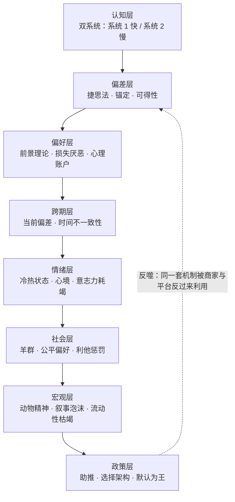

# 📘 行为经济学 · 读书笔记与决策训练存档

**米歇尔·巴德利《行为经济学》——14 个认知偏差，全部扔进 AI 沙盘里被极限施压之后，留下的那份记录。**

🌐 **简体中文** ｜ [English edition](./en/README.md)

> **EN** · A decision-training archive built by throwing Michelle Baddeley's *Behavioural Economics: A Very Short Introduction* into an AI wargaming loop — 14 cognitive-bias concepts, each split into **"what the book actually says"** vs **"how it rewired my decisions"**, plus a 24-rule behavioural-finance risk-control pipeline you can paste into a trading agent. Written in Simplified Chinese, with a condensed [English edition](./en/README.md).

原书：**《行为经济学》** · 米歇尔·巴德利（Michelle Baddeley）著 · 叶星、李井奎 译 · 译林出版社 2024 年 7 月第 1 版 · ISBN 9787575301275

### [👉 零基础？从这篇 30 秒导览开始 →](./docs/00-导览-30秒看懂-术语急救包-演化地图.md)
### [📂 或直接进分篇目录 →](./docs/index.md)

---

## 🧨 一句话核心

**人类不是坏掉的计算机，而是一台用省电模式跑完全部人生的生存机器——所有「非理性」都是它在资源稀缺下的最优解。**

真正的问题不是「人为什么不理性」，而是：**当大脑的省电模式能被商家、平台、市场定价时，谁来替你踩刹车？**

这张图是整份笔记的骨架：14 个主题按它从上往下排，附录 A 的 24 条规则则把它从下往上折回成可执行动作。

---

## 🤔 这是什么

一份**决策训练存档**，不是读书摘要。

原始素材来自一条与 AI 的对练对话链：把《行为经济学》九章的核心概念逐一扔进「生活化沙盘」——超市的 20 种吐司、幼儿园的迟到罚款、抛硬币的赌局、空无一人的餐厅、原价 1000 特价 300 的鞋——每个概念配一个日常困境，做出选择后再被推到极端，看见它怎么死。

九章走完后转入实战：电商促销套路拆解、个人熬夜助推闭环设计、24 条行为金融风控规则、一个可嵌进 Agent 的行为审计模块。

**留下的不是 14 个名词，是一张能挂在决策前面的摩擦力清单。**

## 🎯 为什么值得点开

| | |
| :--- | :--- |
| **不假设你读过原书** | 开篇「30 秒导览」+ 28 条术语大白话对照表 + 21 位学者概念归属速查，零背景也能跟下来 |
| **不给标准答案，给失败过程** | 每个主题严格切成两半：📖 原书核心精髓 ／ ⚡ 我原本怎么想、被什么打醒、现在怎么做 |
| **全部是中文的具体场景** | 老张的吐司、迟到的家长、爆米花与 123456 密码——没有一句「假设有一个代表性主体」 |
| **错判留痕是刻意保留的** | 答错被 *"That is not quite it."* 打回、答「1」被当成数学题、答案被引用标签剧透——三类协作事故原样保留并分析 |
| **标注置信度，也标注边界** | 引文与数据逐条核验并标「高／中／低」；未覆盖章节、沙盘的说服力偏误、24 条规则未经回测，全部写进边界一节，不藏 |
| **附一条可直接抄走的流水线** | 附录 A 的 24 条风控规则，四模块按决策时序排列，专为个人金融分析 Agent 设计 |

---

## 🗂 14 个主题（点标题进单页）

| # | 主题 | 一句话 |
| :--: | :--- | :--- |
| [01](./docs/01-有限理性-满意解-为什么明知要比价还是会随手拿.md) | **有限理性与满意解** | 大脑的记忆、时间与精力都有硬上限——所以人不追求最优解，只追求「够好」 |
| [02](./docs/02-动机与激励-挤出效应-托儿所罚款为何让迟到更多.md) | **挤出效应** | 罚款一进来，迟到反而变多；取消罚款，也回不去了 |
| [03](./docs/03-羊群效应-资讯级联-排队越长的餐厅越好吃吗.md) | **羊群效应与资讯级联** | 排长队的餐厅更好吃吗？核心不是「跟风」，是**你的私人情报被销毁了** |
| [04](./docs/04-可得性捷思-空难新闻与密码为什么都是123456.md) | **可得性捷思** | 看完空难新闻就不敢坐飞机——概率估计被「记忆检索的难易度」替换了 |
| [05](./docs/05-锚定效应-诱饵效应-100规则-1000元原价是怎样骗你的.md) | **锚定 · 诱饵 · 100 规则** | 原价 1000 特价 300 为什么让人心跳加速？第一个数字变成了尺子 |
| [06](./docs/06-前景理论-损失厌恶-为什么赔钱的痛是赚钱两倍.md) | **前景理论与损失厌恶** | 赔 100 元的痛，要赚 250 元才补得回；且亏损区的人会突然爱上风险 |
| [07](./docs/07-心理账户-横财与血汗钱-满500免运费为什么让你多花.md) | **心理账户** | 中奖 3000 元花光、加班费 3000 元存起来——同一笔钱有了不同户口本 |
| [08](./docs/08-时间不一致性-当前偏差-健身房年卡与限时肥料券.md) | **时间不一致性与预先承诺** | 年卡只去三次不是自律问题，是**偏好会随时间翻转** |
| [09](./docs/09-现状偏差-禀赋效应-免费试用为何退不掉.md) | **现状偏差与禀赋效应** | 免费试用退不掉、涨薪 5 万也不跳槽——改变要耗能，维持不用 |
| [10](./docs/10-冷热状态-双系统-生气时下单为什么隔天就后悔.md) | **冷热状态与双系统** | 情绪不是噪声，是**换了一套算法**——球棒与球那道题，多数人脱口而出 0.10 |
| [11](./docs/11-社会偏好-利他惩罚-最后通牒博弈与报复性交易.md) | **社会偏好与利他惩罚** | 宁愿自己拿 0 元也不让对方拿 900 元——公平感是可被定价的力量 |
| [12](./docs/12-动物精神-叙事泡沫-选美理论-郁金香与单边共识.md) | **动物精神与叙事泡沫** | 价格由「别人愿意出多少」决定时，市场就变成关于别人想法的竞猜 |
| [13](./docs/13-助推-选择架构-器官捐赠默认选项与熬夜助推闭环.md) | **助推与选择架构** | 只改默认值、不改价格，群体行为能整片转向——含一份完整的熬夜助推施工图 |
| [14](./docs/14-行为金融审计-24条规则-把偏差做成Agent滤网.md) | **行为审计** | 唯一的出路是把检查点**挪出人类的手**——把 14 个偏差做成 Agent 的强制滤网 |

**附录与边界**

- 🧾 **[附录 A：24 条行为金融风控规则](./docs/A-附录A-24条行为金融风控规则.md)** — 四模组按决策时序排列（情绪辨识 → 买入门槛 → 卖出风控 → 尾部与博弈），含逐条双维度解析
- ⚠️ **[方法论的边界与已知盲区](./docs/B-方法论边界与已知盲区.md)** — 来源性质、三类协作事故、n = 1、规则未经回测、5 项覆盖缺口
- 📎 **[附录 B：书目信息与数据核验](./docs/C-附录B-书目信息与数据核验.md)** — 中英版本、九章标题三方对照、概念出处与置信度
- 🧪 **[附录 C：16 题自测包与两张施工图](./docs/D-附录C-16题自测包与两张施工图.md)** — 选择题 + 开放题，含原始答案与错题解析
- 🧩 **[收束：这份笔记真正改变的东西](./docs/Z-收束-这份笔记真正改变的东西.md)**

📄 也提供 **[单文件完整版](./行为经济学-核心精髓与思维演化笔记.md)**（1829 行，一次下载离线读）。

---

## ✨ 三种读法

| 你想要的 | 怎么读 | 时长 |
| :--- | :--- | :--- |
| **快速知道这本书在讲什么** | 读 [30 秒导览](./docs/00-导览-30秒看懂-术语急救包-演化地图.md) + [边界一节](./docs/B-方法论边界与已知盲区.md) | ~10 分钟 |
| **拿它当决策工具** | 直接跳 [附录 A 的 24 条风控规则](./docs/A-附录A-24条行为金融风控规则.md)，抄进你自己的工作流 | ~15 分钟 |
| **完整跟一遍思维演化** | 从 01 顺读到 14，每个主题**先自己做选择**，再看它被推翻 | ~47 分钟 |

> 每个主题都切成两半：**📖 原书核心精髓**（不依赖下文，独立可读）+ **⚡ 我的演化与实践**（引用沙盘语境，已标可跳过处）。**第一次读，只看 📖 也完全成立。**

## 🙋 谁会从中拿到东西

- 想弄懂 **「人为什么不理性」到底在说什么**，又不想啃教材的人
- 被 **「满 500 免运费」「免费试用自动续约」「原价 1000 特价 300」** 反复收割过的人
- 做投资、风控、交易，需要一套**能立刻用的行为检查清单**的人（重点看附录 A）
- 在建**交易 Agent / LLM 工作流**，缺一套中文行为风控 prompt 的人
- 想知道**自己的坏习惯怎么用「默认值」而不是「意志力」改掉**的人
- 想看**人类直觉是怎么被 AI 一步步打脸**的人（全过程原样保留，包括那些错得离谱的第一反应）

---

## ❓ 常见问题

<b>《行为经济学》这本书到底讲了什么？三句话能说完吗？</b>

能：

1. **传统经济学研究的是一台不存在的计算机。** 它假设你面对 20 种吐司会输入全部参数、算出每一分钱的最优解——但真实的人上了一天班又累又饿，只会拿一包「看起来顺眼」的。这叫**有限理性**，我们追求的不是最优解，是**满意解**。
2. **被忽略的那一半不是「错误」，而是「省电」。** 捷思法、锚定、可得性、默认选项，在演化环境里都是高效的适应性策略，只是被现代市场的定价机制反过来收割：**商家比你自己更懂你的捷思法**。
3. **偏差的终点是宏观现象。** 个体的损失厌恶汇成机构的处置效应，群体的羊群效应急促流动性枯竭——1997、2008、每一次泡沫，都不是数学错了，是**人的系统性反应被定价机制放大**。

<b>为什么罚款一收，幼儿园迟到的家长反而变多了？</b>

因为**外在金钱激励挤掉了内在动机**（Gneezy & Rustichini 的以色列幼儿园实验）。罚款之前，家长不迟到是因为「不好意思让老师加班」——这是一笔**道德账**。一旦引入罚款，这件事被重新定价成一笔**市场交易**：迟到 10 块钱，那我买得起。

最要命的是**撤销罚款也回不去**——道德账已经被市场账户永久替换了。所以「能用规则和认同解决的，别用钱解决」。

详见 [02. 挤出效应](./docs/02-动机与激励-挤出效应-托儿所罚款为何让迟到更多.md)。

<b>损失厌恶到底有多强？2 倍还是 2.5 倍？</b>

经验量级是**损失痛苦约为等额收益快乐的 2 倍以上**，常见估计落在 **2–2.5 倍**区间（Kahneman & Tversky 的前景理论价值函数，λ 参数）。

关键不是精确倍数，而是它带来的**两个推论**：

1. **反射效应**——收益区极度风险厌恶（赚 10% 就落袋），亏损区极度风险偏好（跌 20% 死扛），风险偏好被参考点整个调包。
2. **处置效应**——卖赚留赔，长期跑输。

本笔记**只记录了这一量级，未展开 λ / α / γ 的参数估计**，这是明确的覆盖缺口。

详见 [06. 前景理论与损失厌恶](./docs/06-前景理论-损失厌恶-为什么赔钱的痛是赚钱两倍.md)。

<b>「心理账户」和「沉没成本」是什么关系？为什么我中了奖会乱花钱？</b>

因为钱在你心里**分了户口本**。同样 3000 元，加班费进「血汗钱账户」（存起来），中奖进「横财账户」（花光）——但两者在现实中**完全可替代**。

危害最大的是**次级账户松懈**：把浮盈、横财、小额当「娱乐筹码」，输了不心疼。累积起来会直接侵蚀长期复合回报率。对策只有一条：**所有资金使用同一套风险定价公式**。

顺带一提，「满 500 免运费」也是同一个机制——它把一笔运费偷偷塞进了商品账户，让你多买 200 元。

详见 [07. 心理账户](./docs/07-心理账户-横财与血汗钱-满500免运费为什么让你多花.md)。

<b>为什么「免费试用」我总是退不掉？</b>

因为**现状偏差 + 禀赋效应**联手了：改变要耗能，维持不用；而一旦试用过、拥有过，你对它的估值会自动虚高（禀赋效应）。

两个可直接用的工具：

1. **归零思考测试**——「如果我今天手握等额现金，我还会以现价买入 / 订购它吗？」答案为否，立刻退。
2. **续约即重购台账**——把每一笔自动续费写进台账，到期日必须重新主动勾选一次，不勾选就取消。

详见 [09. 现状偏差与禀赋效应](./docs/09-现状偏差-禀赋效应-免费试用为何退不掉.md)。

<b>「助推」（Nudge）是不是在操纵我？</b>

区别在**透明度**和**目的**。助推三要素：不禁止任何选项、不显著改变经济激励、只改变**选择架构**（通常是默认值）。器官捐献从「默认不捐、自己勾」改成「默认捐、自己取消」，同意率整片翻转，而**你的自由一点没少**。

识别操纵只需问一句：**「这里的默认值是谁设的，为谁服务？」**

而正面用法是——**给自己设计默认值**：不是靠决心，是把好的选项设成「不选就生效」。

详见 [13. 助推与选择架构](./docs/13-助推-选择架构-器官捐赠默认选项与熬夜助推闭环.md)。

<b>附录 A 的 24 条规则能直接拿去交易吗？</b>

**不能，先看边界。** 三点必须说清：

1. **全部未经回测**——24 条来自**逻辑推演 + 理论机制映射**，没有任何一条经过历史数据回测或样本外验证。它们的价值在「约束行为」，不在「预测收益」。
2. **置信度的口径**——规则表里的「高／中」标的是**机制的理论扎实程度**，不是收益，也不是胜率。
3. **冲突时优先级未定义**——例如规则 4（恐慌底部左侧布局）与规则 6（波动率飙升禁止任何操作）在极端行情中可能同时触发，**素材未给出裁决顺序**，这是已知缺口。

它是**个人决策训练记录，不是投资建议**。

详见 [方法论的边界与已知盲区](./docs/B-方法论边界与已知盲区.md)。

<b>这份笔记是 AI 写的吗？可信吗？</b>

**是与人合写的，而且这一点被明确标注。**

- 「📖 原书核心精髓」重建自 AI 对九章的学习导引，**原书正文未逐页比对**（章节脉络与概念归属已用第三方书目信息交叉核验）。
- 「⚡ 我的演化与实践」是人类在沙盘中的真实选择与被打脸过程，**样本 n = 1**，且无法排除引导效应。
- 概念归属到具体学者（西蒙、卡尼曼、塞勒、凯恩斯……）**并非素材原文所载**，是后期核验补上的，置信度均已标注。

边界一节里写明了 6 项限制、3 类协作事故与 5 项覆盖缺口。

<b>我可以拿去用吗？</b>

笔记正文采用 **CC BY-NC-SA 4.0**，署名、非商业、相同方式共享即可。原书观点与引文版权归米歇尔·巴德利及译林出版社所有，此处仅作学习评论之用。

---

## 🔍 如果你在搜这些词

`行为经济学 读书笔记` · `行为经济学 巴德利` · `Behavioural Economics A Very Short Introduction 中文` · `牛津通识读本 行为经济学` · `行为经济学 译林出版社` · `有限理性` · `满意解` · `赫伯特西蒙` · `挤出效应` · `幼儿园迟到罚款实验` · `Gneezy Rustichini` · `内在动机 vs 外在激励` · `羊群效应` · `资讯级联` · `从众心理` · `可得性捷思` · `可得性启发` · `可得性偏差` · `启发式` · `捷思法` · `锚定效应` · `锚定与调整` · `诱饵效应` · `不对称优势效应` · `100 规则` · `框架效应` · `前景理论` · `损失厌恶` · `损失厌恶 2 倍` · `反射效应` · `处置效应` · `沉没成本谬误` · `承诺升级` · `心理账户` · `塞勒` · `禀赋效应` · `沉没成本` · `时间不一致性` · `双曲贴现` · `当前偏差` · `预先承诺` · `现状偏差` · `默认选项` · `免费试用自动续约` · `冷热状态` · `冷热同理心差距` · `洛温斯坦` · `双系统` · `系统1 系统2` · `球棒与球 CRT` · `认知反身性测试` · `情感捷思` · `社会偏好` · `利他惩罚` · `不平等厌恶` · `最后通牒博弈` · `报复性交易` · `动物精神` · `凯恩斯 选美比赛理论` · `叙事经济学` · `席勒 非理性繁荣` · `郁金香狂热` · `泡沫` · `助推` · `nudge 中文` · `选择架构` · `自由意志家长主义` · `器官捐献 opt-out` · `桑斯坦` · `行为金融` · `行为金融风控规则` · `交易纪律清单` · `事前验尸 premortem` · `概率权重函数` · `OTM 期权溢价` · `风控 prompt` · `交易 Agent 提示词`

---

## ⚠️ 免责声明

1. **本文中所有生活情境、商业案例与交易场景**（老张的吐司、迟到的家长、空荡荡的餐厅、抛硬币的赌局……）**均为对话链中构造的教学示例或个人经验转述，不指向任何真实主体**，不能作为事实陈述引用。
2. **沙盘的「后果推演」具有强说服力设计**——它总能构造出让你选错的那条连锁反应。它适合训练批判思维，**不能当作实证证据**。
3. **附录 A 的 24 条规则是个人决策训练记录，不是投资建议**，且**全部未经回测验证**。任何据此做出的真实交易决策，风险与后果完全由决策者承担。
4. 「原书核心精髓」部分是从对话链中**反向提炼**，并非原书逐页摘录；引文未与纸质书页码逐条比对，核验状态见 [附录 B](./docs/C-附录B-书目信息与数据核验.md)。

## 📄 授权

- **笔记正文**（我的演化与实践部分）：[CC BY-NC-SA 4.0](https://github.com/wai-21/behavioral-economics-notes/blob/main/LICENSE)
- **原书观点与引文**：版权归 Michelle Baddeley 及译林出版社所有，此处仅作学习评论之用

---

*核心精髓归 Michelle Baddeley，演化与踩坑归我。*

**如果对你有用，点个 ⭐ 让更多人看到。**

