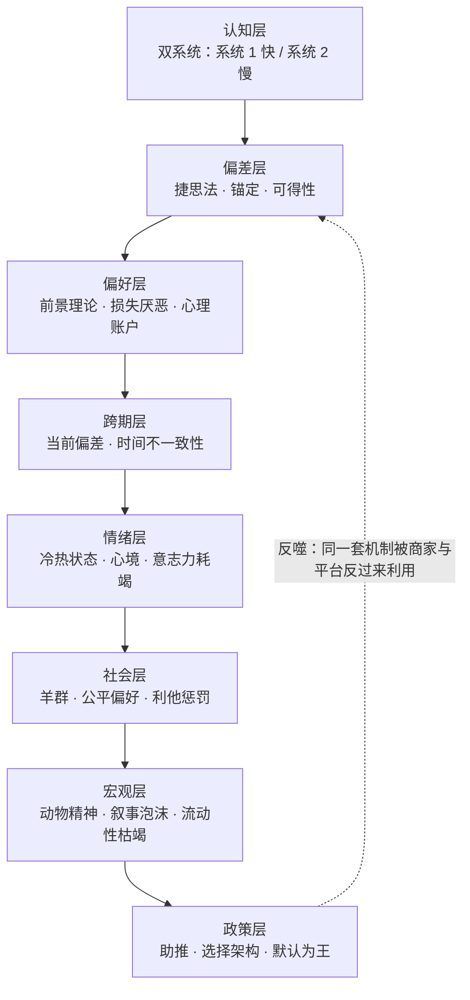

> [📚 总目录](./)　·　[下一篇 ➡️](01-有限理性-满意解-为什么明知要比价还是会随手拿.md)

---

> 📅 最后更新：2026-09-17 · 📖 **14 个主题** · 📝 约 4.9 万字 · ⏱️ 约 47 分钟 · 🌐 简体中文
> **一句话核心提炼：** 人类不是坏掉的计算机，而是一台用省电模式跑完全部人生的生存机器——所有「非理性」都是它在资源稀缺下的最优解。
> **我的思维演化：** 从「知道一堆偏差名词」变成「有一张可执行的摩擦力清单」——落点是一把可衡量的尺子：**每一笔冲动决策，能否被一条事先写好的规则拦下。24 条规则里，目前已产品化 6 条、迭代中 9 条、实践中 5 条、已内化 4 条。**

> [!NOTE]
> **这份笔记是什么：** 一份**决策训练存档**。原料是一条与 AI 的对练对话链——把《行为经济学》九章的核心概念逐一扔进生活化沙盘：每个概念配一个日常困境，作答后被推到极端，看见它怎么死。九章走完后转入实战：电商套路拆解、个人习惯助推设计、24 条行为金融风控规则、一个可嵌进 Agent 的决策审计模块。
> **这份笔记不是什么：** 不是原书摘要，不是投资建议，不是「理性万岁」的说教。它记录的是**我错在哪、被什么打醒、现在怎么做**。
> **两块结构，可分开读：** 每个主题严格切成两半——**📖 原书核心精髓**（不依赖下文，独立可读）与 **⚡ 我的演化与实践**（引用沙盘语境，标了可跳过的地方）。**第一次读，只看 📖 也完全成立。**
> **核验状态：** 引文与数据的置信度逐条标注，书目信息与核验来源见 [附录 B](C-附录B-书目信息与数据核验.md)。原书正文未逐页比对，该边界已写入 [方法论的边界与已知盲区](B-方法论边界与已知盲区.md)。

📑 目录（点开）

**向导**

- [🚪 先读这里：30 秒看懂这份笔记](00-导览-30秒看懂-术语急救包-演化地图.md)
  - [一、原书在讲什么](00-导览-30秒看懂-术语急救包-演化地图.md)
  - [二、这个「沙盘」是怎么玩的](00-导览-30秒看懂-术语急救包-演化地图.md)
  - [三、三个背景常识](00-导览-30秒看懂-术语急救包-演化地图.md)
  - [四、出场人物与概念归属速查](00-导览-30秒看懂-术语急救包-演化地图.md)
  - [五、全书九章一页速览](00-导览-30秒看懂-术语急救包-演化地图.md)
  - [🔤 一分钟术语急救包（28 条）](00-导览-30秒看懂-术语急救包-演化地图.md)
- [🧭 学习演化地图 (Evolution Roadmap)](00-导览-30秒看懂-术语急救包-演化地图.md)

**14 个主题**

- [01. 有限理性：为什么你明明要比价，最后还是随手拿了一包吐司](01-有限理性-满意解-为什么明知要比价还是会随手拿.md)
- [02. 挤出效应：为什么罚款一进来，迟到反而变多了](02-动机与激励-挤出效应-托儿所罚款为何让迟到更多.md)
- [03. 羊群效应：为什么空无一人的神店，你不敢进](03-羊群效应-资讯级联-排队越长的餐厅越好吃吗.md)
- [04. 可得性捷思：为什么看完空难新闻，你连飞机都不敢坐了](04-可得性捷思-空难新闻与密码为什么都是123456.md)
- [05. 锚定与诱饵：为什么「原价 1000、特价 300」让你心跳加速](05-锚定效应-诱饵效应-100规则-1000元原价是怎样骗你的.md)
- [06. 前景理论：为什么赔 100 元的痛，要赚 250 元才补得回](06-前景理论-损失厌恶-为什么赔钱的痛是赚钱两倍.md)
- [07. 心理账户：为什么中奖的钱花得像不是自己的钱](07-心理账户-横财与血汗钱-满500免运费为什么让你多花.md)
- [08. 时间不一致性：为什么年卡办了却只去了三次](08-时间不一致性-当前偏差-健身房年卡与限时肥料券.md)
- [09. 现状偏差与禀赋效应：为什么免费试用退不掉](09-现状偏差-禀赋效应-免费试用为何退不掉.md)
- [10. 冷热状态：为什么生气时下单，隔天就想退货](10-冷热状态-双系统-生气时下单为什么隔天就后悔.md)
- [11. 利他惩罚：为什么宁愿自己拿 0 元，也不让对方拿 900 元](11-社会偏好-利他惩罚-最后通牒博弈与报复性交易.md)
- [12. 动物精神：为什么历史总在制造同一种泡沫](12-动物精神-叙事泡沫-选美理论-郁金香与单边共识.md)
- [13. 助推与选择架构：为什么默认选项能决定你捐不捐器官](13-助推-选择架构-器官捐赠默认选项与熬夜助推闭环.md)
- [14. 行为审计：把 14 个偏差装进一个 Agent 的滤网](14-行为金融审计-24条规则-把偏差做成Agent滤网.md)

**附录与边界**

- [🧾 附录 A：24 条行为金融风控规则（可直接抄进 Agent）](A-附录A-24条行为金融风控规则.md)
- [⚠️ 方法论的边界与已知盲区](B-方法论边界与已知盲区.md)
- [📎 附录 B：书目信息与数据核验](C-附录B-书目信息与数据核验.md)
- [🧪 附录 C：16 题自测包与两张施工图](D-附录C-16题自测包与两张施工图.md)
- [🧩 收束：这份笔记真正改变的东西](Z-收束-这份笔记真正改变的东西.md)

---

# 🚪 先读这里：30 秒看懂这份笔记

### 一、原书在讲什么

**第一，传统经济学研究的是一台不存在的计算机。** 它假设你面对 20 种吐司会输入全部参数、算出每一分钱的最优解。但真实的人上了一天班、又累又饿，只会拿一包「看起来顺眼」的。这不是懒，是**有限理性**：大脑的处理能力、时间和精力都有硬上限，所以我们追求的不是最优解，是**满意解**。

**第二，被忽略的那一半不是「错误」，而是「省电」。** 捷思法、锚定、可得性、默认选项——这些机制在演化环境里都是高效的适应性策略，只是被现代市场的定价机制反过来收割：商家比亚马逊更懂你的捷思法，所以「大脑爱偷懒」直接等于「商家可定价」。

**第三，偏差的终点是宏观现象。** 个体的损失厌恶汇成机构的处置效应，群体的羊群效应急促流动性枯竭——1997、2008、每一次泡沫，都不是数学错了，是**人的系统性反应被定价机制放大**。所以最后一章落在公共政策：既然偏差是可预测的，就可以**设计选择架构**去对冲它。

**一条主线串起来：**

这张图是这份笔记的骨架：14 个主题按它从上往下排，附录 A 的 24 条规则则把它从下往上折回成可执行动作。

---

### 二、这个「沙盘」是怎么玩的

原料不是我的读书摘抄，是一条**与 AI 的对练对话链**。玩法固定为五步循环：

| 步骤 | 动作 | 我的收获 |
| :-- | :--- | :--- |
| **① 顺序推进** | 按九章章节顺序，一章一章走 | 有结构的积累，不是零散收藏 |
| **② 情境先行** | 每章先给一个生活情境（超市买吐司、幼儿园迟到、抛硬币……） | 概念挂在具体场景上，不挂在名词上 |
| **③ 概念落地** | 再点名背后的核心概念与提出者 | 知道这个洞见归谁、叫什么 |
| **④ 作答 + 被追问** | 做「小白测验」，作答；错就被打回，对就被追问到下一层 | **错判留痕——全篇最值钱的部分** |
| **⑤ 跨章抽测 + 实战转化** | 九章走完后综合抽测 5 题，再转成防套路清单、个人助推闭环、交易规则、Agent 模块 | 从知识变成可执行的摩擦力 |

> ⚠️ **两句免责**
> **一、** 本笔记中的全部生活情境（老张的吐司、迟到的家长、空荡荡的餐厅）、商业案例与交易场景，均为对话链中构造的教学示例或个人经验转述，**不指向任何真实主体**，不能作为事实陈述引用。
> **二、** 附录 A 的 24 条规则是**个人决策训练记录**，不是投资建议。它们的价值在于「逼你在冷状态把规则写死」，而不在于预测市场。

---

### 三、三个背景常识（缺了后面看不懂）

| # | 常识 | 为什么缺了看不懂 |
| :-- | :--- | :--- |
| **1** | **「理性」有两个意思** | 规范意义上「理性」= 逻辑上正确的最优解；描述意义上「理性」= 行为主体在自身约束下的自利选择。行为经济学不否定后者，只是指出前者作为**描述模型**不成立。搞混这两个词，会把整本书误读成「人都是蠢的」。 |
| **2** | **偏差 ≠ 智力缺陷** | 捷思法在信息稀缺、时间紧迫的环境里是最优策略（「看别人排队」比「自己试吃 20 家」便宜得多）。所谓偏差，是**旧环境的最优解**在**新定价机制**下的错配。所以对策不是「变聪明」，是**改环境**。 |
| **3** | **这本书是通识读本，不是教材** | 中译本正文 143 页（后附英文原文 137 页），九章从微观认知一路串到公共政策。它的价值是**给出完整图景与坐标系**，不提供严格的数学推导——想要形式化模型（如前景理论的参数估计），得另找文献。 |

---

### 四、出场人物与概念归属速查

| 人物 | 归属的概念 | 在本书的位置 | 置信度 |
| :--- | :--- | :--- | :--: |
| **赫伯特·西蒙** Herbert Simon | 有限理性、满意解 | 第一章 经济学与行为 | 高 |
| **丹尼尔·卡尼曼** Daniel Kahneman | 双系统、前景理论、损失厌恶、可得性、锚定、冷热同理心 | 第四、五、七章 | 高 |
| **阿莫斯·特沃斯基** Amos Tversky | 前景理论、捷思法与偏差（与卡尼曼合作） | 第四、五章 | 高 |
| **理查德·塞勒** Richard Thaler | 心理账户、禀赋效应、助推（与桑斯坦） | 第五、六、九章 | 高 |
| **凯斯·桑斯坦** Cass Sunstein | 助推、选择架构 | 第九章 | 高 |
| **约翰·梅纳德·凯恩斯** Keynes | 动物精神、选美比赛理论 | 第八章 | 高 |
| **罗伯特·席勒** Robert Shiller | 叙事经济学、非理性繁荣 | 第八章（延伸） | 高 |
| **乔治·洛温斯坦** George Loewenstein | 冷热同理心差距、情绪对决策的扭曲 | 第七章 | 高 |
| **保罗·斯洛维奇** Paul Slovic | 情感启发式 | 第四、七章 | 高 |
| **格尼齐 & 鲁斯蒂奇尼** Gneezy & Rustichini | 幼儿园罚款实验（挤出效应） | 第二章 | 高 |
| **比克钱达尼等** Bikhchandani et al. | 资讯级联 | 第三、八章 | 中 |
| **加里·克莱因** Gary Klein | 事前验尸法（Premortem） | 转化环节（非原书正文） | 中 |
| **弗雷德里克** Shane Frederick | 认知反身性测试（CRT，球棒与球） | 第七章相关 | 中 |
| **费尔 & 加希特** Fehr & Gächter | 利他惩罚、强互惠 | 第三章相关 | 中 |
| **杜弗洛 & 克雷默** Duflo & Kremer | 肯尼亚肥料券（限时助推） | 第六、九章相关 | 中 |

「位置」列指该概念在九章脉络中的落点；置信度标的是「概念归属到该学者」这一事实。标「中」的原因：这些人名与论文并非素材原文所载，是我在核验时补上的经典出处，具体年份与论文标题未逐一比对原书（详见 [附录 B](C-附录B-书目信息与数据核验.md)）。

---

### 五、全书九章一页速览

把九章压成五个范畴——**读完这一张表，整本书的地图就在手上了**，后面的 14 个主题只是把它拆开。

| 范畴 | 核心章节 | 学到的核心机制 | 一句话自检问题 |
| :--- | :--- | :--- | :--- |
| **基础与激励** 🧱 | 第一章、第二章 | 有限理性（大脑爱偷懒）、外在激励挤出内在动机（罚款反而让迟到变多） | 这个决策我在省力，还是在省力被利用？ |
| **社会与捷径** 👥 | 第三章、第四章 | 羊群效应（排队效应）、捷思法（可得性、锚定效应） | 我这个答案，是因为它正确，还是因为它好想起来？ |
| **决策与跨期** ⏳ | 第五章、第六章 | 前景理论与损失厌恶（赔钱比赚钱痛苦倍增）、时间不一致性与预先承诺 | 我现在处于收益区还是损失区？我的风险偏好被参考点调包了吗？ |
| **情绪与宏观** 🌊 | 第七章、第八章 | 双系统与冷热状态、动物精神与金融泡沫 | 我现在是冷状态还是热状态？这个价格由现金流决定，还是由「别人愿意出多少」决定？ |
| **实践应用** 🎯 | 第九章 | 助推理論与预设选项架构 | 这里的默认值是谁设的？我为我自己设的默认值是什么？ |

---

### 🔤 一分钟术语急救包（28 条）

点开：全部术语的大白话对照表

| 术语 | 大白话 | 一句话例子 |
| :--- | :--- | :--- |
| **有限理性** | 大脑有算力上限 | 20 种吐司只挑顺眼那包 |
| **满意解** | 够好就行，不求最优 | 找到第一包「还行」的就走 |
| **挤出效应** | 给钱把良心挤走了 | 罚款一收，迟到反而变多 |
| **内在动机** | 出于责任、道德、乐趣 | 不好意思让老师加班 |
| **外在动机** | 出于奖惩、认可、规定 | 迟到罚 10 块 |
| **羊群效应** | 别人干啥我干啥 | 排 30 分钟队那家更好吃 |
| **资讯性影响** | 把别人的选择当情报 | 「大家都在排，肯定好吃」 |
| **资讯级联** | 后面的人全放弃自己的私人情报 | 集体做出次优决策 |
| **捷思法（启发式）** | 脑子里现成的快捷规则 | 猜概率靠「想起来容不容易」 |
| **可得性捷思** | 容易想起 = 概率高 | 空难新闻后半年不敢坐飞机 |
| **锚定效应** | 第一个数字定调 | 原价 1000 → 特价 300 真便宜 |
| **调整不足** | 从锚点微调，调不到位 | 卖方开价永远偏高 |
| **诱饵效应** | 放个没人买的选项衬托主推款 | 中桶 180，显得大桶 190 超值 |
| **100 规则** | 低价用百分比、高价用绝对额 | 50 元说「8 折」，3 万说「省 6000」 |
| **前景理论** | 我们评估的是「相对于参考点的得失」 | 同一笔钱，标注「亏」还是「赚」感受不同 |
| **损失厌恶** | 亏的痛 ≈ 赚的爽的 2 倍以上 | 抛硬币赢输各 1000，多数人拒绝 |
| **反射效应** | 赚时怕风险，亏时赌一把 | 盈利就落袋，亏损就死扛 |
| **处置效应** | 卖赚留赔 | 赚 10% 先跑，跌 20% 等回本 |
| **心理账户** | 钱在心里分了户口本 | 加班费存起来，中奖钱花光 |
| **沉没成本谬误** | 为了不承认亏，继续投 | 电影难看也看完 |
| **承诺升级** | 为证明原决策没错而加码 | 跌了 30% 再补仓摊平 |
| **禀赋效应** | 拥有过就舍不得放 | 免费试用过的服务退不掉 |
| **现状偏差** | 保持原样最省力 | 自动续费就一直续 |
| **时间不一致性** | 远景有耐心，当下没定力 | 年初计划每周去三次 |
| **当前偏差** | 要眼前的，不要以后的 | 今晚追剧，明天再说 |
| **预先承诺** | 提前把未来的选择锁死 | 工资日自动扣款转定存 |
| **双系统** | 系统 1 快直觉 / 系统 2 慢理性 | 球棒与球，脱口而出 0.10 |
| **热状态 / 冷状态** | 情绪上头时决策质量崩塌 | 生气下单，隔天后悔 |
| **动物精神** | 凯恩斯说的冲动与乐观 | 郁金香、房价、股市 |
| **选美比赛理论** | 猜别人猜谁会赢，而非谁最美 | 投机是预测「别人的预测」 |
| **叙事经济学** | 故事本身能推动经济 | 「这次不一样」 |
| **助推（Nudge）** | 不禁止、不改价格，只改默认 | 默认同意捐献 → 同意率飙升 |
| **默认选项** | 不动就是同意 | 自动续约、自动加入养老金 |
| **概率权重函数** | 高估小概率、低估中高概率 | 怕坠机却不怕车祸 |

---
# 🧭 学习演化地图 (Evolution Roadmap)

> **怎么读这张表**：左列是主题，中间两列是「原书说什么」和「我改了什么」。**第一次读可以只看第 2、3 列**；第 4 列「目前状态」是我的执行进度，与理解内容无关。

| 章节/主题 | 🔑 原书核心精髓 (Author) | 💡 我的演化与实践 · 可迁移结论 (Me) | 目前状态 |
| :--- | :--- | :--- | :--- |
| [01 有限理性](01-有限理性-满意解-为什么明知要比价还是会随手拿.md) | 大脑算力、时间、精力都有硬上限，人不追求最优解，追求满意解 | **把「省力」当成设计变量，而不是道德缺陷**：与其要求自己更努力比价，不如把决策前置成一张清单 | ✅ 已内化 |
| [02 挤出效应](02-动机与激励-挤出效应-托儿所罚款为何让迟到更多.md) | 外在金钱激励会挤掉内在动机，且撤销后回不去 | **能用规则和认同解决的，别用钱解决**；一旦开了赏罚的口子，道德账户就被市场账户永久替换 | ✅ 已内化 |
| [03 羊群效应](03-羊群效应-资讯级联-排队越长的餐厅越好吃吗.md) | 信息不明时，他人的选择被当作情报；私人真实情报被放弃导致集体次优 | **先写下自己的独立判断再去看别人怎么做**；先看共识再看数据，等于没看数据 | 🔄 迭代中 |
| [04 可得性捷思](04-可得性捷思-空难新闻与密码为什么都是123456.md) | 用「记忆检索的难易度」代替「真实概率」 | **凡近期高频曝光的信息，判断前先打折**；报道密度是落后指标 | 🔄 迭代中 |
| [05 锚定与诱饵](05-锚定效应-诱饵效应-100规则-1000元原价是怎样骗你的.md) | 第一个数字成为心理基准，后续判断只是微调；无关选项能改变偏好 | **抹除历史坐标，只问现值与替代方案**：「如果它今天挂牌就是这个价，我买不买」 | ✅ 已内化 |
| [06 前景理论](06-前景理论-损失厌恶-为什么赔钱的痛是赚钱两倍.md) | 损失痛苦约为同等收益快乐的 2 倍以上；收益区规避风险、损失区偏好风险 | **进场前把止损写成机械单，而不是靠盘中的意志力**；亏损区的一切「再等等」都是反射效应在说话 | 🚀 已产品化 |
| [07 心理账户](07-心理账户-横财与血汗钱-满500免运费为什么让你多花.md) | 钱在心里按来源与用途分了户口本，彼此不可替代 | **所有资金使用同一套风险定价公式**；浮盈、横财、小额，一律与本金同权 | 🔄 迭代中 |
| [08 时间不一致性](08-时间不一致性-当前偏差-健身房年卡与限时肥料券.md) | 远期有耐心，当下没定力；对策是预先承诺，把选择范围锁死 | **把好行为的摩擦力降到零、坏行为的摩擦力拉到最高**；靠意志力失败过三次以上，就该上自动化 | 🚀 已产品化 |
| [09 现状偏差与禀赋效应](09-现状偏差-禀赋效应-免费试用为何退不掉.md) | 不动最省力；拥有过的东西估值虚高 | **每天问一次归零问题**：若今天手握等额现金，我还会以现价买入吗 | 🚀 已产品化 |
| [10 冷热状态](10-冷热状态-双系统-生气时下单为什么隔天就后悔.md) | 情绪与生理状态直接改写决策机制，热状态下系统 1 接管 | **热状态禁止一切不可逆动作**；把「延迟 24 小时」变成硬规则，不是建议 | 🔄 迭代中 |
| [11 利他惩罚](11-社会偏好-利他惩罚-最后通牒博弈与报复性交易.md) | 人愿自损以惩罚不公平；被不公平对待会触发厌恶中枢 | **市场没有公平、道德与恶意，只有价格**；禁止任何「赌气式」持仓与反手 | ⏳ 实践中 |
| [12 动物精神](12-动物精神-叙事泡沫-选美理论-郁金香与单边共识.md) | 凯恩斯：投资由冲动与乐观驱动；投机是预测别人的预测 | **单边共识即风险警号**；当「这次不一样」成为唯一叙事时，先减仓再思考 | 🔄 迭代中 |
| [13 助推与选择架构](13-助推-选择架构-器官捐赠默认选项与熬夜助推闭环.md) | 不改禁止、不改价格，改默认选项就能改变群体行为 | **给自己设计默认值**：不是靠决心，是把好的选项设成「不选就生效」 | 🚀 已产品化 |
| [14 行为审计](14-行为金融审计-24条规则-把偏差做成Agent滤网.md) | （综合）偏差可预测，因此可被外部化为一套检验流程 | **把 14 个偏差做成 Agent 的强制滤网**：决策前必须过一遍四类偏差触发条件 | 🚀 已产品化 |

**状态口径**：`✅ 已内化` = 已变成不需要提醒的条件反射；`🔄 迭代中` = 知道该做但会反复失手；`⏳ 实践中` = 新规则，刚开始强制执行；`🚀 已产品化` = 已写成脚本/清单/Agent 模块，不依赖当天状态。

注：这张表的第 4 列是我的执行进度，不是对原书内容的评价。第一次读可完全忽略。

---

# 🧠 深度拆解：精髓 vs 演化

> **这一章的读法**
> 每个主题固定两块：**📖 原书核心精髓**（不依赖上下文，独立成立）与 **⚡ 我的演化与实践**（引用沙盘语境，段的开头会标「可跳过」）。
> **时间有限的读法**：只读每节最上面的「📌 一句话说人话」，14 句话看完就是全书骨架。

---

> [📚 总目录](./)　·　[下一篇 ➡️](01-有限理性-满意解-为什么明知要比价还是会随手拿.md)
