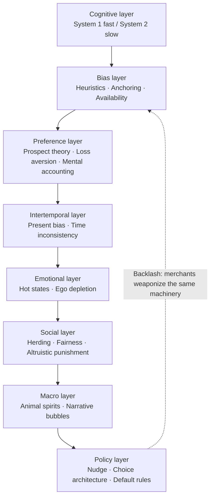

# 📘 Behavioural Economics · English Edition

**Notes on Michelle Baddeley's *Behavioural Economics: A Very Short Introduction* — 14 cognitive biases, all thrown into an AI wargame under extreme pressure. This is what survived.**

[🇨🇳 中文完整版（4.9 万字）](../README.md) · **English edition (condensed)** · [24 risk rules →](A-24-risk-rules.md)

---

## 🧨 The one-line core

**Humans are not broken computers — they are survival machines running their entire lives in power-saving mode.** Every "irrationality" is an optimal solution under scarcity. The trouble starts when modern markets reverse-engineer those shortcuts: merchants understand your heuristics better than you do, so *a lazy brain becomes a priceable brain*.

## 🤔 What this is

A **decision-training archive**, not a book summary. Every concept from the book was translated into a life-scale dilemma, answered, then pushed to its extreme so I could watch my own first instinct die. What survives is not 14 facts — it is **14 judgment rules**, plus a 24-rule risk pipeline distilled into an auditable agent filter.

Each topic page is split the same way:

| Block | What it contains |
| :--- | :--- |
| **What the book actually says** | The underlying mechanism, stripped to its load-bearing parts |
| **How it rewired my decisions** | What I first thought, what broke it, what I do now |
| **⚡ Transferable rule** | One sentence you can take without reading anything else |

> The Chinese edition is the **full archive** (49,000 characters, original wargame transcripts, all answer records including the wrong ones). This English edition is a **faithful condensed rewrite** — same 14 rules, same order, less detail.

## 🗂 The 14 rules

| # | Page | ⚡ Transferable rule |
| :--: | :--- | :--- |
| 01 | [Bounded rationality](01-bounded-rationality.md) | **Treat "effort-saving" as a design variable, not a moral flaw** — move high-stakes decisions out of in-the-moment judgment |
| 02 | [The crowding-out effect](02-crowding-out-fine.md) | **What rules and recognition can fix, don't fix with money** — a fine permanently swaps the moral account for the market account |
| 03 | [Herding & informational cascades](03-herding-informational-cascade.md) | **Write down your independent judgment before you look at the consensus** — after seeing the consensus, your "independent view" is only its echo |
| 04 | [The availability heuristic](04-availability-heuristic.md) | **Discount any recently high-frequency information before judging it** — reporting density is a lagging indicator |
| 05 | [Anchoring, decoys & the Rule of 100](05-anchoring-decoy-rule-of-100.md) | **Erase the historical price, ask only current value vs alternatives** — "down from 1000" and "worth 300" are unrelated questions |
| 06 | [Prospect theory & loss aversion](06-prospect-theory-loss-aversion.md) | **Write the stop-loss as a mechanical order before entry** — every "wait a bit longer" in the loss zone is the reflection effect talking |
| 07 | [Mental accounting](07-mental-accounting.md) | **Price every pool of money with the same risk formula** — windfalls, profits and small amounts get the same weight as core capital |
| 08 | [Time inconsistency & precommitment](08-time-inconsistency-precommitment.md) | **Drive the friction of good behaviors to zero and bad behaviors to maximum** — willpower is a consumable; friction is equipment |
| 09 | [Status-quo bias & the endowment effect](09-status-quo-bias-endowment-effect.md) | **Ask the zero-based question once a day** — "holding" and "buying at the current price" are the same trade |
| 10 | [Hot states & dual systems](10-hot-states-dual-systems.md) | **In a hot state, no irreversible actions** — the 24-hour delay is a hard rule, not advice |
| 11 | [Altruistic punishment & the ultimatum game](11-altruistic-punishment-ultimatum-game.md) | **The market has no fairness, morality or malice — only prices** — ban every spite-driven position |
| 12 | [Animal spirits & the beauty contest](12-animal-spirits-beauty-contest.md) | **A one-sided consensus is a risk alarm** — when "this time is different" becomes the only narrative, de-risk first, think second |
| 13 | [Nudges & choice architecture](13-nudge-choice-architecture.md) | **Design your own defaults** — not with resolve, but by making the good option "what happens if you do nothing" |
| 14 | [The behavioral audit](14-behavioral-audit-agent-filter.md) | **Turn the biases into a mandatory filter** — no order passes until it clears four classes of bias triggers |

## ❓ FAQ

<b>Why does a fine make people late more often?</b>

The Israeli daycare experiment (Gneezy & Rustichini): before the fine, arriving late was a **moral problem** ("I'm making the teachers work overtime"). After the fine, the same act was rewritten as a **market transaction** ("I paid for late pickup"). Once that reframing happens, removing the fine doesn't restore the guilt — lateness stays high. **Incentives change the nature of the behavior, not just its intensity.**

<b>Why did I get the availability question wrong?</b>

I narrowed "availability" to *probability estimation* and answered that using "123456" as a password isn't availability. It is — it's **retrieval substitution**: swapping a hard-to-get answer (a random string) for an easy-to-recall one. The corrected test question is: **"Is my answer right, or is it just easy to recall?"**

<b>What exactly is loss aversion worth?</b>

Roughly **2–2.5×**: the pain of a loss outweighs the pleasure of an equivalent gain (commonly cited λ ≈ 2.25). The deeper consequence is the **reflection effect** — risk preference isn't personality, it's a function of position: risk-averse in the gain zone, risk-seeking in the loss zone. The same person only needs a different reference point.

<b>Why do free trials refuse to be cancelled?</b>

A two-punch combo: the **endowment effect** (30 days of curated watchlists create a feeling of ownership — the trial's real product is ownership, not experience) plus **status-quo bias** (auto-renewal is the default, and doing nothing costs nothing). Fix: write the cancellation date into the calendar **at signup**, and treat renewal as a repurchase decision.

<b>What does the beauty contest say about markets?</b>

Keynes: the prize doesn't go to the face *you* find prettiest, but to the face *you think most people* will pick — and it recurses. So speculators price **other people's forecasts**, not intrinsic value. Markets can stay detached from fundamentals for a long time — that's not a malfunction, it's the game's rules.

<b>Is this AI-written?</b>

**Co-written with AI, and labeled as such.** The raw material is a single AI tutoring conversation; all scenarios are teaching fables, and the "how it rewired my decisions" parts record my real answers — including one wrong answer and one answer spoiled by a leaked label. Known blind spots are documented in the [methodology boundary](B-method-boundary.md).

<b>Can I use this?</b>

The notes (my decisions parts) are **CC BY-NC-SA 4.0**. Views and concepts from the book remain the property of Michelle Baddeley and her publishers; used here for study and commentary only.

## 🔍 If you searched for any of these

`Behavioural Economics Baddeley summary` · `Behavioural Economics Very Short Introduction notes` · `bounded rationality Herbert Simon satisficing` · `crowding out effect daycare fine experiment` · `Gneezy Rustichini fine late pickup` · `informational cascade restaurant queue` · `availability heuristic examples` · `anchoring effect decoy effect popcorn` · `rule of 100 pricing` · `prospect theory loss aversion explained` · `disposition effect selling winners` · `mental accounting windfall` · `free shipping threshold psychology` · `time inconsistency gym membership` · `precommitment device` · `Kenya fertilizer voucher Duflo` · `endowment effect free trial auto renewal` · `status quo bias job offer` · `hot-cold empathy gap impulse buying` · `cognitive reflection test bat and ball` · `ultimatum game rejection fairness` · `altruistic punishment insula` · `revenge trading rules` · `Keynes animal spirits beauty contest` · `tulip mania mansion` · `nudge organ donation opt out` · `default options retirement savings` · `behavioral finance risk rules for AI agent`

---

## ⚠️ Disclaimer

1. **All scenarios, companies and people** in the linked Chinese archive are AI-generated teaching fables with no real-world counterparts.
2. The wargame's "consequence simulations" are **persuasion-engineered** — good for training judgment, not usable as evidence.
3. Nothing here is investment advice. The 24 rules are a personal decision-training record, **untested against any backtest**.
4. "What the book says" blocks are **reverse-distilled** from wargame dialogues, not page-by-page quotations; verification status is in [Appendix C](C-bibliography-verification.md).

## 📄 License

- Notes (the decisions parts): [CC BY-NC-SA 4.0](https://creativecommons.org/licenses/by-nc-sa/4.0/)
- The book's views and concepts: © Michelle Baddeley and publishers

---

*The core insights belong to Michelle Baddeley. The faceplants belong to me.*

**If this helped, ⭐ the repo.**

