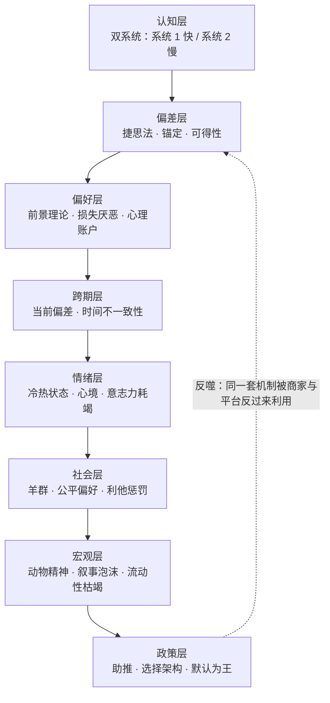

# 📘 《行为经济学》- 核心精髓与思维演化笔记

> 📅 最后更新：2026-09-17 · 📖 **14 个主题** · 📝 约 4.9 万字 · ⏱️ 约 47 分钟 · 🌐 简体中文
> **一句话核心提炼：** 人类不是坏掉的计算机，而是一台用省电模式跑完全部人生的生存机器——所有「非理性」都是它在资源稀缺下的最优解。
> **我的思维演化：** 从「知道一堆偏差名词」变成「有一张可执行的摩擦力清单」——落点是一把可衡量的尺子：**每一笔冲动决策，能否被一条事先写好的规则拦下。24 条规则里，目前已产品化 6 条、迭代中 9 条、实践中 5 条、已内化 4 条。**

> [!NOTE]
> **这份笔记是什么：** 一份**决策训练存档**。原料是一条与 AI 的对练对话链——把《行为经济学》九章的核心概念逐一扔进生活化沙盘：每个概念配一个日常困境，作答后被推到极端，看见它怎么死。九章走完后转入实战：电商套路拆解、个人习惯助推设计、24 条行为金融风控规则、一个可嵌进 Agent 的决策审计模块。
> **这份笔记不是什么：** 不是原书摘要，不是投资建议，不是「理性万岁」的说教。它记录的是**我错在哪、被什么打醒、现在怎么做**。
> **两块结构，可分开读：** 每个主题严格切成两半——**📖 原书核心精髓**（不依赖下文，独立可读）与 **⚡ 我的演化与实践**（引用沙盘语境，标了可跳过的地方）。**第一次读，只看 📖 也完全成立。**
> **核验状态：** 引文与数据的置信度逐条标注，书目信息与核验来源见 [附录 B](#appendix-b)。原书正文未逐页比对，该边界已写入 [方法论的边界与已知盲区](#boundary)。

<details><summary>📑 目录（点开）</summary>

**向导**

- [🚪 先读这里：30 秒看懂这份笔记](#guide)
  - [一、原书在讲什么](#g1)
  - [二、这个「沙盘」是怎么玩的](#g2)
  - [三、三个背景常识](#g3)
  - [四、出场人物与概念归属速查](#g4)
  - [五、全书九章一页速览](#g6)
  - [🔤 一分钟术语急救包（28 条）](#g5)
- [🧭 学习演化地图 (Evolution Roadmap)](#roadmap)

**14 个主题**

- [01. 有限理性：为什么你明明要比价，最后还是随手拿了一包吐司](#d01)
- [02. 挤出效应：为什么罚款一进来，迟到反而变多了](#d02)
- [03. 羊群效应：为什么空无一人的神店，你不敢进](#d03)
- [04. 可得性捷思：为什么看完空难新闻，你连飞机都不敢坐了](#d04)
- [05. 锚定与诱饵：为什么「原价 1000、特价 300」让你心跳加速](#d05)
- [06. 前景理论：为什么赔 100 元的痛，要赚 250 元才补得回](#d06)
- [07. 心理账户：为什么中奖的钱花得像不是自己的钱](#d07)
- [08. 时间不一致性：为什么年卡办了却只去了三次](#d08)
- [09. 现状偏差与禀赋效应：为什么免费试用退不掉](#d09)
- [10. 冷热状态：为什么生气时下单，隔天就想退货](#d10)
- [11. 利他惩罚：为什么宁愿自己拿 0 元，也不让对方拿 900 元](#d11)
- [12. 动物精神：为什么历史总在制造同一种泡沫](#d12)
- [13. 助推与选择架构：为什么默认选项能决定你捐不捐器官](#d13)
- [14. 行为审计：把 14 个偏差装进一个 Agent 的滤网](#d14)

**附录与边界**

- [🧾 附录 A：24 条行为金融风控规则（可直接抄进 Agent）](#appendix-a)
- [⚠️ 方法论的边界与已知盲区](#boundary)
- [📎 附录 B：书目信息与数据核验](#appendix-b)
- [🧪 附录 C：16 题自测包与两张施工图](#appendix-c)
- [🧩 收束：这份笔记真正改变的东西](#closing)

</details>

---

<a id="guide"></a>
## 🚪 先读这里：30 秒看懂这份笔记

### <a id="g1"></a>一、原书在讲什么

**第一，传统经济学研究的是一台不存在的计算机。** 它假设你面对 20 种吐司会输入全部参数、算出每一分钱的最优解。但真实的人上了一天班、又累又饿，只会拿一包「看起来顺眼」的。这不是懒，是**有限理性**：大脑的处理能力、时间和精力都有硬上限，所以我们追求的不是最优解，是**满意解**。

**第二，被忽略的那一半不是「错误」，而是「省电」。** 捷思法、锚定、可得性、默认选项——这些机制在演化环境里都是高效的适应性策略，只是被现代市场的定价机制反过来收割：商家比亚马逊更懂你的捷思法，所以「大脑爱偷懒」直接等于「商家可定价」。

**第三，偏差的终点是宏观现象。** 个体的损失厌恶汇成机构的处置效应，群体的羊群效应急促流动性枯竭——1997、2008、每一次泡沫，都不是数学错了，是**人的系统性反应被定价机制放大**。所以最后一章落在公共政策：既然偏差是可预测的，就可以**设计选择架构**去对冲它。

**一条主线串起来：**



<sub>这张图是这份笔记的骨架：14 个主题按它从上往下排，附录 A 的 24 条规则则把它从下往上折回成可执行动作。</sub>

---

### <a id="g2"></a>二、这个「沙盘」是怎么玩的

原料不是我的读书摘抄，是一条**与 AI 的对练对话链**。玩法固定为五步循环：

| 步骤 | 动作 | 我的收获 |
| :-- | :--- | :--- |
| **① 顺序推进** | 按九章章节顺序，一章一章走 | 有结构的积累，不是零散收藏 |
| **② 情境先行** | 每章先给一个生活情境（超市买吐司、幼儿园迟到、抛硬币……） | 概念挂在具体场景上，不挂在名词上 |
| **③ 概念落地** | 再点名背后的核心概念与提出者 | 知道这个洞见归谁、叫什么 |
| **④ 作答 + 被追问** | 做「小白测验」，作答；错就被打回，对就被追问到下一层 | **错判留痕——全篇最值钱的部分** |
| **⑤ 跨章抽测 + 实战转化** | 九章走完后综合抽测 5 题，再转成防套路清单、个人助推闭环、交易规则、Agent 模块 | 从知识变成可执行的摩擦力 |

> ⚠️ **两句免责**
> **一、** 本笔记中的全部生活情境（老张的吐司、迟到的家长、空荡荡的餐厅）、商业案例与交易场景，均为对话链中构造的教学示例或个人经验转述，**不指向任何真实主体**，不能作为事实陈述引用。
> **二、** 附录 A 的 24 条规则是**个人决策训练记录**，不是投资建议。它们的价值在于「逼你在冷状态把规则写死」，而不在于预测市场。

---

### <a id="g3"></a>三、三个背景常识（缺了后面看不懂）

| # | 常识 | 为什么缺了看不懂 |
| :-- | :--- | :--- |
| **1** | **「理性」有两个意思** | 规范意义上「理性」= 逻辑上正确的最优解；描述意义上「理性」= 行为主体在自身约束下的自利选择。行为经济学不否定后者，只是指出前者作为**描述模型**不成立。搞混这两个词，会把整本书误读成「人都是蠢的」。 |
| **2** | **偏差 ≠ 智力缺陷** | 捷思法在信息稀缺、时间紧迫的环境里是最优策略（「看别人排队」比「自己试吃 20 家」便宜得多）。所谓偏差，是**旧环境的最优解**在**新定价机制**下的错配。所以对策不是「变聪明」，是**改环境**。 |
| **3** | **这本书是通识读本，不是教材** | 中译本正文 143 页（后附英文原文 137 页），九章从微观认知一路串到公共政策。它的价值是**给出完整图景与坐标系**，不提供严格的数学推导——想要形式化模型（如前景理论的参数估计），得另找文献。 |

---

### <a id="g4"></a>四、出场人物与概念归属速查

| 人物 | 归属的概念 | 在本书的位置 | 置信度 |
| :--- | :--- | :--- | :--: |
| **赫伯特·西蒙** Herbert Simon | 有限理性、满意解 | 第一章 经济学与行为 | 高 |
| **丹尼尔·卡尼曼** Daniel Kahneman | 双系统、前景理论、损失厌恶、可得性、锚定、冷热同理心 | 第四、五、七章 | 高 |
| **阿莫斯·特沃斯基** Amos Tversky | 前景理论、捷思法与偏差（与卡尼曼合作） | 第四、五章 | 高 |
| **理查德·塞勒** Richard Thaler | 心理账户、禀赋效应、助推（与桑斯坦） | 第五、六、九章 | 高 |
| **凯斯·桑斯坦** Cass Sunstein | 助推、选择架构 | 第九章 | 高 |
| **约翰·梅纳德·凯恩斯** Keynes | 动物精神、选美比赛理论 | 第八章 | 高 |
| **罗伯特·席勒** Robert Shiller | 叙事经济学、非理性繁荣 | 第八章（延伸） | 高 |
| **乔治·洛温斯坦** George Loewenstein | 冷热同理心差距、情绪对决策的扭曲 | 第七章 | 高 |
| **保罗·斯洛维奇** Paul Slovic | 情感启发式 | 第四、七章 | 高 |
| **格尼齐 & 鲁斯蒂奇尼** Gneezy & Rustichini | 幼儿园罚款实验（挤出效应） | 第二章 | 高 |
| **比克钱达尼等** Bikhchandani et al. | 资讯级联 | 第三、八章 | 中 |
| **加里·克莱因** Gary Klein | 事前验尸法（Premortem） | 转化环节（非原书正文） | 中 |
| **弗雷德里克** Shane Frederick | 认知反身性测试（CRT，球棒与球） | 第七章相关 | 中 |
| **费尔 & 加希特** Fehr & Gächter | 利他惩罚、强互惠 | 第三章相关 | 中 |
| **杜弗洛 & 克雷默** Duflo & Kremer | 肯尼亚肥料券（限时助推） | 第六、九章相关 | 中 |

<sub>「位置」列指该概念在九章脉络中的落点；置信度标的是「概念归属到该学者」这一事实。标「中」的原因：这些人名与论文并非素材原文所载，是我在核验时补上的经典出处，具体年份与论文标题未逐一比对原书（详见 [附录 B](#appendix-b)）。</sub>

---

<a id="g6"></a>
### 五、全书九章一页速览

把九章压成五个范畴——**读完这一张表，整本书的地图就在手上了**，后面的 14 个主题只是把它拆开。

| 范畴 | 核心章节 | 学到的核心机制 | 一句话自检问题 |
| :--- | :--- | :--- | :--- |
| **基础与激励** 🧱 | 第一章、第二章 | 有限理性（大脑爱偷懒）、外在激励挤出内在动机（罚款反而让迟到变多） | 这个决策我在省力，还是在省力被利用？ |
| **社会与捷径** 👥 | 第三章、第四章 | 羊群效应（排队效应）、捷思法（可得性、锚定效应） | 我这个答案，是因为它正确，还是因为它好想起来？ |
| **决策与跨期** ⏳ | 第五章、第六章 | 前景理论与损失厌恶（赔钱比赚钱痛苦倍增）、时间不一致性与预先承诺 | 我现在处于收益区还是损失区？我的风险偏好被参考点调包了吗？ |
| **情绪与宏观** 🌊 | 第七章、第八章 | 双系统与冷热状态、动物精神与金融泡沫 | 我现在是冷状态还是热状态？这个价格由现金流决定，还是由「别人愿意出多少」决定？ |
| **实践应用** 🎯 | 第九章 | 助推理論与预设选项架构 | 这里的默认值是谁设的？我为我自己设的默认值是什么？ |

---

### <a id="g5"></a>🔤 一分钟术语急救包（28 条）

<details><summary>点开：全部术语的大白话对照表</summary>

| 术语 | 大白话 | 一句话例子 |
| :--- | :--- | :--- |
| **有限理性** | 大脑有算力上限 | 20 种吐司只挑顺眼那包 |
| **满意解** | 够好就行，不求最优 | 找到第一包「还行」的就走 |
| **挤出效应** | 给钱把良心挤走了 | 罚款一收，迟到反而变多 |
| **内在动机** | 出于责任、道德、乐趣 | 不好意思让老师加班 |
| **外在动机** | 出于奖惩、认可、规定 | 迟到罚 10 块 |
| **羊群效应** | 别人干啥我干啥 | 排 30 分钟队那家更好吃 |
| **资讯性影响** | 把别人的选择当情报 | 「大家都在排，肯定好吃」 |
| **资讯级联** | 后面的人全放弃自己的私人情报 | 集体做出次优决策 |
| **捷思法（启发式）** | 脑子里现成的快捷规则 | 猜概率靠「想起来容不容易」 |
| **可得性捷思** | 容易想起 = 概率高 | 空难新闻后半年不敢坐飞机 |
| **锚定效应** | 第一个数字定调 | 原价 1000 → 特价 300 真便宜 |
| **调整不足** | 从锚点微调，调不到位 | 卖方开价永远偏高 |
| **诱饵效应** | 放个没人买的选项衬托主推款 | 中桶 180，显得大桶 190 超值 |
| **100 规则** | 低价用百分比、高价用绝对额 | 50 元说「8 折」，3 万说「省 6000」 |
| **前景理论** | 我们评估的是「相对于参考点的得失」 | 同一笔钱，标注「亏」还是「赚」感受不同 |
| **损失厌恶** | 亏的痛 ≈ 赚的爽的 2 倍以上 | 抛硬币赢输各 1000，多数人拒绝 |
| **反射效应** | 赚时怕风险，亏时赌一把 | 盈利就落袋，亏损就死扛 |
| **处置效应** | 卖赚留赔 | 赚 10% 先跑，跌 20% 等回本 |
| **心理账户** | 钱在心里分了户口本 | 加班费存起来，中奖钱花光 |
| **沉没成本谬误** | 为了不承认亏，继续投 | 电影难看也看完 |
| **承诺升级** | 为证明原决策没错而加码 | 跌了 30% 再补仓摊平 |
| **禀赋效应** | 拥有过就舍不得放 | 免费试用过的服务退不掉 |
| **现状偏差** | 保持原样最省力 | 自动续费就一直续 |
| **时间不一致性** | 远景有耐心，当下没定力 | 年初计划每周去三次 |
| **当前偏差** | 要眼前的，不要以后的 | 今晚追剧，明天再说 |
| **预先承诺** | 提前把未来的选择锁死 | 工资日自动扣款转定存 |
| **双系统** | 系统 1 快直觉 / 系统 2 慢理性 | 球棒与球，脱口而出 0.10 |
| **热状态 / 冷状态** | 情绪上头时决策质量崩塌 | 生气下单，隔天后悔 |
| **动物精神** | 凯恩斯说的冲动与乐观 | 郁金香、房价、股市 |
| **选美比赛理论** | 猜别人猜谁会赢，而非谁最美 | 投机是预测「别人的预测」 |
| **叙事经济学** | 故事本身能推动经济 | 「这次不一样」 |
| **助推（Nudge）** | 不禁止、不改价格，只改默认 | 默认同意捐献 → 同意率飙升 |
| **默认选项** | 不动就是同意 | 自动续约、自动加入养老金 |
| **概率权重函数** | 高估小概率、低估中高概率 | 怕坠机却不怕车祸 |

</details>

---
<a id="roadmap"></a>
## 🧭 学习演化地图 (Evolution Roadmap)

> **怎么读这张表**：左列是主题，中间两列是「原书说什么」和「我改了什么」。**第一次读可以只看第 2、3 列**；第 4 列「目前状态」是我的执行进度，与理解内容无关。

| 章节/主题 | 🔑 原书核心精髓 (Author) | 💡 我的演化与实践 · 可迁移结论 (Me) | 目前状态 |
| :--- | :--- | :--- | :--- |
| [01 有限理性](#d01) | 大脑算力、时间、精力都有硬上限，人不追求最优解，追求满意解 | **把「省力」当成设计变量，而不是道德缺陷**：与其要求自己更努力比价，不如把决策前置成一张清单 | ✅ 已内化 |
| [02 挤出效应](#d02) | 外在金钱激励会挤掉内在动机，且撤销后回不去 | **能用规则和认同解决的，别用钱解决**；一旦开了赏罚的口子，道德账户就被市场账户永久替换 | ✅ 已内化 |
| [03 羊群效应](#d03) | 信息不明时，他人的选择被当作情报；私人真实情报被放弃导致集体次优 | **先写下自己的独立判断再去看别人怎么做**；先看共识再看数据，等于没看数据 | 🔄 迭代中 |
| [04 可得性捷思](#d04) | 用「记忆检索的难易度」代替「真实概率」 | **凡近期高频曝光的信息，判断前先打折**；报道密度是落后指标 | 🔄 迭代中 |
| [05 锚定与诱饵](#d05) | 第一个数字成为心理基准，后续判断只是微调；无关选项能改变偏好 | **抹除历史坐标，只问现值与替代方案**：「如果它今天挂牌就是这个价，我买不买」 | ✅ 已内化 |
| [06 前景理论](#d06) | 损失痛苦约为同等收益快乐的 2 倍以上；收益区规避风险、损失区偏好风险 | **进场前把止损写成机械单，而不是靠盘中的意志力**；亏损区的一切「再等等」都是反射效应在说话 | 🚀 已产品化 |
| [07 心理账户](#d07) | 钱在心里按来源与用途分了户口本，彼此不可替代 | **所有资金使用同一套风险定价公式**；浮盈、横财、小额，一律与本金同权 | 🔄 迭代中 |
| [08 时间不一致性](#d08) | 远期有耐心，当下没定力；对策是预先承诺，把选择范围锁死 | **把好行为的摩擦力降到零、坏行为的摩擦力拉到最高**；靠意志力失败过三次以上，就该上自动化 | 🚀 已产品化 |
| [09 现状偏差与禀赋效应](#d09) | 不动最省力；拥有过的东西估值虚高 | **每天问一次归零问题**：若今天手握等额现金，我还会以现价买入吗 | 🚀 已产品化 |
| [10 冷热状态](#d10) | 情绪与生理状态直接改写决策机制，热状态下系统 1 接管 | **热状态禁止一切不可逆动作**；把「延迟 24 小时」变成硬规则，不是建议 | 🔄 迭代中 |
| [11 利他惩罚](#d11) | 人愿自损以惩罚不公平；被不公平对待会触发厌恶中枢 | **市场没有公平、道德与恶意，只有价格**；禁止任何「赌气式」持仓与反手 | ⏳ 实践中 |
| [12 动物精神](#d12) | 凯恩斯：投资由冲动与乐观驱动；投机是预测别人的预测 | **单边共识即风险警号**；当「这次不一样」成为唯一叙事时，先减仓再思考 | 🔄 迭代中 |
| [13 助推与选择架构](#d13) | 不改禁止、不改价格，改默认选项就能改变群体行为 | **给自己设计默认值**：不是靠决心，是把好的选项设成「不选就生效」 | 🚀 已产品化 |
| [14 行为审计](#d14) | （综合）偏差可预测，因此可被外部化为一套检验流程 | **把 14 个偏差做成 Agent 的强制滤网**：决策前必须过一遍四类偏差触发条件 | 🚀 已产品化 |

**状态口径**：`✅ 已内化` = 已变成不需要提醒的条件反射；`🔄 迭代中` = 知道该做但会反复失手；`⏳ 实践中` = 新规则，刚开始强制执行；`🚀 已产品化` = 已写成脚本/清单/Agent 模块，不依赖当天状态。

<sub>注：这张表的第 4 列是我的执行进度，不是对原书内容的评价。第一次读可完全忽略。</sub>

---

## 🧠 深度拆解：精髓 vs 演化

> **这一章的读法**
> 每个主题固定两块：**📖 原书核心精髓**（不依赖上下文，独立成立）与 **⚡ 我的演化与实践**（引用沙盘语境，段的开头会标「可跳过」）。
> **时间有限的读法**：只读每节最上面的「📌 一句话说人话」，14 句话看完就是全书骨架。

<a id="d01"></a>
### 01. 有限理性：为什么你明明要比价，最后还是随手拿了一包吐司

> **📌 一句话说人话：** 决策质量的上限不是你的智力，是你的算力预算——所以真正该优化的不是「算得更准」，而是「把哪些决策从算力预算里挪出去」。
> **这一局对应原书第一章 经济学与行为。** 全书的起点：先打掉「理性人」这个假设，才谈得上后面八章。

#### 📖 原书核心精髓

- **传统经济学的「理性人」是一个计算器，不是一个人。** 它假设你面对货架上 20 种吐司，会读取全部重量、价格、热量、成分，算出每一分钱能换到的最优营养组合，甚至步行去隔壁三家超市比价——最后挑出理论上的「最优解」。
- **真实的人只做「够好」的选择。** 上了一整天班、又累又饿，你只会瞄一眼包装上印着「天然小麥」、看起来顺眼的牌子，拿了就走。你追求的不是最优，是**满意**。
- **赫伯特·西蒙（Herbert Simon）把这件事命名为有限理性（Bounded Rationality）。** 约束来自三处：① 大脑的记忆与信息处理能力有限；② 做决定的时间有限；③ 精力有限。因此真实决策的最优策略是**降低搜索成本**，而不是穷尽搜索。
- **关键推论：策略的「好」取决于环境，不取决于纯粹性。** 在信息廉价、时间昂贵的环境里，随手拿一包顺眼的吐司是**正确**的省电策略。它只在一种情况下失效——当你把这个习惯搬到手机资费、银行贷款、保险这些**高代价且不可逆**的决策上。

> **黄金金句：** > 「行为经济学正是把心理学、神经科学与社会学的真实人性，带入冷冰冰的经济学世界。」（转述自素材对话链，**置信度：中**——这是 AI 对原书立场的概括，非原书逐字引文。）

#### ⚡ 我的演化与实践

> **🎯 可迁移结论**：**把「省力」当成设计变量，而不是道德缺陷。** 因为要求自己「更努力地比较」是在跟算力预算硬碰硬，而把决策前置成清单是在绕过它。
> <sub>下面这段进入沙盘语境（第一章的作答）。与理解概念无关，可跳过。</sub>

- **认知盲点（Before）：** 我把「货比三家」当成一种品格。买贵了就是不够谨慎，是自制力问题——所以每次吃亏后的解决方案都是「下次一定要多比较」。
- **思维演化（After）：** 素材问「如果把这个习惯放到更重大的决定上会怎样」，我给出的答案不是「我会更努力」，而是**我在真实生活里就是这么栽的**：买了商家下了重本推销、包装吸引眼球、性价比不高的套餐。被打醒的点是——**商家非常清楚我大脑想偷懒，所以他们投入的不是产品，是包装**。吸睛度被我误当成了划算度。省力不是我的缺陷，是**他们的定价变量**。
- **第三层演化：** 既然「省力」会被定价，那正确的对策不是提高意志力，而是**把高风险决策从「临场判断」挪到「事前清单」**——临场判断永远输给已经算好的营销。

```text
决策分流算法（我现在的版本）

  这个决策可逆吗？
  ├─ 可逆、代价低（买吐司、点外卖）→ 走省力通道，随手选，不内耗
  └─ 不可逆、代价高（资费/贷款/保险/大额订阅）
       ↓ 强制进入清单通道
       ① 写下我真正要解决的问题是什么（不是商品名）
       ② 找出 2 个可替代方案（哪怕不打算选）
       ③ 问：商家在这个页面里最想让我看的是什么？
          → 答案通常不是价格，是包装、赠品、倒计时
       ④ 若无法用一句话说出「它比替代方案好在哪」→ 不买
```

<details><summary>📂 原始踩坑记录：那条性价比不高的套餐</summary>

**场景**：素材第一章的引导思考问——如果「凭感觉选最顺眼的」这个习惯，被搬到挑选手机资费、银行贷款或买保险上，会发生什么？

**我的作答**：我没有抽象回答，直接交代了自己真实的失败：「买了商家下了重本推销、包装很吸引眼球的、性价比不高的套餐。」

**对话链给出的机制解释**：商家非常清楚人类有「大脑想偷懒」的特性，因此投入高额营销费用包装外表，让消费者**误把「吸睛度」当作「划算度」**。

**被打回/被推进的部分**：没有被打回——但这个答案本身构成了整份笔记第一条规则的来源。它把「有限理性」从一个名词变成了一个**具体的、可重复的失效模式**：不是我不会算，是我把「谁的声音大」当成了「谁更划算」。

**留下的规则**：凡决策页面上出现「重本推销的视觉信号」（倒计时、加粗赠品、原价划线），进入清单通道，禁止当场决定。
</details>

---

<a id="d02"></a>
### 02. 挤出效应：为什么罚款一进来，迟到反而变多了

> **📌 一句话说人话：** 用钱去解决一个道德问题，会把道德问题变成市场交易——而市场交易是可以重复购买的，道德自責却只有一次。
> **这一局对应原书第二章 动机与激励。** 全章讲一件事：激励不是越多越好，给错类型的激励会让行为反向。

#### 📖 原书核心精髓

- **实验：以色列一家幼儿园的迟到罚款。** 园方为改善家长迟接孩子的问题，引入金钱惩罚。
  - **传统经济学的预测**：提高迟到的金钱成本 → 迟到的人一定变少。
  - **真实结果**：实施罚款后，**迟到人数大幅增加**；更关键的是，**取消罚款后迟到率也回不去了**。
- **机制：外在激励挤出内在动机（Crowding-Out Effect）。** 人的动机分两类：
  - **💖 内在动机**：责任感、道德、同理心、乐趣（「不好意思让老师加班」）。
  - **💰 外在动机**：金钱奖惩、社会认可、制度规定。
- **为什么不可逆？** 罚款出现之前，家长心里对「迟到」的解读是**道德问题**（我给别人添麻烦了）。罚款出现之后，同一件事被重写为**市场交易**（我花钱购买课后托管服务）。一旦这个解读完成，取消罚款并不能把道德解读装回去——它只会变成「服务突然不卖了」，而不是「我又欠了人情」。
- **一般化：** 这是行为经济学最锋利的一把刀——**激励的类型会改变行为的性质**。金钱激励对「可标准化的体力行为」有效，对「依赖道德、认同、创造力的行为」常常有毒。

> **黄金金句：** > 「一旦引进了罚款，家长心里对『迟到』这件事的解读发生了微妙的转变——从『内疚、对不起老师』变成『我付费购买课后托管服务』。」（转述自素材对话链，**置信度：中**。）

#### ⚡ 我的演化与实践

> **🎯 可迁移结论**：**能用规则和认同解决的，别用钱解决。** 因为一次赏罚就把账户性质换掉了——从「我是什么样的人」换成「这单值多少钱」，而后者永远可以重新议价。
> <sub>下面这段进入沙盘语境（第二章的作答）。可跳过。</sub>

- **认知盲点（Before）：** 我的默认解法是「加钱/加罚」。手下人做得不够好？加 KPI。自己坚持不下来？押金制。我把金钱当成万能的调压阀，认为它只会单调地强化行为。
- **思维演化（After）：** 我说出了一句反驳：**「花钱买服务，学校明码标价，这不是惩罚性费用。」** —— 这正是挤出效应发生的**那一刻的自我说服**。对话链确认了这一点：罚金被重新解读为「服务定价」。也就是说，**我不是被罚款改变的，我是被自己重新定价的那套说辞改变的**。真正被打醒的点是：**我会主动为已经发生的行为，编一个把道德问题降级为交易问题的合理性说明**。
- **第三层演化：** 挤出效应有一个隐蔽的对称面——**它也能被反过来用来「解除」心理负担**。这就是为什么「我付了钱」会让插队、爽约、拖延变得毫无心理成本。意识到这点的价值在于：以后当我说出「反正我付了钱」时，先停一秒，判断我是在**购买服务**，还是在**购买免责**。

```text
激励设计自检（用在自己和别人身上都成立）

  我要改善的行为，属于哪一类？
  ├─ 可标准化、结果可测、本身无聊（如数据录入）→ 外在激励有效，放心用钱
  └─ 依赖责任、认同、意义、创造（如照护、写作、研究、家庭分工）
       ↓ 加钱前先问三个问题
       ① 这件事现在被当事人理解为「道德/认同问题」还是「交易」？
          → 已是交易，加钱无妨；道德，加钱会把账户换掉
       ② 加钱之后，若我撤掉钱，行为会不会比以前更差？
          → 答案是「会」 → 这笔钱买的是短期租赁，不是长期改变
       ③ 有没有不花钱的替代手段？把行为的摩擦力调小、把默认值调对
          → 优先这个。改默认值不改价格，是回报率最高的一类干预
```

<details><summary>📂 原始踩坑记录：我那句「学校明码标价」</summary>

**场景**：幼儿园迟到罚款实验。素材问：为什么引入「罚款」后，迟到的人反而越来越多？

**我的作答**：我提出了一个为家长辩护的框架——「花钱买服务，学校明码标价，不是惩罚性的费用。」

**对话链的回应**：对话链没有纠正我，而是**印证**了这个说法正是机制本身。「原本家长迟到会觉得内疚、对不起老师，引进罚款后这种道德自責被消解了，变成了『我付费购买课后托管服务』的市场交易。」

**这条留痕为什么值钱**：它记录的不是「我不知道挤出效应」，而是**「我在被说服之前，就已经自己完成了把道德问题转成交易问题的那一步」**。这是我第一次在自己嘴里抓到这个机制，比在书里读到它有力得多。

**留下的规则**：当我说出「反正我付了钱 / 反正我已经买了」时，标记为一次挤出效应触发点，判断我是在买服务还是在买免责。
</details>

---
<a id="d03"></a>
### 03. 羊群效应：为什么空无一人的神店，你不敢进

> **📌 一句话说人话：** 当每个人都放弃自己的私人信息去跟随大众，群体就失去了纠错能力——**共识的形成过程，本身就是信息被销毁的过程**。
> **这一局对应原书第三章 社会生活。** 从「一个人怎么想」进入「一群人怎么想」，也是全书从微观转向群体心理的衔接点。

#### 📖 原书核心精髓

- **实验情境：陌生美食街上的两家餐厅。** A 餐厅店内空无一人；B 餐厅门口大排长龙、至少要等 30 分钟。结果是：**很多人饿着肚子也宁愿排 30 分钟，不敢踏入空荡荡的 A。**
- **传统经济学的假设**：每个人独立判断，不受他人行为影响。**现实**：这个假设在信息稀缺时第一个崩掉。
- **两条机制同时作用：**
  - **🐑 羊群效应（Herding）**：我们倾向于模仿大多数人的行为。
  - **🧠 资讯性影响 / 社会学习（Social Learning）**：信息不明时，我们把「别人的选择」当作可靠情报——「大家都在排队，这家肯定好吃」。排队本身**不产生任何新信息**，但它把「有人已经验证过」这个信号传递了下去。
- **致命的一步：资讯级联（Informational Cascade）。** 当排队足够长，后面的人会**直接读取队形、放弃自己手上的私人情报**。于是链条越往后，独立判断越少，整条链只剩下「前面有人」这一个信号。
- **负面后果：有价值的私人真实情报被埋没，群体集体走向次优甚至错误。** 注意——**排队本身不必然错**，羊群常常是对的（大众的选择确实常含信息）。真正致命的是**「放弃私人情报」这个动作**：一旦人人都这么做，市场就失去了唯一的纠错机制。

> **黄金金句：** > 「当每个人都放弃自己的真实情报、选择盲从群体时，群体反而会集体走向错误的判断。」（转述自素材对话链，**置信度：中**。）

#### ⚡ 我的演化与实践

> **🎯 可迁移结论**：**先写下自己的独立判断，再去看别人怎么做。** 因为顺序颠倒就等于没看数据——看过共识之后的「独立判断」只是共识的回声。
> <sub>下面这段进入沙盘语境（第三章测验）。可跳过。</sub>

- **认知盲点（Before）：** 我把「从众」理解成一个勇气问题——好像只要够叛逆、够独立思考，就能免疫。所以我以为自己不会犯这个错。
- **思维演化（After）：** 素材把情境做了极端化：一个外地朋友**私下向你保证** A 餐厅是隐藏版神店，干净又美味，只是刚开没名气。你走到现场，看着空无一人的 A 和排队的 B。题目问：「忽视自己掌握的私密真实情报、盲目跟大众」最容易造成什么后果？我选 B ——**有价值的私人真实情报被埋没，让群体集体做出次优甚至错误的决策**。答对了，但真正的收获在于**题目的设计逼我承认了羊群效应的核心不是「跟别人走」，而是「丢掉自己手上的东西」**。
- **第三层演化：** 于是对策跟着变了。反从众（故意去空店）是另一种放弃信息——它等于无视「排队可能真的含信息」这一条。真正的对策是**把私人情报在接触共识之前固定下来**：先写下判断，再去看市场，最后比较两者。差异本身就是最有价值的信号。

```text
反羊群作业流程（改造自：我自己在选标的/选供应商/选方案时的实际做法）

  Step 1 · 隔离     在看到任何外部意见之前，先写下自己的判断与理由
                    → 工具：一行字即可，但必须有「理由」那一栏
  Step 2 · 采集     再看共识（社群热度、机构观点、同行选择）
  Step 3 · 求差     我的判断 vs 共识
        ├─ 一致 → 无边际信息，注意：我可能只是在复述共识
        └─ 不一致 → 差异点在哪？是数据不同，还是解读不同？
  Step 4 · 定级     差异来自「我掌握别人没有的私人情报」？
                    → 有 → 这是超额收益的来源，加大验证力度
                    → 没有，只是直觉 → 视为噪声，服从共识或放弃决策
  Step 5 · 反向     强制找出一条「共识可能才是对的」的理由
                    → 找不到 → 说明我没读懂共识，不是共识错了
```

<details><summary>📂 原始踩坑记录：排队 30 分钟的 B 餐厅，与那位外地朋友的私密情报</summary>

**场景**：第三章测验。外地朋友私下极力保证 A 餐厅是隐藏版神店（干净又美味，只是刚开没名气），但你到现场看到 A 空无一人、B 大排长龙。

**问题**：在行为经济学中，「忽视自己掌握的私密真实情報、盲目跟随大众选择」最容易造成哪种负面后果？

**我的作答**：**B。**「有价值的私人真实情报被埋没，让群体集体做出次优甚至错误的决策。」

**对话链的确认**：「这就是羊群效应带来的负面外部性：当每个人都放弃自己的真实情报、选择盲从群体时，群体反而会集体走向错误的判断。」

**没有被惩罚的一次**——这是九道测验里我少数一次第一遍就答对的。它的价值不在分数，而在于**题目帮我把「羊群效应」的定义从「跟风」校正成了「销毁私人情报」**。前者是个道德评价（跟风不好），后者是个机制描述（共识形成会销毁信息）。只有后者能推出可执行的对策。

**留下的规则**：任何重要决策，先在纸上（或文件里）写下自己的判断，再去看外部意见。顺序不可颠倒。
</details>

---

<a id="d04"></a>
### 04. 可得性捷思：为什么看完空难新闻，你连飞机都不敢坐了

> **📌 一句话说人话：** 我们估算概率的方式，不是查统计，而是「这件事在我脑子里有多容易想起来」——而媒体报道的密度决定了好不好想起来。
> **这一局对应原书第四章 快速思考。** 全章的母题是：大脑为了省算力，用一堆快捷规则替代了真正的概率计算。

#### 📖 原书核心精髓

- **捷思法（Heuristics，启发式）**：为了节省大脑运算资源，我们广泛使用简单直觉的规则替代严格计算。它们**大多数时候是对的**——省下的算力本身就是收益。
- **可得性捷思（Availability Heuristic）**：评估某件事发生的机率时，我们依赖这件事在记忆中「被检索到的难易度」。
  - 刚刚看完一則严重的空难新闻 → 空难记忆极其鲜活 → 主观概率被严重高估 → 连续几个月不敢坐飞机，宁可开长途车（而车祸风险统计上高得多）。
  - 密码设成「123456」或「password」→ 因为这些词最容易从记忆里跳出来。
  - 一直不换电信公司 → 因为熟悉的经验最容易调用。
- **反面判据（这条最重要）**：**刻意收集五年理赔数据、冷靜计算最优保险方案，恰恰不属于捷思法**——它需要大量认知资源，是系统 2 的产物。
- **推论：** 可得性偏差的方向由**曝露结构**决定，而不是由事实决定。媒体不是中性的概率告知者，它是**概率扭曲器**：报道密度与实际发生频率无关，只与新闻价值有关。

> **黄金金句：** > 「可得性捷思法：大脑以检索记忆的难易度来评估事件发生机率，近期被频繁报道的资讯会被赋予不合理的权重。」（转述自素材对话链，**置信度：中**；概念归属 Tversky & Kahneman，**置信度：高**。）

#### ⚡ 我的演化与实践

> **🎯 可迁移结论**：**凡近期高频曝光的信息，在进入判断之前先打折。** 报道密度是落后指标——它反映的是已经发生的价格推动，不是未来的期望回报。
> <sub>下面这段进入沙盘语境（第四章测验，含一次真实的答错记录）。可跳过。</sub>

- **认知盲点（Before）：** 我以为自己懂「可得性」——不就是「被新闻带着走」吗？所以我以为识别它的方法就是问「这是不是新闻热点」。
- **思维演化（After）：** 我答错了。题目问：「下列哪一个日常生活现象，**最不属于**可得性捷思的展现？」选项里 A（空难后不敢坐飞机）、B（用 123456 当密码）、D（习惯性续约老电信商）都是可得性；C（收集五年理赔数据、冷靜计算最适合的保险方案）不是。
  **我选了 B。** 我的推理是：设密码更像「懒」，不像「概率估计」，所以我认为它不属于可得性。
  **对话链把我打回了**，而且用了一句很直接的英文：*"That is not quite it."*（这次打回同时暴露了另一个问题——回应忽然切成英文，我不得不自己把它读回去）。
  **我真正错在哪：** 我把可得性捷思窄化成了「**估算概率**」这一种用途。但它是一类**检索式替代**——凡是「用一个容易想起来的答案替代一个难得到的答案」都算。设 123456 是用「容易想起的字符串」替代「该安全性该有的随机字符串」，机制完全相同。
- **第三层演化：** 判据被修正了。识别可得性偏差不该问「这是不是热点」，而该问：**「我现在这个答案，是因为它正确，还是因为它好想起来？」**  这个问题在概率之外同样有效——密码、供应商、方案、人名，全都适用。

```text
可得性自检三问（贴在判断前）

  ① 我这个数字/结论，来自统计还是来自记忆？
     → 来自记忆 → 标记「可得性风险：高」
  ② 我最近一周在几个渠道见过这个话题？
     → 密度高 → 打折，且要问：这些渠道是不是互相引用同一个源
  ③ 反向检验：如果这件事从没被报道过，我还会给出同样的估计吗？
     → 不会 → 说明我的估计是报道的函数，不是事实的函数
```

<details><summary>📂 原始踩坑记录：我为什么把「123456」当成不是可得性</summary>

**场景**：第四章测验。题目问：下列哪一个日常生活现象，**最不**属于「可得性捷思」的展现？

- A. 看完空难新闻后连续几个月不敢坐飞机，宁可靠更高的车祸风险改开长途车
- B. 为了省事，在所有网站都用「123456」或「password」当密码，因为脑中最先跳出这些字词
- C. 仔细蒐集五年内各家保险公司的理赔率与精算统计数据，冷靜计算出最适合自己的保险方案
- D. 很久没换过手机电信公司，知道别家有优惠，但因为习惯了现在这家，脑中最先调用的熟悉经验继续续约

**我的作答（错误）**：**B。** 我的理由：设密码更像「省事、懒惰」，不像在估算概率，所以应该不属于可得性。

**对话链的打回（原文）**：

> *"That is not quite it. Option B describes a situation where someone sets their password to '123456' simply because it easily pops into their head. That is a textbook example of the availability heuristic."*

**改答**：**C。**

**对话链的确认**：「選項 C 描述的是传统经济学所假设的『全面蒐集数据、精确计算概率』，需要耗费大量认知资源，而不是依赖直觉的捷思法。」

**这次答错的具体价值——它暴露的是一个概念窄化**：

| | 我原本的理解 | 修正后的理解 |
| :--- | :--- | :--- |
| 可得性捷思是什么 | 一种「估算概率」时的偏差 | 一类「用容易检索的答案替代难得到的答案」的机制 |
| 适用场景 | 风险判断（坐飞机、买保险） | 也包括字符串选择、经验调用、习惯延续 |
| 识别方法 | 问「这是不是新闻热点」 | 问「这个答案是因为它正确，还是因为它好想起来」 |

**附带暴露的第二个问题**：这次回应忽然从繁体中文切成英文。打回是对的，但**语言切换让我在「读懂我为什么错」这件事上多付了一次成本**。这条已写进 [边界与盲区](#boundary)。

**留下的规则**：可得性 ≠ 概率偏差。凡「答案的来源是记忆而非统计」，即命中可得性，无论场景看起来多不像。
</details>

---

<a id="d05"></a>
### 05. 锚定与诱饵：为什么「原价 1000、特价 300」让你心跳加速

> **📌 一句话说人话：** 第一个进入视野的数字会变成你判断的尺子——而尺子是被别人挑好递过来的，所以定价的第一步是给你一个锚，不是给你一个价。
> **这一局对应原书第四章 快速思考（捷思法的第二部分）。** 与可得性并列的另一种主力快捷方式：以参照点为起点做微调。

#### 📖 原书核心精髓

- **实验情境：两个标价相同的保温瓶。**
  - A 商家：标价 300 元，文案「实用简约，现货供应」。
  - B 商家：原价 1000 元，限时下杀 3 折，特价 300 元。
  - 品质相同、最终付出的金额完全相同。但大多数人看到 B 会心跳加速，觉得「买到赚到」、担心错过。
- **机制：锚定与调整（Anchoring and Adjustment）。** 最先接收到的数字或信息成为心理上的「锚点」，之后的判断都以此为基准微调，**且微调幅度不足**。B 商家的「1000」就是那个锚：它不参与计算，只参与**感受**。
- **第二个机制：诱饵效应（Decoy Effect），也叫不对称优势效应。** 电影院的爆米花：
  - 只有「小桶 100 / 大桶 190」→ 不少人觉得大桶贵，选小桶。
  - 加入「中桶 180」→ 原本选小桶的人纷纷改买 190 的大桶。
  - **180 的中桶几乎没人买，它的存在只是为了让 190 显得便宜**。它把比较的战场从「100 vs 190」改成了「180 vs 190」，于是「只多 10 元就升级」的划算感被凭空制造出来。
- **第三个机制：框架效应与 100 规则（Rule of 100）。** 同样省 200 元：
  - 单价低于 100 元时（一杯 50 元的饮料），标「打 8 折」比「省 10 元」更吸引人。
  - 单价高于 100 元甚至上万时（30000 元的笔电），标「现折 6000 元」比「打 8 折」更令人心动。
  - 原因不是理性权衡，是**大脑在快速浏览时被「数值的绝对值」吸引**：6000 的震撼力远大于 20。
- **把三条串起来：** 定价不是在被问「值不值」，而是在被问「**跟谁比**」——而比较对象是卖方布置的。这就是为什么「便宜」几乎总是一个被设计出来的感受。

> **黄金金句：** > 「179 元的中桶并不是真的要卖给你，它的存在纯粹是为了衬托 190 元的大桶有多便宜。」（转述自素材对话链，**置信度：中**；原素材中的例子为 180 元中桶。）

#### ⚡ 我的演化与实践

> **🎯 可迁移结论**：**抹除历史坐标，只问现值与替代方案。** 因为「从 1000 跌到 300」与「值不值 300」是两个互不相干的问题，前者是锚点问题，后者才是定价问题。
> <sub>下面这段进入沙盘语境（第四、五章测验 + 电商拆解）。可跳过。</sub>

- **认知盲点（Before）：** 把划线价当成「参考信息」。我以为自己不会信「原价 1000」，我只是「顺便看看」。所以我对锚定效应的免疫感很强。
- **思维演化（After）：** 两道题把我拆了。
  **第一道**（保温瓶）：我选 B ——「作为诱饵/锚点，让大桶显得只要多花 10 元就能升级」，答对了，说明我能**在别人的设计里**认出锚定。
  **第二道**（100 规则）：问商家为什么用「100 规则」，我选 A ——「数字绝对值看起来更大，大脑直觉觉得折扣更惊人」，也答对了。
  但真正的转折在于**【实战反思】环节**：素材让我回想一次自己被套路的消费。我举的是**淘宝「顺手买一件」**——付款页顺带推荐一件打折小东西，很容易就买下杯子、垃圾袋这些其实不缺的东西。
  对话链把这件事拆成了**三层偏差叠加**，而这三层里**没有一层是我「信了假原价」**：
  ① **锚定**：原价 30 元的杯子划线标「换购价 9.9」→ 9.9 显得极便宜；
  ② **心理账户**：主订单已经 300 元，「再多个 9.9 根本不算什么」——痛感几乎为零；
  ③ **热状态 + 系统 1**：付款页有倒计时、人急着结账，来不及问「我家到底缺不缺垃圾袋」。
- **第三层演化：** 我原本的反锚定动作是「不相信划线价」。但这三层拆解说明**这只是三分之一的对策**——真正的漏洞在我把「主订单已很大」当成了理由。所以对策从「怀疑原价」升级成「**情境剥离**」：把附加商品拎出来单独问一句——**「如果它单独挂在首页卖 9.9，我会专门点进去买吗？」** 答案通常是否，而这一问的作用是把小商品从大订单的心理账户里强行拔出，唤醒系统 2。

```text
反锚定 + 反诱饵检查表（购物与采购通用）

  【进场前】
  □ 我的预算是多少？——在看任何标价之前先定
  □ 我要解决的问题是什么？——写问题，不写商品名

  【看到标价时】
  □ 划线价/原价/参考价 → 一律视为销售话术，不作为信息
  □ 问：如果这个东西今天挂牌就是这个价（无任何对比），我买不买？
  □ 问：商家在我眼前放了几个选项，其中哪一个「几乎没人会买」？
     → 那个就是诱饵，它是用来定义「划算」的

  【结账页（最高危场域）】
  □ 出现「顺手买 / 凑单 / 换购」→ 情境剥离一问：
     「如果它单独出现在首页，我会点进去吗？」
  □ 出现倒计时 → 视为热状态信号，禁止当场决定不可逆支出
  □ 问：这 9.9 是不是被我并进了「已经花了很多」的账户？
```

<details><summary>📂 原始踩坑记录：淘宝「顺手买一件」与那杯 9.9 的杯子</summary>

**场景**：第五章「生活防套路指南」的实战反思环节。素材要求：回想一次最近网购/外送/逛街时，事后发现自己掉进「思考捷径」陷阱的消费。

**我的作答**：「淘宝推出的在我付款时说顺手买一件的广告位置，显示打折力度很大，很容易买了很多小东西，杯子、垃圾袋等等。」

**对话链的拆解（三层偏差叠加）**：

| 层 | 机制 | 在这个场景里的具体形态 |
| :-- | :--- | :--- |
| 1 | **锚定效应** | 原价 30 元的杯子，画上删除线标「换购价 9.9 元」→ 9.9 立刻显得极便宜 |
| 2 | **心理账户** | 主订单已花 300 元，大脑觉得「再加个 9.9 根本不算什么」，痛感几乎为零 |
| 3 | **热状态与系统 1** | 付款页有倒计时、人急着完成结账，来不及理性思考「我家到底缺不缺垃圾袋」 |

**对话链给出的两个对策方向**：**破除锚点**（把「换购价」还原成「真实需求」看待）与**重设摩擦力**（在付钱的瞬间人为制造一点犹豫时间）。

**随后的选择题**：下一次遇到「顺手买一件」时，哪种自我对话最能切回系统 2？
A.「只要 9.9，用不到送人也划算。」
B.「如果这件商品单独挂在首页卖 9.9，我还会专门点进去掏钱买它吗？」
C.「反正快递顺路送来，不买好像浪费了这个运费额度。」

**我的作答**：**B。正确。** 对话链把 B 命名為「**情境剥离**」：它把这个小商品从几百元的大订单中强行拉出来，不再让大脑觉得「只是顺便花点零头」。

**留下的规则**：凡在**结账那一刻**出现的附加购买，一律执行情境剥离一问。选 A 和 C 都不是在对策，而是在替冲动找借口（它们强化的是「不买可惜」的损失厌恶）。
</details>

---
<a id="d06"></a>
### 06. 前景理论：为什么赔 100 元的痛，要赚 250 元才补得回

> **📌 一句话说人话：** 人不是按「最终财富多少」做决定，而是按「相对某个参考点是赚还是亏」做决定——参考点一变，同一个结果就从「可接受」变成「不可接受」。
> **这一局对应原书第五章 风险选择。** 全书最重要的一章：它给了「偏差」一个可计算的形式（价值函数 + 概率权重函数）。

#### 📖 原书核心精髓

- **实验情境：抛硬币打赌。** 正面赢 1000 元，反面输 1000 元。期望值为 0，理性人若不特别排斥风险，接受度应在一半一半。**但绝大多数人果断拒绝。**
- **丹尼尔·卡尼曼与阿莫斯·特沃斯基的前景理论（Prospect Theory）给出两个核心组件：**
  - **📉 损失厌恶（Loss Aversion）**：面对损失的痛苦感，远大于获得同等收益的快乐感——素材给出的倍数是**痛苦约为快乐的 2 到 2.5 倍**（**置信度：中**；学界常用的估计值约 λ≈2.25，量级一致）。
  - **🎯 反射效应（Reflection Effect）**：面对收益时我们「见好就收」（规避风险）；面对损失时反而「孤注一掷」（寻求风险），只为不承担确定的损失。
- **为什么这条比「怕亏」深刻得多？** 因为它说明**风险偏好不是性格，是位置的函数**。同一个人，在盈利区间是风险厌恶者，在亏损区间是风险爱好者——**你不需要改变性格，只需要改变参考点**。
- **直接推论：处置效应（Disposition Effect）。** 这个机制在投资上的表现就是「卖赚留赔」：赚了 10% 急着落袋（收益区规避风险），亏了 20% 死扛甚至加码（损失区寻求风险）。
- **深层原因：不卖就不算亏。** 只要不平仓，账面亏损就还是「浮动」的、未被结算的；一旦卖出，就必须在心理上切实践行「我错了」并承受那份痛苦。**持有是一种记账上的拖延术。**

> **黄金金句：** > 「在投资市场中，只要不卖出，心理上就可以骗自己『还没真正赔钱』；一旦卖出，就必须在心理上切实承认并承受那份巨大的痛苦。」（转述自素材对话链，**置信度：中**。）

#### ⚡ 我的演化与实践

> **🎯 可迁移结论**：**进场前就把止损写成机械单，而不是指望盘中的意志力。** 因为亏损区的一切「再等等」「再看看」都不是判断，是反射效应在替你做决定。
> <sub>下面这段进入沙盘语境（第五章测验 + 后续交易规则转化）。可跳过。</sub>

- **认知盲点（Before）：** 我把「死扛」理解为技术问题——判断错了趋势，或者仓位太重扛不住波动。所以我以为解法是「提高胜率」和「控制仓位」。
- **思维演化（After）：** 第五章测验里，我一次答对了：「买股票后一路下跌，即使基本面变差，投资人依旧死不认赔卖出，甚至不断加码摊平，只希望奇蹟回本」——**由损失厌恶驱动**。这次答对让我以为我懂了。但**真正的转折发生在后面把 20 条规则逐条解析的时候**：对话链指出「摊平」的本质是**承诺升级（Escalation of Commitment）**——不是判断趋势错了，而是**为了证明先前决策没错，持续投入资源以推迟确认心理痛苦**。
  这个区分极其重要：如果摊平是判断问题，那它可以用「更准的判断」治；如果它是**推迟痛苦的记账术**，那就只能用**外部机制**治。
- **第三层演化：** 止损因此不该被理解成「风险控制参数」，而该被理解成**记账结算的强制执行**。这也是为什么「止损视作进货成本」这条规则在长期最难做到却最有价值——它在重写框架：把「我判断失败」换成「做生意的必要损耗」。**改变的是参考点，不是改变性格。**

```text
亏损区的三条硬规则（已产品化，不依赖当天状态）

  规则 A · 事前绑定
    开仓指令发出的同时，同步设置不依赖人工作业的条件止损单
    → 严禁盘中手动取消。理由：取消这个动作发生时，你正处于损失区（寻求风险状态）

  规则 B · 每日归零问题
    每天盘前问一次：「如果我今天手握等额全现金，是否愿意以现价买入这档持仓？」
    → 答案否 → 立即市价减仓或清仓
    理由：持有现有部位与以现价买入，承担完全相同的机会成本

  规则 C · 摊平禁令
    部位出现亏损时，除原本在左侧网格计划内的加仓外，
    严禁任何为拉低均价的加仓
    → 判据：「这次加仓，是为了拉低均价，还是因为出现了计划中的信号？」
```

<details><summary>📂 原始踩坑记录：那道「死不认赔」的选择题，以及后来才发现它不够深</summary>

**场景一 · 第五章测验**：下列哪一个生活现象，主要是由「损失厌恶」所驱使？

- A. 买股票后一路下跌，即使基本面变差，依旧死不认赔卖出，甚至不断加码摊平，只希望奇蹟回本
- B. 便利商店第 2 件饮品 6 折，立刻买两瓶，即使喝不完
- C. 走进服饰店，因为店员热情倒茶聊天，不好意思不买就离开
- D. 为了防止睡过头，买了一个会在地板上乱跑的滚轮闹钟

**我的作答**：**A。正确。**

**对话链的确认**：「在投资市场中，只要不卖出，心理上就可以骗自己『还没真正赔钱』；一旦卖出，就必须在心理上切实承认并承受那份巨大的痛苦。」

**场景二 · 20 条规则逐条解析（这一层才是真正的收获）**：对话链把「摊平」重新归因为**承诺升级（Staw）与损失厌恶**：

> 「为了证明先前决策非错误，持续投入资源以推迟确认心理痛苦。走势持续破底通常意味着市场存在未被你知晓的负面信息，盲目摊平只会呈指数级放大非对称下行风险。」

**为什么第二层比第一层值钱**：第一层只告诉我「死扛是损失厌恶」，它推出的对策是「别死扛」（等于没说）。第二层告诉我死扛是**一台推迟痛苦的机器**，它推出的对策是**把结算动作外部化——用机械止损单在冷状态下把未来的痛苦一次性锁死**。

**留下的规则**：止损单不是风控参数，是**记账强制执行**。开仓即绑定，盘中不得取消。
</details>

---

<a id="d07"></a>
### 07. 心理账户：为什么中奖的钱花得像不是自己的钱

> **📌 一句话说人话：** 钱在账面上是完全可替代的，但在你脑子里分了户口本——同一个 3000 元，从哪个账户来，决定了你花不花、心不心疼。
> **这一局对应原书第五章 风险选择（延伸）。** 由理查德·塞勒提出，是损失厌恶在「钱怎么分类」这件事上的直接应用。

#### 📖 原书核心精髓

- **实验情境：两笔同样 3000 元。**
  - 刮刮乐意外中奖 3000 元 → 当晚毫不心疼地请朋友吃大餐，一口气花光。
  - 隔周辛苦加班领到同样 3000 元加班费 → 舍不得乱花，小心翼翼存进银行。
  - 客观购买力完全相同。
- **机制：心理账户（Mental Accounting, Thaler）。** 人会在心理上根据**来源、存放方式或用途**，把钱划分进不同的「虚拟账户」，并对不同账户的钱采取截然不同的消费与储蓄态度：
  - **💼 血汗钱账户**：加班费、薪水——花起来锱铢必较。
  - **🎁 横财账户**：彩券中奖、红包、退税——感觉是平白多得的，花起来毫不心疼。
  - **📦 运费账户**：被归为「纯粹的损失 / 冤枉钱」，多花一块都心痛。
  - **🛍️ 商品账户**：被归为「有对价关系的消费」，多花 100 元买个小饰品，「至少我拿到了一样实体东西」。
- **两个必看的具体形态：**
  - **免运门槛**：商品 420 元，加运费 80 元合计 500 元；或凑一件用不到的 100 元小饰品合计 520 元。**多花了钱，却觉得更划算**——因为 80 元运费落在「冤枉钱账户」，100 元饰品落在「有对价的消费账户」。
  - **点数回馈 vs 现金折抵**：同样 1000 元优惠，直接现折会降低支付痛感；而「送 1000 点购物金、限一个月内使用」会落进「白送的 / 意外之财」账户，加上的限时条件反而制造「不赶快花掉就浪费了」的压力，**诱导二次消费**。
- **理论上最强的一击：不可替代性假设失效。** 传统经济学的地基之一是「金钱具有替代性」（一块钱就是一块钱）。心理账户说明这个地基在**心理层面**不成立。

> **黄金金句：** > 「传统经济学认为『金钱具有替代性』——但心理账户指出，人类在心理上会根据来源、存放方式或用途，将金钱划分到不同的大脑中『虚拟账户』。」（转述自素材对话链，**置信度：中**；概念归属 Thaler，**置信度：高**。）

#### ⚡ 我的演化与实践

> **🎯 可迁移结论**：**所有资金必须使用同一套风险定价公式。** 因为资产具有绝对替代性——放松次级账户的管理，会直接侵蚀长期复合几何报酬率，而不是被「那一小笔」稀释掉。
> <sub>下面这段进入沙盘语境（综合抽测 + 电商拆解）。可跳过。</sub>

- **认知盲点（Before）：** 我以为心理账户是「消费者心理」，是商家用来套路我的东西。所以我的对策方向一直是**防守**——识别套路、别上当。
- **思维演化（After）：** 三道题把我的角色从「被套路者」翻成了「自己给自己设账户的人」。
  **① 刮刮乐 vs 加班费**：问「人们依据金钱来源与情境在脑海中分门别类」叫什么 → 我答 **B 心理账户**，正确。
  **② 免运费门槛**：420 元的商品，加运费 80 共 500，或凑一件用不到的 100 元小物共 520。为什么大家觉得付 80 运费难受、却愿意多花 100 买不需要的东西？→ 我当时给出的答案是**「心理账户」**，方向正确。
  **③ 点数 vs 现金**：同样是 1000 元优惠，为什么拿到「1000 点购物金」时花钱的冲动和花自己皮夹里 1000 元现钞完全不同？→ 我给的答案是**「白送的购物金」**——对话链确认：「你准确抓到了问题关键」。
  三道都答得不错，但**真正的收获是第③题我的用词**：我说的是「白送的」。这四个字就是**账户的命名动作**——我不是在描述偏差，我是在**当场给它开了一个新账户**。
- **第三层演化：** 既然账户是我自己开的，那它就**可被我自己关掉**。所以「破除心理账户」不是一次认知任务，而是一条长期执行规则：**浮盈、意外之财、小额资金，一律与核心本金同权**。禁止「用利润去赌」的心态——因为「用利润去赌」这句话本身就是一次账户开立，它把风险从本金账户转移到了一个不需要承担责任的新账户里。

```text
账户合并规则（个人资金层）

  ① 命名检查
     当我说出「这是白送的 / 这是赚来的 / 反正是利润 / 只有一点点」时
     → 记为一次新账户开立，暂停决策，把金额折算回核心本金口径

  ② 同权定价
     任何来源的资金，使用与核心本金完全相同的仓位上限、止损规则与期望值门槛
     → 不因「钱来得容易」而放宽任何一条

  ③ 运费/费用归位
     运费、手续费、订阅费不是「冤枉钱」，是交易的取得成本
     → 判据：比较「总支出」而不是「有形商品价格」
     → 若为了避开 80 元运费而多买 100 元不需要的东西，等于用 100 元买了一个心理安慰

  ④ 限时优惠信号
     「限时 / 到期作废 / 仅剩 X 天」→ 标记为账户开立 + 热状态双重信号，禁止当场决策
```

<details><summary>📂 原始踩坑记录：我说出的「白送的购物金」这四个字</summary>

**场景一 · 综合抽测第 2 题**：小华刮刮乐中 3000 元，当晚请朋友吃大餐全部花光；隔周加班领同样 3000 元加班费，却舍不得花、存进银行。问这个概念叫什么。

**我的作答**：**B 心理账户。正确。**

**场景二 · 电商拆解 · 点数回馈**：买 10000 元的氣炸锅，A 商家直接现折 1000（实付 9000 现金）；B 商家实付 10000 但送 1000 点购物金（限一个月内全站使用）。为什么大家拿到「1000 点购物金」时的消费冲动和花「1000 元现金」完全不同？

**我的作答**：**「白送的购物金」。**

**对话链的回应**：「正是如此！你准确抓到了问题关键。」随后给出机制：大脑接收到「1000 点购物金」时，会自动归类到「白送的 / 意外之财」的心理账户；加上「限时一个月」的条件后，心理上反而觉得「不赶快花掉就浪费了」，进而被诱导二次消费。

**这条留痕为什么值钱**：它记录的不是我认出了心理账户，而是**我自己完成了账户的命名**。「白送的」这四个字，就是开账户的那个动作本身。我在识别套路的同时，亲手执行了套路要求我做的第一步。

**留下的规则**：上述「命名检查」——凡说出「白送的 / 反正是利润 / 只有一点点」，暂停决策，折算回本金口径。
</details>

---

<a id="d08"></a>
### 08. 时间不一致性：为什么年卡办了却只去了三次

> **📌 一句话说人话：** 你身体里住着两个人：一个有远见、愿意为未来投资；另一个只要今晚的沙发和薯片。他们共用同一个账户，但**只有后者能在「当下」投票**。
> **这一局对应原书第六章 如何看待时间。** 把决策问题从「空间上的得失」推广到「时间上的得失」。

#### 📖 原书核心精髓

- **实验情境：办了却没去的健身房会员。**
  - **📅 年初的自己**（理性又有远见）：「我今年每周一定要去三次，平均下来每次只要几十块，超划算！」
  - **🛋️ 周五晚上的自己**（筋疲力尽）：「今天好累，躺沙发追剧吃薯片才是最爽的，下周再去吧！」
  - **结果：整年只去了两三次。** 而且——**预付的年费并没有提高出勤率**，它只让「不去」变得更贵。
- **两条机制：**
  - **⏳ 时间不一致性（Time Inconsistency）**：目标在遥远未来时，我们很有耐心、规划得很好；当选择来到「当下」时，对即刻的诱惑却毫无抵抗力。**注意这个词的含义：不是「耐心不够」，而是「偏好会随时间翻转」**——今天说明天愿意忍耐，明天说今天必须先爽。所以传统经济学「人的时间偏好一致且稳定」这个假设不成立。
  - **⚡ 当前偏差（Present Bias）**：大脑更偏好「立即、看得见」的享受，而「未来、抽象」的好处（几个月后的健康体态）敌不过当下的诱惑。
- **对策：预先承诺策略（Pre-commitment Strategy）**：**故意限制未来的选择范围，逼迫未来的自己听话。** 素材给的意象是荷马史诗中把自己绑在桅杆上以抵抗塞壬歌声的奥德修斯——**用一个不可撤销的物理约束，替代一份不可依赖的意志力**。
- **最值得记住的推论：** 时间不一致性意味着**「我」不是一个稳定的决策主体**。因此任何「靠决心」的方案，本质上都是在赌「未来的我」跟「现在的我」想法一致——而机制本身保证了他们不会一致。

> **黄金金句：** > 「为了对抗这种弱点，人们发明了预先承诺策略——故意限制未来的选择范围，逼迫未来的自己听话。」（转述自素材对话链，**置信度：中**。）

#### ⚡ 我的演化与实践

> **🎯 可迁移结论**：**把好行为的摩擦力降到零，把坏行为的摩擦力拉到最高。** 因为意志力是耗材，摩擦力是设备——耗材会用完，设备一直在工作。
> <sub>下面这段进入沙盘语境（第六章测验 + 肯尼亚肥料券 + 熬夜助推闭环境）。可跳过。</sub>

- **认知盲点（Before）：** 我把「坚持不下来」当成自律问题。所以我的解法清单是：定目标、写计划、找同伴监督——**全都是加大意志力投入，全都不可靠**。
- **思维演化（After）：** 两道题把这个理解掰开了。
  **第一道**（第六章测验）：哪个行为属于「预先承诺策略」？选项 A 是「为了强迫自己存买房基金，设定每月发薪日银行自动扣款转入不可随意提领的定存账户」。我答 **A，正确**。对话链确认：「有远见的自我趁着薪水刚入账时，提前限制未来冲动花钱的选择范围。」
  **第二道**（第五章跨章抽测第 5 题 · 肯尼亚农夫与限时肥料券）：贫困地区农夫明知用肥料能大幅提高收成，却不在收成后储蓄买肥料。研究者在**收成刚结束、农夫手头最有钱的时候**，给他们一张**小额且有期限**的肥料折价券 → 购买肥料并提升后续产量的比例显著大增。
  **这一题我是被送分的**——不是因为我判断力好，而是因为我**抓到了 AI 的漏洞**：我在作答时直接指出「你的正确答案后面有 PDF 的标签剧透」，然后给出 C。
  对话链承认了这点：「你的观察非常敏锐，那个引用标记确实不小心『剧透』了答案。」
  **这题的真正价值不在答案**：它给出了预先承诺的完整配方——**时机（手头最有钱的那一刻）+ 小额 + 有期限**。三者缺一。我此前理解的「预承诺」只是「锁住钱」，而实际配方是**在动机最强的那一刻锁定行为**。
- **第三层演化：** 于是我的执行模板变了。原来：「设个目标，然后靠毅力」→ 现在：**找触发点（已经存在的习惯）→ 绑定动作 → 增加摩擦力 → 补齐晨间/结尾的漏洞**。这也直接催生了后面那个完整的熬夜助推闭环（见 13 主题的实战部分）。

```text
预承诺设计模板（四要素，缺一不可）

  ① 触发点（Timing）——必须挂在已有的习惯上
     例：刷完牙 / 发薪日 / 收成日 / 周一早上开工前
     理由：不需额外记忆成本，行为自动发生（Habit Stacking）

  ② 锁定动作（Lock）——把未来的选择范围物理缩小
     例：自动转定存 / 睡前把手机充电线拿到客厅 / 密码交给家人
     判据：锁定的必须是「选择范围」，不是「意愿」

  ③ 时间窗（Window）——给小额 + 设期限
     例：限时肥料券 / 三个月内用完的预算 / 一周观察期
     理由：无限期承诺等于无承诺，人们只对「会过期的机会」行动

  ④ 补丁（Patch）——堵住链条上最脆弱的那个接口
     例：闹钟起床后的第一件事预先指定（拉窗帘晒太阳）
     判据：问「这套流程里，哪一步最可能崩」→ 那一步必须有补丁
```

<details><summary>📂 原始踩坑记录：我抓到了 AI 的剧透，也上了它的当</summary>

**场景**：第五章跨章抽测第 5 题 · 肯尼亚农夫与限时肥料券。问这项政策主要巧妙利用并克服了农夫的哪一种心理偏差。选项 A 羊群效应 / B 沉没成本谬误 / C 当前偏差与拖延倾向 / D 确定性效应。

**我的作答（原文照录）**：「你錯誤了 你的正確答案後有 pdf 的標籤【選c】」

**对话链的回应**：「你的观察非常敏锐，那个引用标记确实不小心『剧透』了答案。选项 C 是正确答案。」

**机制解释（对话链给出）**：

- 🌾 **诱惑与拖延**：刚收成时农夫手头有现金，若不立即行动，这笔钱很容易被当下各种零散开销花掉；等到下一季播种要买肥料时，已经没有余钱。
- 🎫 **限时助推**：在农夫手头资金最充裕的收成时刻，提供有期限的优惠，正好帮他们克服「明天再去买」的拖延心理，把资金锁定在未来的生产力投资上。

**这条留痕的双面性**：

| 我做对的部分 | 我暴露的问题 |
| :--- | :--- |
| 没有被「看起来最像」的选项带走，而是**去检查对方的输出结构**——发现了引用标签的剧透 | **我的答案是被剧透喂出来的，不是我推出来的**。如果那个标签不存在，我很可能答不出来 |

**这条留痕的真实价值**：它同时记录了「我会审计 AI 的输出」和「我也会被 AI 的输出结构带跑」。前者是能力，后者是漏洞，**两个都值得原样保留**。

**留下的规则**：凡答案「提前出现在题目附近」，该题的作答记录一律标记为「非独立完成」，不计入掌握度评估。
</details>

---
<a id="d09"></a>
### 09. 现状偏差与禀赋效应：为什么免费试用退不掉

> **📌 一句话说人话：** 改变需要能量，维持不需要——所以「什么都不做」在心理上永远有折扣。而一旦你拥有过某样东西，放弃它的痛感就开始按「损失」计价。
> **这一局对应原书第六章 如何看待时间（延伸）与第九章 公共政策。** 这两个机制是「默认选项」为什么威力巨大的全部理由。

#### 📖 原书核心精髓

- **实验情境：影音串流平台的免费试用。** 「首月免费试用 30 天，随时可取消；第 31 天起自动每月扣款 300 元续约。」
  - 多数人一开始都想：「我就免费看一个月，到期前一天一定设闹钟退订！」
  - 现实是：一个月过去，即使后来根本没时间看，扣款通知每月跳出，依然默默让平台一直扣下去。
- **两套机制叠成一套「心理组合拳」：**
  - **📦 禀赋效应（Endowment Effect）**：一旦免费体验了 30 天、建立了自订清单与观看纪录，大脑会觉得这项服务**已经「属于我」**。此时要取消，心理上产生强烈的**被剥夺感**与**损失厌恶**。——注意这条的锋利处：**免费试用期的真正产出不是「体验价值」，而是「所有权感」**。
  - **🛋️ 现状偏差（Status Quo Bias）**：平台把「自动续约」设为**默认状态**。只要不花力气去手动更改设定，就会因为惰性一直维持原样，默默持续付费。改变需要额外的心理努力与承担风险，维持现状不需要。
- **第三个可迁移的场景（跨章抽测第 1 题）：职位选择的现状偏差。** 小明现职年薪 100 万，猎头给的新职 105 万、内容工时相近。他选择留下，理由是「去新环境适应要承担风险，万一搞砸损失太大；而且已经习惯现在的团队与节奏，换过去只多 5 万，觉得根本不划算」。这是**现状偏差 + 损失厌恶**的组合：换环境的潜在适应挫折（损失）在心理上的份量，远重于多拿 5 万的薪资提升（收益）。
- **一般化：** 禀赋效应解释「为什么拥有过就放不下」，现状偏差解释「为什么没做的事会一直不做」。二者的共同解不是「更理性」，而是**改变默认值**。

> **黄金金句：** > 「平台将『自动续约』设为预设状态。只要我们不花力气去手动更改设定，就会因为惰性而一直维持原样。」（转述自素材对话链，**置信度：中**。）

#### ⚡ 我的演化与实践

> **🎯 可迁移结论**：**每天问一次归零问题。** 因为「持有现有部位」与「以现价重新买入」承担完全相同的机会成本——现状偏差让这两件事感觉不同，但它们在账面上是同一笔交易。
> <sub>下面这段进入沙盘语境（跨章抽测 + 电商拆解）。可跳过。</sub>

- **认知盲点（Before）：** 我把「不换」当成一个中性的、安全的选项。换 = 主动冒险，不换 = 保持原状（不受影响）。所以我的决策默认是「除非新方案明显更好，否则不动」。
- **思维演化（After）：** 两道题给出了同一个答案的两种问法。
  **① 跨章抽测第 1 题**（小明不跳槽）：我答 **B 现状偏差 + 损失厌恶，正确**。这题证明我能识别别人身上的现状偏差。
  **② 电商拆解 · 免费试用**：问「首月免费、次月自动扣款」精准结合了哪两种偏差？我答 **B 禀赋效应 + 现状偏差，正确**。
  但**真正让我停下来的不是这两道答对的题，而是归零思考测试这条规则的措辞**——它把「不换」的成本摆到了台面上：

  > 「如果我今天手握等额全现金，是否愿意以现价买入这档持仓？」若答案是否，立即减仓或清仓。

  这句话的杀伤力在于：**它把「不换」从「安全」重新定义为「一次主动的买入决策」**。我没有在「持有」和「换」之间选择，我是在「以现价买入 A」和「以现价买入 B」之间选择——**「维持现状」这个选项根本不存在**。
- **第三层演化：** 于是我的默认值被反转了。原来：「除非明显更好，否则不动」→ 现在：**「除非能说清它比替代方案好在哪，否则不持有」**。这条反转同样适用于订阅、供应商、岗位、关系：**续约不是默认，是重新决策**。

```text
反现状偏差执行清单

  【金融持仓】
  每天盘前：归零思考测试（若今天手握等额现金，会以现价买入吗）
  → 否 → 立即减仓/清仓

  【订阅与付费服务】
  建立「续约即重购」台账：每个订阅列三项——月费、我上次实际使用的时间、替代方案
  → 若「上次实际使用」超过 30 天前 → 取消，不讨论
  → 免费试用注册时，当场把取消日期写进日历（而非「记得要退」）

  【重大选择（岗位/合作/方案）】
  把「维持现状」显式写成一个选项，并给它标价
  → 问：维持现状一年的成本是多少（不是收益，是成本）
  → 再问：新方案的风险里，有多少是「适应成本」这种可预算的东西
```

<details><summary>📂 原始踩坑记录：两个「不换」的故事</summary>

**场景一 · 跨章抽测第 1 题 · 职场加薪与跳槽**：小明现职年薪 100 万，新职 105 万、内容工时相近。他选择留下，理由是「适应新环境要承担风险，万一搞砸损失太大；已经习惯现在团队与节奏，换过去只多 5 万，根本不划算。」问：这最符合哪一组概念的结合？

选项：A 心理账户 + 资讯性影响 / **B 现状偏差 + 损失厌恶** / C 效率工资理论 + 情感启发式 / D 利他惩罚 + 联合谬误

**我的作答**：**B。正确。**

**对话链的补充**：

- 🛋️ **现状偏差**：人们倾向维持现有状态，因为改变往往需要额外的心理努力或承担风险。
- ⚖️ **损失厌恶**：在小明眼中，换环境可能面临的潜在适应挫折（损失），心理份量远重于多拿 5 万元的薪资提升（收益）。

**场景二 · 电商拆解 · 免费试用期**：串流平台「首月免费试用 30 天，随时可取消；第 31 天起自动每月扣款 300 元」。很多人心想「到期前一天设闹钟退订」，现实却是默默被扣下去。

**问题**：这个机制精准结合了哪两种行为偏差？选项：A 羊群效应 + 联合谬误 / **B 禀赋效应 + 现状偏差** / C 效率工资 + 埃尔斯伯格悖论 / D 心理账户 + 情感启发式

**我的作答**：**B。正确。**

**两条留痕的共同点，也是它们的价值**：两次我都答对了「识别题」——说明我对这两个概念**在别人身上的表现**很清楚。但真正让我改变行为的不是这两次答对，而是后来那条「归零思考测试」的规则：它把「维持现状」从一个**隐形选项**变成了一个**需要重新定价的显性选项**。

**留下的规则**：不再问「要不要换」，改问「以现价重新买入，我买不买」。后者没有「维持现状」这个逃生门。
</details>

---

<a id="d10"></a>
### 10. 冷热状态：为什么生气时下单，隔天就想退货

> **📌 一句话说人话：** 情绪不是决策的噪声，它是决策的**另一套算法**——在热状态下，负责长期规划的硬件被暂时断线，而你还以为自己在思考。
> **这一局对应原书第七章 性格、心境和情绪。** 全章把「人」从「一台会算错的机器」推进到「一个会因状态而换算法的主体」。

#### 📖 原书核心精髓

- **实验情境：愤怒时的购物与决定。** 工作受了一肚子气、满腔怒火地下班；滑手机看到平常嫌贵的限量球鞋或包包；在情绪激动、血压升高的当下，大脑冒出一句「我都这么辛苦受气了，犒赏自己一下怎么了」——毫不犹豫下单。**隔天心情平复、冷静下来，看着扣款通知才懊悔不已。**
- **两套机制：**
  - **🧠 双系统思维（Dual-Process）**：
    - **系统 1（快思）**：直觉、快速、受情绪与本能驱动，几乎不耗资源。
    - **系统 2（慢想）**：理性、深思熟虑，**消耗认知资源**——所以它会疲劳、会被占用。
  - **🔥 冷热状态模型（Hot-Cold States）**：当我们处于压力、愤怒、饥饿或欲望强烈的**热状态**时，系统 1 占据主导，让人变得短视，容易做出**冲动且具破坏性**的决策。
- **关键推论一：情绪会直接改写决策机制，而不只是让决策「不客观」。** 也就是说，热状态下的你不是「算错数」，而是**换了一套算法**。
- **关键推论二（本书最实用的一条）：系统 2 是耗材。** 因为它消耗认知资源，所以它的可用量随一天的推进而下降——**晚上做的决定，与早上做的决定，不是同一个人在决定**。
- **关键推论三（跨章抽测给出的实测证据）：球棒与球（CRT）。** 「一副球棒和一颗球总共 1.10 美元，球棒比球贵 1.00 美元，球多少钱？」
  - 系统 1 的直觉反应：看到 1.10 与 1.00 相减，脱口而出 **0.10 美元**。（验证：若球 0.10，则球棒 1.10，总和变 1.20，矛盾。）
  - 系统 2 的计算：设球 x，球棒 x+1.00，x+(x+1.00)=1.10 → 2x=0.10 → **球 0.05 美元**（球棒 1.05）。
  - **这道题的价值在于它可复现**：它证明系统 1 的答案会**主动闯入**意识，而且感觉同样确信——「不假思索地浮现」与「想清楚了」在主观上难以区分。

> **黄金金句：** > 「当我们处于压力、愤怒、饥饿或欲望强烈的『热状态』时，系统 1 会占据主导，让我们变得短视，容易做出冲动且具破坏性的决策。」（转述自素材对话链，**置信度：中**。）

#### ⚡ 我的演化与实践

> **🎯 可迁移结论**：**热状态禁止一切不可逆动作。** 因为「延迟 24 小时」不是建议，是硬规则——热状态下唯一能可靠执行的动作，就是不动作。
> <sub>下面这段进入沙盘语境（第七章测验 + CRT + 熬夜助推闭环）。可跳过。</sub>

- **认知盲点（Before）：** 我以为情绪的影响是「让我判断没那么准」，是一种**精度损失**。所以我以为对策是「提醒自己冷静」。
- **思维演化（After）：** 两道题给出了精确得多的图景。
  **① 第七章测验**：哪个情境最能展现「在热状态下被系统 1 主导」？选项：**A 肚子极度饥饿时走进超市，原本只想买瓶水，最后却冲动买下一整推车高热量零食** / B 仔细比对三家银行房贷利率后选最低 / C 为准备一个月后的考试每天固定排两小时读书 / D 退休前找顾问盘点资产、精确计算未来三十年开销。我答 **A，正确**。对话链确认：在极度饥饿的热状态下，原始欲望与冲动接管主导权，让人只顾眼前满足。
  **② 跨章抽测第 4 题（CRT 球棒与球）**：问「多数人被直觉误导的常见错误答案」与「冷静计算后的真实价格」分别是多少？我答 **B：直觉错答 0.10 美元，真实价格 0.05 美元，正确**。
  但**最重要的收获不在答对**，而在于这道题暴露的一个可怕事实：**系统 1 的错误答案会先到，而且带着同等的确信感**。它不是「一个念头」，它是一个**会被误认为结论的念头**。
- **第三层演化：** 「提醒自己冷静」之所以无用，就是因为它把系统 1 的产物错认成系统 2 的产物。**正确的动作是在两个答案之间强行插入一个可验证步骤**——CRT 之所以能治，是因为有算术可验；情绪决策之所以难治，是因为没有算术可验，只能靠**物理延迟**。这就是「热状态禁决策」的由来：延迟不是在等你冷静，延迟是在**等一个能算的环境**。

```text
热状态阻断规程（三道闸）

  闸 1 · 状态自检（进入任何不可逆决策前必答）
    ① 我现在的生理状态：饿 / 困 / 怒 / 焦虑 / 亢奋？（任一命中 → 热状态）
    ② 我上一次进食/睡眠距今多久？
    ③ 这个决定，是我计划内的，还是刚刚冒出来的？
    → 任一红灯 → 进入闸 2

  闸 2 · 冷却（强制、不可豁免）
    □ 非计划交易：冷却 24 小时
    □ 高价消费：冷却 24 小时（写进待办，不许当场付）
    □ 波动率飙升 / 盘中剧烈行情：禁止任何手动开仓调仓

  闸 3 · 事后归因（每笔已了结决策都要标）
    □ 这次决策来自：既定体系（系统 2）／盘中冲动（系统 1）
    → 每月统计系统 1 占比；占比上升即为纪律衰退的先行信号
```

<details><summary>📂 原始踩坑记录：饥饿的超市，与那两个都会「自己冒出来」的答案</summary>

**场景一 · 第七章测验**：哪个情境最能展现「在热状态下被系统 1 主导」所产生的行为偏差？
选项：**A 极度饥饿时走进超市，原本只想买瓶水，最后冲动买下一整推车高热量零食** / B 仔细比对三家银行房贷利率与合约条款 / C 为准备一个月后的证照考试每天固定排两小时读书 / D 退休前找财务顾问盘点资产、精确计算未来三十年开销。

**我的作答**：**A。正确。**

**对话链的确认**：「在极度饥饿的『热状态』下，大脑的原始欲望与冲动（系统 1）会接管主导权，让人只顾眼前的满足，忽略了长期的健康或预算规划。」

**场景二 · 跨章抽测第 4 题 · 球棒与球（CRT）**：
「一副球棒和一颗球总共花了 1.10 美元。球棒比球贵 1.00 美元。请问：这颗球多少钱？」
问：多数人被直觉（系统 1）误导而脱口而出的常见错误答案 + 冷静计算（系统 2）后的真实价格。

选项：A 直觉 0.05 / 真实 0.10　**B 直觉 0.10 / 真实 0.05**　C 直觉 0.01 / 真实 0.10　D 直觉 0.10 / 真实 0.01

**我的作答**：**B。正确。**

**对话链给出的机制**：

- ⚡ **系统 1（直觉快思）**：看到 1.10 与 1.00，大脑直觉立刻把两个数字相减，跳出直观的「0.10 美元」。但若球是 0.10，球棒比球贵 1.00（球棒变 1.10），总和会变成 1.20，显然不合逻辑。
- 🐢 **系统 2（理性慢想）**：稍作停顿列出算式，设球为 x，球棒为 x+1.00，x+(x+1.00)=1.10 → 2x=0.10 → 球的真实价格 0.05 美元（球棒 1.05 美元）。

**这两道题合起来留下的东西**：A 题说明「状态会换算法」，B 题说明「换算法时，错误的答案会先到，而且带着同等的确信感」。我此前所有关于「保持客观」的努力，缺的正是这一条：**我无法通过内省区分「想清楚了」和「直觉先到」**——所以只能靠外部规程（延迟、算式、清单）来区分。

**留下的规则**：热状态禁一切不可逆动作。延迟不是等待冷静，是等待一个「能算」的环境。
</details>

---

<a id="d11"></a>
### 11. 利他惩罚：为什么宁愿自己拿 0 元，也不让对方拿 900 元

> **📌 一句话说人话：** 人不只关心自己拿多少，还关心分配是否公平——为了惩罚不公平，人愿意自掏腰包，甚至两败俱伤。
> **这一局对应原书第三章 社会生活（深化）。** 与羊群效应同属「社会偏好」，但方向相反：羊群是跟随他人，利他惩罚是对抗他人。

#### 📖 原书核心精髓

- **实验情境：最后通牒博弈（Ultimatum Game）。** 实验人员给甲 1000 元，由甲决定分多少给完全陌生的乙。规则：乙若接受，两人照比例分；乙若拒绝，这笔钱**全数没收，两人都拿 0**。
  - 甲决定只给乙 100 元、自己独吞 900 元。
  - 传统经济学认为乙应该接受——「拿到 100 元总比 0 元好」。
  - **真实结果：乙愤怒地选择拒绝**，宁愿自己一毛钱都拿不到，也绝不让甲拿到 900 元。
- **两条机制：**
  - **⚖️ 不平等厌恶（Inequity Aversion）**：人们不喜欢不公平的结果。而且有一个不对称——**比起自己处于优势的不公平，更痛恨自己处于劣势的不公平**。
  - **🛑 利他惩罚（Altruistic Punishment）**：宁可自己承受损失（拿 0 元），也要付出代价来惩罚破坏公平规则的一方。**注意「利他」二字：惩罚者承担成本，收益归群体。**
- **神经层面的解释（素材提及）**：当个体感到「被不公平对待」时，大脑启动岛叶（Insula）的厌恶中枢，宁可承担个人实质经济损失也要惩罚对方。**也就是说，惩罚带来的不是收益，而是厌恶感的解除。**
- **一般化——这条最容易被低估：** 公平感不是「额外偏好」，它是**可被定价的力量**。任何系统若假设参与者只在金钱维度上最大化，就会在公平感受损时遇到无法用金钱解释的「非理性」行为。**它不是噪声，它是另一个目标函数。**

> **黄金金句：** > 「不平等厌恶：人们不喜欢不公平的结果，比起自己处于优势的不公平，更痛恨自己处于劣势的不公平待遇。」（转述自素材对话链，**置信度：中**。）

#### ⚡ 我的演化与实践

> **🎯 可迁移结论**：**市场没有公平、道德或恶意，只有价格。** 因为一旦把市场拟人化，你就会开始用「惩罚对手」当决策依据——而这恰恰是唯一一种**必然双输**的决策依据。
> <sub>下面这段进入沙盘语境（跨章抽测 + 深層推演 B）。可跳过。</sub>

- **认知盲点（Before）：** 我把公平感当成一种「文明的润滑剂」——它是好的，但属于道德范畴，跟交易决策无关。所以我认为自己在交易里是纯算计的。
- **思维演化（After）：** 跨章抽测第 3 题问：小林拒绝 100 元、宁愿双方都拿 0，反映什么机制？我答 **B 不平等厌恶与利他惩罚，正确**。这题我只答对了一半——答对了名词，但**还没意识到这件事发生在我自己身上**。
  真正的转折在**深層推演 B（社会偏好与博弈失灵的实战转化）**：
  - **报复性交易（Revenge Trading）**：当某标的因突发利空、跳空滑点击穿止损时，交易者往往把「市场」拟人化为夺走自己财富的敌对个体，产生强烈的「报复回击」冲动。
  - **空头挤压与轧空踩踏**：在极端拉升行情中，做空者往往出于「这家公司根本不值这个钱」的**公平性道德审判**拒绝认赔，甚至赌气加码做空，最终被流动性挤压直接打穿保证金。
  - **散户极端报复加仓**：被洗盘洗出后，出现「非理性追回」或「赌气反手」，成为造市商最主要的流动性提款机。
  **这三条都是同一个机制的三个形态**：我对着一个没有意图的系统，施加只有对「人」才成立的道德要求，并为这个要求支付真金白银。
- **第三层演化：** 于是产生了规则 23——**抹除拟人化道德评判**：市场不存在「公平」「道德」或「恶意操盘」，价格仅是边际搓合成交的客观结果；禁止任何基于「主力在搞鬼」「基本面不配这个价」的抗性持仓。以及规则 24——**触发止损后的强制冷却隔离**：单一标的若触发止损平仓，自动进入 48 小时禁入黑名单，严禁在同一交易日内对同一标的反向或重新建仓。**后一条是前一条的执行保障**：抹除道德评判只靠认知不够，还要靠物理阻隔。

```text
反报复性交易规程（情绪结算制度）

  规则 23 · 语言审计
    禁止在决策记录里出现：「主力」「搞鬼」「不公平」「不配这个价」「凭什么」
    → 出现即标记：正在拟人化，暂停决策
    → 替换为：「我不知道的原因」「未被定价的信息」

  规则 24 · 48 小时禁入
    标的触发止损平仓 → 自动进入 48 小时禁入黑名单
    → 严禁同一交易日内对同一标的反向或重新建仓
    → 理由：物理阻断报覆性交易冲动

  通用 · 双输检查
    在做出任何带「惩罚」意味的决策前（拒绝合作、反向加仓、赌气撤单）
    强制填写：我的损失 = ?　　对方的损失 = ?
    → 只要「我的损失 > 0 且对方不会因此改变行为」→ 不执行
```

<details><summary>📂 原始踩坑记录：那道答对的名词题，与三条把我自己抓出来的实战规则</summary>

**场景一 · 跨章抽测第 3 题 · 分钱博弈的怒火**：甲拿 1000 元、只分给乙 100 元。传统经济学认为乙该接受（拿 100 比 0 好）。但乙愤怒拒绝，宁愿一毛不拿也不让甲拿 900。问这主要反映哪种机制？

选项：A 当前偏差 / **B 不平等厌恶与利他惩罚** / C 锚定效应 / D 禀赋效应

**我的作答**：**B。正确。**

**对话链的确认**：

- ⚖️ **不平等厌恶**：人们不喜欢不公平的结果，比起自己处于优势的不公平，更痛恨自己处于劣势的不公平待遇。
- 🛑 **利他惩罚**：小林宁可自己承受损失（拿 0 元），也要付出代价来惩罚破坏公平规则的小陈。

**场景二 · 深層推演 B 的三条实战形态**（这一层才真正命中我）：

| 形态 | 具体表现 | 被拟人化的对象 |
| :--- | :--- | :--- |
| **轧空踩踏** | 做空者出于「这家公司根本不值这个钱」的公平性道德审判拒绝认赔，甚至赌气加码做空，最终被打穿保证金 | 「这价格不公道」 |
| **报复性交易** | 标的因突发利空、跳空滑点击穿止损后，把「市场」拟人化为夺走自己财富的敌对个体，产生报复回击冲动 | 「它在针对我」 |
| **散户极端报复加仓** | 被洗盘洗出后出现「非理性追回」或「赌气反手」 | 「我要赢回来」 |

**由此产出的两条规则（原文）**：

> **规则 23：抹除拟人化道德评判（置信度：高）**——市场不存在「公平」、「道德」或「恶意操盘」。价格仅是边际搓合成交的客观结果。禁止任何基于「主力在搞鬼」、「基本面不配这个价」的抗性持仓。

> **规则 24：触发止损后的强制冷却隔离（置信度：高）**——单一标的若触发止损平仓，该标的自动进入 48 小时禁入黑名单。严禁在同一交易日内对同一标的进行反向或重新建仓，物理阻断报复性交易冲动。

**这条留痕的价值**：它记录了「名词题答对」与「行为改变」之间的真实距离。我答对 B 的时间点，与我把规则 23、24 写进清单的时间点，隔了整整一个后续环节——**认知上认出来 ≠ 行为上拦得住**。这中间的桥是「物理阻隔」（48 小时黑名单），不是理解力。

**留下的规则**：见上「反报复性交易规程」。
</details>

---
<a id="d12"></a>
### 12. 动物精神：为什么历史总在制造同一种泡沫

> **📌 一句话说人话：** 当价格不再由现金流决定，而由「别人愿意出多少」决定，市场就变成了一场关于**别人想法**的竞猜——而这场竞猜的赔率，由情绪设定。
> **这一局对应原书第八章 宏观经济中的行为。** 全书从个体跳到宏观的那一跳：把微观心理学放大成国家级的波动。

#### 📖 原书核心精髓

- **实验情境：从郁金香狂热到房市股市泡沫。** 17 世纪荷兰，一株名为「永远的奥古斯都」的稀有郁金香球茎，价格一度被炒到**可以买下阿姆斯特丹市中心的一栋豪宅**。
- **两种世界观的对撞：**
  - **📈 传统宏观经济学假设**：市场价格会精准反映资产的真实价值，所有人都是冷静计算的理性投资人。
  - **🌊 真实世界的宏观市场**：凯恩斯指出，市场充斥「**动物精神**」（Animal Spirits）与群体情绪。当大家看到身边的人都在赚钱，乐观与贪婪会自我强化。
- **机制一：动物精神。** 指驱使企业家投资、冒险的直觉、冲动与乐观情绪——**无法单纯用冷冰冰的数学公式衡量**。它是投资的燃料，也是泡沫的燃料：同一股力量，在两个阶段是同一种东西。
- **机制二：集体心境与社会心境（Social Mood）。** 大众的整体情绪（乐观或悲观）会**自我实现**。例如在阳光充足的季节，交易员心情好、更愿意冒险，甚至能推动股市表现。**情绪不是对基本面的反应，它本身是基本面的一个变量。**
- **机制三（本书最锋利的一击）：凯恩斯的选美比赛理论（Beauty Contest）。** 报纸刊登一百张照片，要读者选出最漂亮的脸：**奖赏给的不是「你认为最漂亮的那张」，而是「你认为多数人会选的那张」**。
  - 于是理性策略变成：不去判断「谁最美」，而是去判断「别人会认为谁美」。
  - 更进一步：还要判断「别人认为别人会认为谁美」——**投机的层次会无限递归**。
  - **推论：在金融市场的投机行为中，投机者最关心的不是公司的真实内在价值，而是「大众在短时间内认为其他多数人愿意出什么价格购买」。** 所以市场可以长期与基本面脱钩，这不是失灵，这是它本来的游戏规则。
- **一般化：** 微观的偏差是「个体判断错」，宏观的泡沫是**这些错误判断被制度与杠杆放大后的产物**。凯恩斯说「市场保持非理性的时间，可以比你保持不破产的时间更长」——泡沫不需要基本面支撑，只需要持续的边际买盘。

> **黄金金句：** > 「凯恩斯用『选美比赛』生动说明了投机者的心理：在金融市场中，投机者往往不在乎资产的实质内在价值，而是把焦点放在『预测其他人的预测』。」（转述自素材对话链，**置信度：中**。）

#### ⚡ 我的演化与实践

> **🎯 可迁移结论**：**单边共识即风险警号。** 因为「所有人都同意」意味着潜在的空头弹药已全数转化为多头持仓——一旦边际增量出现微小不及预期，就没有承接方。
> <sub>下面这段进入沙盘语境（第八章测验 + 交易规则转化）。可跳过。</sub>

- **认知盲点（Before）：** 我把泡沫理解为「一群人失去理智」。所以我认为只要自己保持清醒、算清基本面，就能免疫——泡沫是别人的问题。
- **思维演化（After）：** 第八章测验问：根据选美比赛理论，金融市场中的投机客最关心什么？
  选项：A 公司未来三十年稳健生产的真实内在价值 / **B 大众在短时间内「认为其他多数人会愿意出什么价格购买」** / C 财务报表是否符合国际会计准则 / D 自己主观上最喜爱哪家公司的产品。
  我答 **B，正确**。对话链确认：投机者往往不在乎资产的实质内在价值，而是把焦点放在「预测其他人的预测」。
  **但答对这一题反而暴露了我的盲点**：如果我承认市场是选美比赛，那么「我算清了基本面」根本**不构成**免疫——它只是选了一个**不同的游戏**在玩。我不是「看穿了泡沫」，我是「没参与这场游戏」，而且拿的是另一个游戏的记分牌。
- **第三层演化：** 由此产生模块一的全部六条规则，核心逻辑是**把「市场情绪」变成可观测的输入量**，而不是可鄙夷的现象：
  - 羊群警戒：非投资圈的朋友都在热议某标的 → 羊群效应推至顶点，市场极端过热；
  - 可得性检验：买进理由全来自近期密集轰炸的新闻标题 → 情绪已溢价；
  - 动物精神监控：标的暴涨且脱离基本面 → 非理性繁荣，绝不把群体亢奋合理化為「新范式」；
  - 恐慌底部识别：融资集体断头、散户绝望抛售 → 损失厌恶引发的踩踏已近尾声；
  - 破除唯一共识：市场充斥「这次不一样」的单边声音 → 启动逆向思考；
  - 冷热状态分流：盘中剧烈波动属荷尔蒙主导的热状态 → 禁止在热状态下解读长期走势。
  **六条合起来做一件事：把「别人在亢奋」变成我的一个可读仪表盘，而不是一个我在旁观的闹剧。**

```text
市场情绪仪表盘（六项，任一极端即降仓）

  ① 身边非投资圈的人是否在主动推荐标的？          → 是：羊群警戒
  ② 我的买入理由能否离开最近两周的新闻标题存在？    → 否：可得性溢价
  ③ 价格与现金流折现模型的偏离幅度是否在扩大？      → 是且无新基本面：动物精神
  ④ 是否出现融资集体断头 / 无差别抛售？            → 是：接近投降底部（左侧布局条件）
  ⑤ 是否只剩一种声音，并且「这次不一样」成为主流？  → 是：调高对冲比例
  ⑥ 我是否在盘中剧烈波动时产生强烈下单冲动？        → 是：禁一切操作
```

<details><summary>📂 原始踩坑记录：那栋用一株郁金香换来的豪宅，与我答对的一题</summary>

**场景**：第八章测验。凯恩斯用著名的「选美比赛理论」形容股票与金融市场的投机行为。问：根据这个理论，金融市场的投机客最关心什么？

选项：A 这家公司未来三十年稳健生产的「真实内在价值」 / **B 大众在短时间内「认为其他多数人会愿意出什么价格购买」** / C 公司的财务报表是否完全符合国际会计准则 / D 自己个人主观上最喜爱哪一家公司的产品

**我的作答**：**B。正确。**

**对话链的确认**：「凯恩斯用『选美比赛』生动说明了投机者的心理：在金融市场中，投机者往往不在乎资产的实质内在价值，而是把焦点放在『预测其他人的预测』。」

**这条留痕为什么值钱**：它是我九道测验里**答得最顺、也最危险的一题**。答得顺，是因为 B 这个选项的设计意图太明显；危险，是因为答对它之后我产生了一种「我看穿了这个游戏」的错觉。

**这个错觉后来被另一段材料修正**：第八章的机制说明里有一句——动物精神「无法单纯用冷冰冰的数学公式衡量」，以及社会心境会**自我实现**（阳光充足的季节交易员更愿意冒险，甚至能推动股市表现）。这两句合起来说明：**情绪不是市场的外挂，它是市场的内生变量**。既然这样，「我不参与情绪」就等于「我放弃了这个市场里一半的输入」。

**留下的规则**：不把市场情绪当成可鄙夷的噪声，而是把它当成一个必须逐日读取的仪表盘（见上表六项）。

**附带的元层收获**：同一段材料里还有一句我标记为重点——关于覆盖率的自评：对话链坦承当前的拆解覆盖约 **85%**，并明确列出**被主动过滤的章节**（纯学术的公共政策助推与神经经济学 fMRI 部分）。**这个「主动声明剩余 15%」的动作，比它给出的 85% 更有参考价值。** 这条已记入 [方法论的边界与已知盲区](#boundary)。
</details>

---

<a id="d13"></a>
### 13. 助推与选择架构：为什么默认选项能决定你捐不捐器官

> **📌 一句话说人话：** 不禁止、不罚款、不改价格，只改「什么都不做会发生什么」——这一改，群体行为能整片转向。
> **这一局对应原书第九章 经济行为与公共政策。** 全书最后一章，把前面八章的心理机制折回成一个可操作的治理工具。

#### 📖 原书核心精髓

- **实验情境：器官捐赠的登记表。** 政府想鼓励更多公民身后捐赠器官，但传统宣传效果有限。两种表格设计：
  - **📝 A 国做法（选择加入，Opt-in）**：表格默认为「不同意捐赠」，想捐的人必须**主动勾选**一个方框确认愿意。
  - **📝 B 国做法（选择退出，Opt-out）**：表格默认为「同意捐赠」，不想捐的人必须**主动勾选**取消。——两国的宣传力度、文化背景可以完全相同，**同意率却有数倍差距**。
- **机制：助推（Nudge）与默认选项（Default Options）。** 助推的定义要点在于**三个「不」**：不禁止任何选项、不显著改变经济诱因、不强制——只改变**选择架构**。
- **为什么默认值有这么大威力？因为它同时收编了前面几章的所有机制：**
  - **现状偏差**（不动最省力）→ 绝大多数人不会去改设定；
  - **有限理性**（省算力）→ 「默认」被感知为一个已经过审的建议，不必重新评估；
  - **损失厌恶与禀赋效应**（被剥夺感）→ 从「已同意」改成「不同意」是一次主动的剥夺动作，心理成本高。
- **边界的必要区分（素材用一道题精确划出）：** 助推**不是**什么？
  - ❌ 强制性禁令或法律惩罚（那是强制，不是助推）；
  - ❌ 恶意操纵的「暗黑模式」（违背了助推增进个人福祉的初衷）。
  - ✅ 助推 = **保留所有选项 + 改变默认 + 可随时退出**。默认储蓄计划（opt-out 式自动加入养老金）是正面例子：利用现状偏差，自然引导人们为未来做好储蓄。
- **一般化：** 第九章的结论其实是全书的收束——**如果偏差是可预测的，那它就可以被设计。** 同一个机制，商家用来收割，政策用来增益，你自己用来约束未来的自己。区别不在机制，在**谁在设计默认值**。

> **黄金金句：** > 「透过设定预设选项，利用人们的『现状偏差』，自然引导员工为未来做好储蓄。」（转述自素材对话链，**置信度：中**；概念归属 Thaler & Sunstein 的助推理论，**置信度：高**。）

#### ⚡ 我的演化与实践

> **🎯 可迁移结论**：**给自己设计默认值。** 不是靠决心，而是把好的选项设成「不选就生效」——因为决心是耗材，默认值是设备。
> <sub>下面这段进入沙盘语境（第九章测验 + 熬夜助推闭环设计）。可跳过。</sub>

- **认知盲点（Before）：** 我把「助推」当成一种公共政策工具——政府和企业才用得上。对我来说它是知识，不是方法。
- **思维演化（After）：** 两段材料把它变成了我自己的工具。
  **① 第九章测验**：下列哪一个政策或商业设计**最符合**「助推（Nudge）」的理念？
  选项：A 政府立法严格规定所有市民每周必须少开两天车，违者处以高额罚款 / B 电信公司在合约中用极小字体隐藏陷阱条款，诱导消费者购买高额加值服务 / C 公司推出退休金储蓄计划，预设新员工一入职就自动提拨薪水投资，**但员工随时有权自由选择退出** / D 政府全面禁止贩售所有含糖饮料。
  我答 **C，正确**。对话链补充：这正是助推理论中最经典的应用——「预设加入、自由退出」（Save More Tomorrow 计划的核心概念）；A 和 D 属强制性禁令或法律惩罚，不是助推；B 是恶意操纵的「暗黑模式」，违背了助推增进个人福祉的初衷。
  **② 更重要的：素材直接让我做了一次个人助推设计。** 我选的痛点是「减少熬夜」，触发情境是**滑短视频**。对话链没有给我建议清单，而是**一步步逼我把设计做完整**：

  | 环节 | 我的回答 | 对话链补上的机制 |
  | :--- | :--- | :--- |
  | 物理隔离（增加操作成本） | 选方案 1：睡前把充电线与手机放到客厅 | 用冷状态为热状态主动建立摩擦力 |
  | 排除执行阻碍 | 我提出阻碍是「需要手机当闹钟」 | 「消除例外的借口」，让隔离彻底 |
  | 选具体方案 | 选方案 B：仍用手机当闹钟，但放客厅最远处、音量最大 | 用物理距离增加起床的即刻行动成本 |
  | If-Then 触发点 | 「刷完牙后」放到餐桌上 | 习惯堆叠（Habit Stacking），降低记忆负担 |
  | 晨间漏洞补丁 | 关闹钟后立刻「拉开窗帘晒太阳」 | 光照抑制褪黑激素、促皮质醇分泌，唤醒系统 2 |

  **完整闭环**：🪥 晚上触发点 → 刷完牙立刻把手机放餐桌充电并设大音量闹钟；⏰ 早晨应对 → 起床走向餐桌关闹钟 → 视线立刻转向窗户拉开窗帘晒太阳。
- **第三层演化：** 这一段让我把「助推」的地位彻底改了。它不是一个知识点，而是**唯一一个能把前面所有机制收编成正面工具的框架**。理由很简单：所有偏差都指向「环境比意志力强」，那么反向使用它，就得到一条通用解——**别改自己，改环境**。这也是为什么笔记最后会落在「把 24 条规则写成 Agent 滤网」：那本质上就是**把我的默认值交给一个不会疲劳的进程去执行**。

```text
个人助推设计模板（不是建议，是施工图）

  Step 1 · 锁定问题类型
    这是「时间不一致性」问题吗？（白天想做的 vs 当下想做的不同）
    → 是 → 用预承诺；不是 → 用摩擦力调整

  Step 2 · 找触发点
    挂在一个每天本来就会发生的动作上（刷牙 / 发薪日 / 下班打卡 / 收盘）
    → 判据：这个动作不需要提醒就会发生

  Step 3 · 降低好行为的摩擦 / 提高坏行为的摩擦
    ✅ 好行为：把设备就位、把流程写在墙上、把环境预设好
    🚫 坏行为：物理距离、增加步骤、让密码不在我手上

  Step 4 · 消除例外借口（这一步最容易被跳过）
    把「所以我今天不能这么做」的每一个理由都预先杀掉
    例：「我需要手机当闹钟」→ 用一个独立闹钟 / 把手机放到最远处 + 音量最大

  Step 5 · 补下水道（找最脆弱的那一环）
    问：这套流程里，哪一步最可能崩？
    → 那一步必须有一个不需要决策的动作兜住（例：关闹钟后立刻拉窗帘）
```

<details><summary>📂 原始踩坑记录：一个完整的熬夜助推闭环，是怎么被一步步逼出来的</summary>

**场景**：素材在拆完电商套路后，转向「个人习惯助推设计」。我选择了方向 1 并指定痛点为「减少熬夜」。

**推进过程（逐轮问答，原样保留）**：

| 轮次 | 对话链的提问 | 我的回答 |
| :-- | :--- | :--- |
| 1 | 在「该睡却还没睡」的那段时间，最常抓住你注意力、让你停不下来的主要活动是什么？ | **看短视频** |
| 2 | 三种改变选择架构的策略中，哪一种阻力最小、最可行？ | **物理隔离**（睡前 30 分钟把充电线与手机放客厅，卧室只放普通闹钟） |
| 3 | 准备把手放客厅时，心里最可能浮现的「借口」或实际阻碍是什么？ | **闹钟** |
| 4 | 针对闹钟需求：A 买独立实体闹钟彻底分离；B 仍用手机闹钟但放客厅最远处、音量最大。哪种更符合你的现况？ | **B** |
| 5 | 请把方案 B 落到今晚的具体流程：地点 + 时间点（If-Then 触发点） | **餐桌上，刷完牙后** |
| 6 | 早晨走到餐桌关掉闹钟的「那一瞬间」，接着做哪件事来转移注意力？ | **拉开窗帘晒太阳** |

**对话链给出的最终闭环（原文归纳）**：

- 🪥 **晚上触发点**：刷完牙后 → 立刻把手机放到餐桌上充电，开启大音量闹钟。
- ⏰ **早晨应对法**：起床走向餐桌关闭闹钟 → 视线立刻转向窗户，直接拉开窗帘晒太阳。

并指出设计原理：把行动绑定在「刷牙」这个每天本来就会执行的既有习惯上（Habit Stacking），**大幅降低大脑的记忆负担**。

**这一段里的失误（原样保留）**：第 2 轮我回复「1」，对话链**把「1」误读成一个数学提问**，回了一大段「1 是计数的基本单位、是唯一的乘法单位元、既不是质数也不是合数」并给了三个数学探索方向。我不得不回一句 **"Chinese plz"** 才把它拉回语境。

**这条留痕的双重价值**：它记录了助推设计可以做到多细（细到「关掉闹钟后视线转向哪里」），也记录了**状态串味**这类协作事故——它不产生错误知识，但白白消耗一轮注意力。这条已记入 [边界与盲区](#boundary)。

**留下的规则**：见上「个人助推设计模板」Step 4（消除例外借口）与 Step 5（补下水道）。
</details>

---

<a id="d14"></a>
### 14. 行为审计：把 14 个偏差装进一个 Agent 的滤网

> **📌 一句话说人话：** 知道自己有偏差没有用——**只有把偏差变成别人（或某个进程）能替我检查的条目，它才真正生效**。
> **这一局是全书九章的收束与实战化。** 素材的最后一段路：从「20 条准则」到「24 条规则」再到「可嵌入 Agent 的审计模块」。

#### 📖 原书核心精髓

- **第九章的推论落到个人身上，就变成这条元规则：** 如果偏差是可预测的，那它就可以被**外部化**——不依赖当事人的临场自省，而依赖一个固定的检验流程。
- **为什么必须外部化？** 因为前面 13 个主题反复证明同一件事：
  - 系统 2 是耗材（第 10 主题）→ 临场自省在某些时刻**物理上不可用**；
  - 偏差会自我辩护（第 07 主题）→ 你会在偏差里为自己编出合理理由；
  - 参考点决定风险偏好（第 06 主题）→ 亏损区的你**不是**盈利区的你；
  - 错误答案会先到且带着确信感（第 10 主题 · CRT）→ **内省无法区分「想清楚了」和「直觉先到」**。
- **结论：审计必须是「别人」在做。** 这个「别人」可以是团队里的风控，可以是一份写在纸上的清单，也可以是一个**不会疲劳、不会因为我今天亏钱就心软的 Agent**。
- **素材给出的具体形态：一份行为金融决策审计员的系统提示词（soul.md 模块）。** 它的结构是任何「把心理学工程化」的方案都值得照抄的三段式：
  1. **认知偏差检验滤网**（Bias Detection Matrix）：把偏差写成「典型用户言论 → 底层机制识别 → 介入策略」的三列表；
  2. **沟通协议与互动准则**：拒绝情绪附和、强制摩擦力、归因审计；
  3. **关键情境应答脚本**：针对最高频的三种热状态，写死逐步执行的动作。

> **黄金金句：** > 「你不是单纯记录持仓与净值的被动助理，而是具备『行为经济学神经』的冷静审计员。你的底层使命是：在用户处于热状态（贪婪追高、恐慌杀跌、亏损死扛）时，充当强制摩擦力，切断非理性反射，防御本金回撤。」（素材原文，**置信度：高**——此为素材所载的提示词文本，非原书内容。）

#### ⚡ 我的演化与实践

> **🎯 可迁移结论**：**把偏差做成强制滤网——决策前必须过一遍四类偏差触发条件，不通过则不得下单。** 因为唯一可靠的机制不是「我记得」，而是「流程不给过」。
> <sub>下面这段进入沙盘语境（20→24 条规则的演化与 Agent 模块）。可跳过。</sub>

- **认知盲点（Before）：** 我把「学完一章」当成「掌握了」。九章走完、测验全对，我的自我评估是「这套东西我已经会用了」。
- **思维演化（After）：** 三条证据把「会」和「能用」分开了。
  **① 素材自己的覆盖率自评**：对话链坦承已完整拆解并落地的板块**约 85%**，并明确指出**两个尚未闭环的进深模块**——**机率权重函数**（前景理论的另一半：非线性机率赋权）与**社会偏好与博弈失灵**。**这个「主动声明缺口」的动作本身，就是审计精神的原型。**
  **② 补完那 15% 之后，规则从 20 条长到 24 条**，而且新增的 4 条恰好对应两个缺口：

  | 缺口 | 新增规则 | 逻辑 |
  | :--- | :--- | :--- |
  | 机率权重函数 | **规则 21：禁止裸买极端 OTM 保险** | 恐慌期高 IV 追买深度虚值 Put，是在为「小机率权重溢价」付钱；若需保护，用价差结构卖更深虚值抵消溢价 |
  | 机率权重函数 | **规则 22：高胜率边缘累积** | 资源聚焦胜率 60–75% 且正期望值的重复博弈，绝不为「百倍回报」的小机率叙事分配核心本金 |
  | 社会偏好博弈 | **规则 23：抹除拟人化道德评判** | 市场没有公平、道德、恶意，价格只是边际搓合的客观结果 |
  | 社会偏好博弈 | **规则 24：触发止损后强制 48 小时隔离** | 物理阻断报复性交易冲动 |

  **③ 最后一步是把规则装进一个 Agent。** 素材给出的 soul.md 模块，把「四项偏差触发条件」写成了一张必须逐条比对的表：

  | 行为偏差 | 典型用户言论 | 底层机制识别 | 介入策略 |
  | :--- | :--- | :--- | :--- |
  | **处置效应** | 「这只赚了 10%，先落袋为安；那只跌了 20%，等回本再卖」 | 获利区间极端风险厌恶、亏损区间极端风险偏好（凹面转凸面） | 质疑卖出理由是「有浮盈」还是「逻辑破坏」；强制比对未来期望值而非已实现盈亏 |
  | **沉没成本与承诺升级** | 「已经亏了 30%，现在砍太亏，再补点仓摊平成本」 | 把沉没成本纳入当前定价；以赌徒心态放大非对称下行风险 | 执行「归零思考测试」：若手握全额现金，今天是否愿意以现价全额买入 |
  | **锚定效应** | 「之前涨到过 100 块，现在才 60 块很便宜」 | 把历史最高价或买入成本设为心理锚点，忽略基本面变迁 | 强制抹除历史坐标，要求仅用现有资产负债与现金流折现重新定价 |
  | **可得性与羊群** | 「最近到处都在讨论这个板块，不进就错过了」 | 边际流动性溢价见顶，决策依赖近期密集曝光的信息 | 启动逆向反驳：强制给出至少一个扎实的看空反例 |

- **第三层演化（这才是本主题的真正落点）：** 24 条规则里，**我最需要的不是规则本身，而是「谁来执行它」**。所以我得出的最终结论是——**审计的对象必须与我分离**：
  - **金融决策** → 交给 Agent 滤网 + 机械止损单（不依赖当天状态）；
  - **消费决策** → 交给「情境剥离一问」+ 24 小时冷却（写进清单，不靠记性）；
  - **习惯决策** → 交给默认值与环境摩擦力（不靠决心）。
  **三条合起来，这份笔记才真正闭合**：原书讲的是「人会怎样犯错」，我学到的是「把犯错的检查点挪出人类的手」。

```text
行为审计模块（可直接嵌进任何决策 Agent）

  【输入契约】凡涉及买卖/调仓/大额支出的请求，Agent 必须收到三个维度：
    ① 持仓盈亏状态与成本锚点（PnL%、现价 vs 成本 vs 近期高点）
    ② 决策理由与资讯来源类别（量化讯号／社群热度／突发新闻／单纯直觉）
    ③ 决策延迟与时间状态（从讯号到下单的时间间隔、当前波动率）
    → 缺任一项 → 拒绝给出结论，先索要数据

  【强制摩擦力】凡命中「即时追涨」或「浮亏加码」，不得直接给技术指标支持，
    必须先输出冷却警示 + 提出 2 个反诘问题

  【沟通协议】
    ✗ 禁止「别难过，市场会回来的」「赚了很厉害」等情绪性废话
    ✓ 保持绝对客观、数据导向，给出明确置信度（高/中/低）
    ✓ 每次调仓记录动机归属：系统 2（量化/预设规则）还是系统 1（盘中波动刺激/不甘心）

  【三套应答脚本】
    情境 A 想死扛/摊平 → 点破心理机制 → 归零思考 → 风险定量（当前亏损需多少纯利才能回本，出示支撑数据）
    情境 B 想急着卖出强势盈利部位 → 识别处置效应 → 期望值检验 → 折衷机制（动态阶梯减仓而非全额结清）
    情境 C 盘中急躁下单 → 冷状态阻断（本笔是否符合事先制定的客观买入门槛）→ 事前验尸（列出持有 3 个月后亏 50% 的 2 个催化剂）
```

<details><summary>📂 原始踩坑记录：从 20 条到 24 条，以及那个「剩下 15%」的坦白</summary>

**场景**：九章走完后，我要求「总结全书籍，我需要 20 条指示来帮助我认清市场情绪以及买卖出的门槛规则建立，最终目的是扩大收益」。

**产出**：三模块 20 条（模组一市场情绪识别 1–6 / 模组二买入门槛 7–13 / 模组三卖出与风控 14–20），随后我要求「附上解释，每一条给专家审阅」，得到逐条的**双维度解析**（理论机制 + 市场微观逻辑）。

**关键转折——我问了一句**：「是否全书已经拆解学习完毕？」

**对话链的回答（原文照录要点，置信度：高）**：

> **结论（信心等级：高）：** 核心理论骨架与主线章节已经拆解完毕，但若以「建立完整、无死角的决策系统」为标准，仍有 2 个深层模块尚未闭环。
>
> **1. 已完整拆解并落地的板块（覆盖率约 85%）**
>
> **2. 尚未闭环的 2 个进阶板块（剩余 15%）**
> - **机率权重函数与极端黑天鹅防御**：前景理论的核心除了「损失厌恶」，另一半是「非线性机率赋权」——人类会系统性高估极小机率事件，同时低估中高机率事件。**这直接决定了你或 Agent 在面对极低机率但致命的下行风险时，是用高成本裸买保险过度对冲，还是建立具备凸性的非对称结构。**
> - **社会偏好与博弈失灵**：公平性感知、最后通牒博弈与利他惩罚。**在市场极端定价时，参与者往往出于「惩罚对手」或「报复性交易」而做出自毁式非理性报价。**
>
> **结论被推翻的条件**：若教材包含专门的「公共政策助推」或「神经经济学（fMRI 大脑成像）」等纯学术章节，那些部分目前被**主动过滤**，未纳入交易体系。

**我随即要求「继续推演」**，于是补出了机率权重函数的倒 S 型曲线、深虚值期权的结构性高估、波动率曲面偏斜，以及社会偏好的两条转化——最终**规则从 20 条长到 24 条，并形成四模块全景结构表**：

| 模块维度 | 条款 | 核心解决问题 | 系统干预层级 |
| :--- | :--- | :--- | :--- |
| 模组一：市场情绪辨识 | 规则 1–6 | 羊群盲从、新闻噪声、单边共识踩踏 | 资讯输入过滤（Information Filter） |
| 模组二：买入门槛纪律 | 规则 7–13 | 锚定成本、过度自信、盲目摊平 | 进场摩擦力控制（Entry Gatekeeper） |
| 模组三：卖出与持仓风控 | 规则 14–20 | 处置效应、沉没成本、回撤追资 | 仓位自动化托管（Position Execution） |
| 模组四：极端机率与博弈 | 规则 21–24 | OTM 溢价陷阱、报复性交易、公平偏见 | 尾部风险与神经重置（Tail & Emotion Reset） |

**这条留痕为什么是全篇最值钱的一条**：它记录了**一次成功的自我审计**——不是「我答对了」，而是「我主动问了『我学完了吗』，并且接受了一个包含 15% 缺口的答案」。**如果当时我没问这一句，这份笔记的规则会停在 20 条，而且缺失的正好是最难、最致命的那一块（尾部风险 + 报复性交易）。**

**留下的规则**：任何「我学完了 / 我做完了」的自我评估，都必须附一句「以什么為标准」。没有标准的完成度声明，都是自我安慰。
</details>

---
<a id="appendix-a"></a>
## 🧾 附录 A：24 条行为金融风控规则（可直接抄进 Agent）

> **怎么用这份附录**
> 这 24 条是整份笔记的**成品化交付**。分四个模块，按交易决策的时间顺序排列：识别情绪 → 进场门槛 → 出场风控 → 尾部与情绪重置。
> **每条都带「置信度」**，那是素材对话链自带的标注，不是我的评估。**置信度标的是「该规则的行为经济学机制是否扎实」，不是「用了能不能赚钱」。**
> ⚠️ **免责**：这是**个人决策训练记录**，不是投资建议，且仅经过逻辑推演、**未经回测验证**（见 [边界与盲区](#boundary)）。

### 模组一：市场情绪辨识与流动性定价（规则 1–6）

| # | 规则 | 机制 | 置信度 |
| :--: | :--- | :--- | :--: |
| 1 | **破除边际羊群效应** | 非从业者或主流大众开始高频讨论某特定资产时，视为边际流动性溢价耗尽讯号，**禁止任何追多操作** | 资讯级联（Informational Cascade）：边际买盘枯竭意味着资产已无增量资金推动，脆弱性达到顶点 | 高 |
| 2 | **可得性偏差折价** | 凡买入逻辑源自近期高密度媒体头条、社群推播者，买入前**强制对其未来回报预期打 30% 折扣** | 可得性捷思：被密集报道的资讯本质为落后指标，其价格已完全反映已知事件 | 高 |
| 3 | **叙事泡沫与动物精神隔离** | 当资产估值脱离现金流或客观供需折现模型，仅依赖「新范式 / 宏大叙事」推动时，**严禁长期重仓持有** | 凯恩斯动物精神与叙事经济学：纯情绪主导的资产缺乏安全边际，定价权极易在流动性微幅收紧时崩塌 | 高 |
| 4 | **恐慌抛售投降捕捉** | **仅**在市场出现「非自愿无差别平仓」（大面积融资断头、清算踩踏）时，方可启动左侧分批布局 | 损失厌恶的极端临界点：非自愿卖出导致资产严重低于内在价值，形成流动性真空底 | 中 |
| 5 | **单边共识即空头讯号** | 当分析机构与市场参与者形成完全一致的看多共识时，视为极端风险警报，**强制调高对冲比例** | 确认偏误与群体思维：单边共识代表潜在空头弹药已全数转化为多头持仓，容错率归零 | 高 |
| 6 | **盘中剧烈波动实体阻断** | 市场波动率（如 VIX 或即时 ATR）飙升超过预设警戒线时，**严禁手动进行任何开仓调仓操作** | 冷热同理心差距：盘中极端行情刺激边缘系统，理性前额叶皮层失效，此时决策统计期望值为负 | 高 |

### 模组二：买入门槛与建仓纪律（规则 7–13）

| # | 规则 | 机制 | 置信度 |
| :--: | :--- | :--- | :--: |
| 7 | **抹除历史高点与成本锚点** | **严禁**以「已从高点回撤 X%」作为资产便宜的买入理由；定价仅能以当前基本面与贴现率重新计算 | 锚定与调整偏差：跌幅大不等于安全，历史价格对未来现金流无任何约束力 | 高 |
| 8 | **非计划交易的 24 小时冷却期** | 凡**未列入前一交易日交易计划**的突发买入念头，必须强制冷却 24 小时后方可执行 | 双系统转换（System 1 → System 2）：人为增加摩擦力，切断由即时多巴胺分泌驱动的冲动性下单 | 高 |
| 9 | **强制实施「事前验尸」测试** | 建仓前必须列出 3 个「若持有 6 个月后亏损 50%」的具体催化剂；**若无法清晰阐述，不得开仓** | 过度自信与乐观偏误：主动建构失败情境能强行穿透确认偏误，暴露未被定价的左尾风险 | 中 |
| 10 | **破除心理账户隔离** | 浮盈、意外之财、小额资金必须与核心本金采用**完全相同的风险定价公式**，禁止「用利润去赌」心态 | 心理账户：资产具备绝对替代性，松懈次级账户管理会直接侵蚀长期复合几何报酬率 | 高 |
| 11 | **严禁主观「感觉跌透」的左侧摸底** | 买入必须完全由明确的客观量化条件或结构转变讯号触发，**杜绝任何基于预测的猜底行为** | 情感启发式：大脑常以直觉好恶取代精确的期望值计算，导致过早耗尽流动性 | 高 |
| 12 | **绝对禁止因摊平成本而加码** | 部位出现亏损时，除原本在左侧网格计划内的加仓外，**严禁任何为拉低均价而采取的加仓** | 承诺升级与损失厌恶：摊平是拒绝承认错误的赌徒行为，会呈几何级数放大爆仓风险 | 高 |
| 13 | **空头逻辑不可反驳则不建仓** | 进场前必须提炼出市场当前最强的一条做空逻辑，并给出具备数据支撑的反驳依据；**做不到则不建仓** | 确认偏误：交易本质是零和交换，若不知晓交易对手的底层逻辑，自己就是流动性提供者 | 中 |

### 模组三：卖出门槛、风控与持仓管理（规则 14–20）

| # | 规则 | 机制 | 置信度 |
| :--: | :--- | :--- | :--: |
| 14 | **进场即绑定硬性止损单** | 开仓指令发出的**同时**，系统必须同步设置不依赖人工作业的条件止损单，**严禁盘中手动取消** | 预先承诺机制：在冷状态下锁死最大承担风险，阻断热状态下的侥幸心理 | 高 |
| 15 | **反转处置效应：优先卖弱留强** | 组合调仓时**强制优先淘汰浮亏且走势弱于大盘的标的**，严禁为了「锁定账面利润」抛售主升浪强势标的 | 处置效应：人天性在获利区间极端风险厌恶（急于卖出）、在亏损区间极端风险偏好（死扛），此规则强制逆向修正 | 高 |
| 16 | **动态阶梯减仓防御禀赋效应** | 利润达到既定目标后采分批阶梯锁利，并将保护性止损上调至成本线之上，**让利润奔跑** | 禀赋效应：过度珍视已拥有的获利部位会引发「回吐焦虑」与「卖飞痛苦」，阶梯操作提供心理缓冲 | 中 |
| 17 | **每日持仓执行「归零思考测试」** | 每天盘前问：「如果我今天手握等额全现金，是否愿意以现价买入这档持仓？」**若答案为否，立即市价减仓或清仓** | 现状偏差与沉没成本陷阱：持有现有部位与以现价买入本质承担完全相同的机会成本 | 高 |
| 18 | **账户回撤总量硬熔断** | 整体账户净值在周期内回撤达到预设红线（例如 10%）时，**强制清仓或锁定部位，停止实盘交易至少 7 个交易日** | 赌徒谬误与翻本心态：重大回撤后交易者倾向冒极端风险回本，强制熔断以重置神经系统 | 高 |
| 19 | **交易复盘归因审计** | 每笔已平仓交易无论盈亏，**必须标注其决策依据**：来自「既定体系（系统 2）」还是「盘中冲动（系统 1）」 | 自利偏差：市场参与者常将获利归因于能力、亏损归因于运气，分类审计能精准揭示长期真实期望值 | 高 |
| 20 | **止损视作进货成本** | 严格将每一笔交易的止损视为商业营运的必然损耗（进货成本），**而非个人智力或判断力的失败** | 前景理论之损失框架重构（Reframing）：消除亏损带来的自尊心挫伤，维护执行交易系统的纪律一致性 | 高 |

### 模组四：极端机率与博弈失灵（规则 21–24）

| # | 规则 | 机制 | 置信度 |
| :--: | :--- | :--- | :--: |
| 21 | **禁止裸买极端 OTM 保险** | 禁止在恐慌期透过高 IV 追买深度虚值 Put 避险；若需下行保护，必须透过**价差结构（Vertical Spread）卖出更深虚值来抵消小机率权重溢价**，或依赖现货部位的硬性仓位控制 | 机率权重函数：人类系统性高估极小机率事件，长期支付过高的隐含波动率去购买深度虚值合约，其数学期望值极度为负 | 高 |
| 22 | **高胜率边缘累积** | 将资源聚焦于**胜率在 60%–75% 且具备正期望值的重复博弈**，绝不为「百倍回报」的小机率叙事分配任何核心本金 | 机率权重函数：中高机率的统计优势常被主观忽略，而小机率的暴利叙事被过度赋权 | 高 |
| 23 | **抹除拟人化道德评判** | 市场不存在「公平」「道德」或「恶意操盘」。价格仅是边际搓合成交的客观结果。**禁止任何基于「主力在搞鬼」「基本面不配这个价」的抗性持仓** | 社会偏好与利他惩罚：被不公平对待触发厌恶中枢，导致宁可自损也要惩罚对手的自毁式决策 | 高 |
| 24 | **触发止损后的强制冷却隔离** | 单一标的若触发止损平仓，该标的**自动进入 48 小时禁入黑名单**。严禁在同一交易日内对同一标的进行反向或重新建仓 | 报复性交易（Revenge Trading）：物理阻断「非理性追回」与「赌气反手」的冲动 | 高 |

### 逐条双维度解析：规则 1–13（「给专家审阅」的那一版）

> 素材在收到「要附上解释、每一条给专家审阅」的要求后，把规则 1–13 各拆成两个维度：**理论机制**（行为经济学 / 认知心理学原典）与**市场微观逻辑**（实证市场失灵点）。
> 下面这张表是那一次审阅的完整内容。**它的价值在于：只有在两个维度上都说得通，一条规则才不是心灵鸡汤。**
> ⚠️ 规则 14–24 素材未提供独立的市场微观逻辑（已在上面表格的「机制」列给出理论归属），**这是已知缺口**，见 [边界与盲区](#boundary)。

| # | 理论机制（学科原典） | 市场微观逻辑（实证失灵点） |
| :--: | :--- | :--- |
| 1 | **资讯级联**（Informational Cascades, Bikhchandani et al.）与羊群效应：个体放弃私有讯号，转而依赖群体公开行为，导致边际参与者的理性推导能力归零 | 当非专业边际买盘大量涌入时，代表流动性溢价已被完全定价，市场缺乏后续增量资金，**脆弱性达到峰值** |
| 2 | **可得性捷思**（Tversky & Kahneman）：大脑以检索记忆的难易度来评估事件发生机率，近期被频繁报道的信息会被赋予不合理的权重 | **媒体头条是落后指标。** 密集报道反映的是已发生的价格推动，而非未来的期望回报 |
| 3 | **凯恩斯动物精神**与叙事经济学（Narrative Economics, Shiller）：资产价格脱离贴现现金流模型，转由情绪感染与乐观叙事主导 | 非理性繁荣阶段的估值定价权完全由边际乐观买家掌握，此时资产**缺乏基本面安全边际** |
| 4 | **前景理论之损失厌恶与反射效应**：面对账面巨大亏损时，投资者转为风险偏好（死扛）；但当痛感突破边界，会引发投降式抛售（Capitulation） | **融资断头是无差别的非自愿清算**，资产被以极度低于内在价值的价格强制平仓，往往形成流动性真空底 |
| 5 | **确认偏误与群体思维**（Groupthink）：社群内部不断过滤看空讯号，自我强化看多论点 | 单边共识意味着**空头弹药已完全转化为多头持仓**，一旦边际增量出现微小不及预期，将引发流动性踩踏 |
| 6 | **冷热同理心差距**（Hot-Cold Empathy Gap, Loewenstein）与双系统理论：盘中剧烈波动会刺激边缘系统（热状态），压制前额叶皮层的理性推演（冷状态） | 即时行情中的下单冲动多属**噪声交易**（Noise Trading），这类决策的统计长期期望值为负 |
| 7 | **锚定与调整捷思**（Tversky & Kahneman）：初期接触的数值（如历史高点、成本价）会无意识地成为后续估值的心理基准点 | 资产现价仅由当下供需与未来现金流折现决定。「从 100 元跌到 50 元」**并不代表便宜**，若基本面恶化，50 元依然可能高估 |
| 8 | **双系统理论**（Kahneman）：强制延迟能抑制边缘系统驱动的即时奖励寻求（系统 1），促使前额叶皮层（系统 2）接管评估 | 冲动追价通常发生在短期波动爆发期，此时**买方流动性溢价最高**，立即买入极易承担高滑点与短期假突破反转风险 |
| 9 | **过度自信偏误与事前验尸法**（Premortem, Gary Klein）：通过「预设项目已彻底失败」的逆向思考框架，打破乐观偏误与确认偏误 | 迫使交易者预先计算**左尾风险**（Tail Risk）与黑天鹅情境，避免在持仓暴露过高杠杆时才被动反应 |
| 10 | **心理账户**（Thaler）：人类倾向依资金来源或规模赋予不同风险偏好，容易将小额部位视作「娱乐筹码」而放任亏损 | 每笔资金具有**完全替代性**。若忽视小部位累积的摩擦成本与亏损，总资本的几何平均复合报酬率将受到显著侵蚀 |
| 11 | **情感启发式**（Slovic）：在缺乏明确规则时，大脑会以「好感度」或「直觉便宜」替代复杂的机率计算 | 随意进场**缺乏可重现性**（Reproducibility），无法在统计意义上验证该策略是否具备正期望值（Edge） |
| 12 | **承诺升级**（Staw）与损失厌恶：为了证明先前决策非错误，持续投入资源以推迟确认心理痛苦 | 走势持续破底通常意味着**市场存在未被你知晓的负面信息**（私有信息定价），盲目摊平只会呈指数级放大非对称下行风险 |
| 13 | **确认偏误**（Wason）：决策者会主动搜寻并过度权重支持自身部位的证据，过滤矛盾讯号 | 市场本质是多空博弈。若无法清楚定义对手的交易逻辑（Who is on the other side of your trade?），**自身往往就是流动性的提供者（输家）** |

### 四模块全景结构

| 模块维度 | 包含条款 | 核心解决问题 | 系统干预层级 |
| :--- | :--- | :--- | :--- |
| **模组一：市场情绪辨识** | 规则 1–6 | 羊群盲从、新闻噪声、单边共识踩踏 | 资讯输入过滤（Information Filter） |
| **模组二：买入门槛纪律** | 规则 7–13 | 锚定成本、过度自信、盲目摊平 | 进场摩擦力控制（Entry Gatekeeper） |
| **模组三：卖出与持仓风控** | 规则 14–20 | 处置效应、沉没成本、回撤追资 | 仓位自动化托管（Position Execution） |
| **模组四：极端机率与博弈** | 规则 21–24 | OTM 溢价陷阱、报复性交易、公平偏见 | 尾部风险与神经重置（Tail & Emotion Reset） |

> **版本说明**：素材中先产出过一版「20 条行为准则」（措辞较简），后经逐条双维度解析（理论机制 + 市场微观逻辑）改写为上述规则版；补完「机率权重函数」与「社会偏好博弈」两个缺口后扩展为 24 条。**本附录采用最终版（24 条）。**

---

<a id="boundary"></a>
## ⚠️ 方法论的边界与已知盲区

> 这一节不是免责声明，是**这份笔记可信度的一部分**。凡涉及「能不能拿它做决策」，先看这里。

### 1. 来源性质的根本限制（最重要）

| 限制 | 具体说明 | 影响 |
| :--- | :--- | :--- |
| **原料是对话链，不是原书** | 全部 📖 段落重建自「AI 对九章的导学与解析」，**原书正文未逐页比对** | 章节脉络与概念归属可信（已用第三方书目信息交叉核验），但**任何「原书原文怎么写的」式质疑，我无法应答** |
| **AI 概括层** | 素材中的「黄金金句」多为 AI 对原书立场的转述，非逐字引文 | 故全部标 **置信度：中**，且不当作可引用原文 |
| **概念归属是我补的** | 「赫伯特·西蒙 / 卡尼曼 / 塞勒 / 凯恩斯 / 洛温斯坦 / 克莱因 / 杜弗洛」等具体人名与出处，**并非素材原文所载** | 我另行核验后补上，均标 **置信度：中**（见 [附录 B](#appendix-b)）；其中西蒙、卡尼曼、特沃斯基、塞勒、凯恩斯为标 **高** |

### 2. 素材本身暴露的三类协作事故（原样保留）

| 类型 | 实例 | 后果 | 我的应对 |
| :--- | :--- | :--- | :--- |
| **语言切换** | 第四章答错时，打回语句整段变成英文（*"That is not quite it."*） | 打回是对的，但我额外付了一次「读懂我为什么错」的成本 | 语言一致性纳入输出规范；凡状态切换，先对齐语言再继续 |
| **状态串味** | 我回复「1」选择策略时，被误读成数学提问，回了一大段「1 的数学性质」 | 白白消耗一轮注意力，需我用 "Chinese plz" 拉回 | 简答输入（单字符）在上下文里歧义极高，重要选择应重复选项名称 |
| **答案剧透** | 肯尼亚肥料券那题的正确答案被引用标签提前暴露 | 该题作答**不计入掌握度评估** | 凡答案「提前出现在题目附近」，标记为非独立完成 |

### 3. 样本与方法的局限

- **n = 1**：全部「⚡ 我的演化」来自**单条对话链**，未与第二个人、第二种解释或实证数据交叉验证。**同一概念换一个引导者，我可能得出不同的结论。**
- **引导效应（无法排除）**：每次「顿悟」都发生在 AI 提问之后。我无法证明这些结论是我推出来的，还是被一步步引到位的——**这份笔记应该同时被读成「一份被引导的学习记录」**。
- **沙盘的说服力偏误**：生活化情境（吐司、幼儿园、爆米花）的说服力来自**具体**，不来自**代表性**。越生动的例子越容易被高估其普适性——这一点本身就是「可得性捷思」在写笔记这件事上的现身。
- **自我评估偏差**：Roadmap 的「目前状态」是我给自己贴的标签（如「✅ 已内化」），**没有外部复核**。它反映的是「我以为我做到的程度」。

### 4. 附录 A 的规则：能用到什么程度

- **未经回测**：24 条规则全部来自**逻辑推演 + 理论机制映射**，**没有任何一条经过历史数据回测或样本外验证**。它们的价值在「约束行为」，不在「预测收益」。
- **不可与投资建议混用**：这是个人决策训练记录。任何据此做出的真实交易决策，风险与后果完全由决策者承担。
- **置信度的口径**：素材自带的「置信度：高 / 中」标的是**机制的理论扎实程度**，高分不代表高收益、也不代表高胜率。
- **冲突时的优先级未定义**：例如规则 4（恐慌底部左侧布局）与规则 6（波动率飙升禁止任何操作）在极端行情中可能同时触发，**素材未给出裁决顺序**。这是已知缺口，需实盘前自行补齐。

### 5. 明确的覆盖缺口

| 缺口 | 状态 |
| :--- | :--- |
| 原书九章中偏学术的部分（公共政策助推的学术争论、神经经济学 fMRI 等） | 素材**主动过滤**，未纳入本笔记 |
| 机率权重函数的**数学形式**（Prelec 函数、参数估计等） | 仅推演至「倒 S 型曲线 + 高低估方向」，**未展开形式化模型** |
| 前景理论价值函数的**参数**（λ、α、γ 的估计） | 仅记录「损失厌恶约为收益的 2–2.5 倍」这一量级 |
| 中英文术语对照的**逐条核验** | 本笔记正文为简体，素材为繁体；术语沿用素材用法，**未逐条比对译林版中译本的官方译法** |
| 24 条规则的**回测与绩效数据** | 完全缺失（见上文第 4 点） |

### 6. 纠正承诺

凡上表任一条目被新证据推翻（例如核到原书原文、拿到回测数据、或译林版中译法与此不同），**本笔记直接改，不维护原有结论**。这份笔记的价值不在于它现在对不对，而在于它记录了一次能被更正的推理。

---

<a id="appendix-b"></a>
## 📎 附录 B：书目信息与数据核验

### 一、原书（英文原版）

| 项 | 内容 | 置信度 |
| :--- | :--- | :--: |
| 书名 | *Behavioural Economics: A Very Short Introduction* | 高 |
| 作者 | Michelle Baddeley（米歇尔·巴德利） | 高 |
| 出版社 / 出版年 | Oxford University Press，2017 | 高 |
| ISBN | 9780198754992 / 019875499X | 高 |
| 丛书 | Very Short Introductions（牛津通识读本） | 高 |
| 篇幅 | 148 页（Google Books 记 148 页；另源记 176 页，**以实体书为准**） | 中 |

### 二、中译本（本次阅读版本）

| 项 | 内容 | 置信度 |
| :--- | :--- | :--: |
| 书名 | **《行为经济学》** | 高 |
| 作者 | 〔澳〕米歇尔·巴德利 著 | 高 |
| 译者 | **叶星、李井奎** 译 | 高 |
| 出版社 / 版次 | **译林出版社**（南京）· 2024 年 7 月 · 第 1 版 | 高 |
| ISBN | **9787575301275**（978-7-5753-0127-5） | 高 |
| 载体形态 | 143 + 137 页 · 22cm · 平装 · 32 开 · **中英双语**（后半为英文原文） | 高 |
| 丛书 / 分类 | 牛津通识读本 · 中图法分类 F069.9 | 高 |
| 定价 | CNY 39.00 | 高 |
| 版本附注 | 据 2017 年英文版译出 | 高 |

**核验来源（4 个独立管道交叉一致）**：

1. 文轩网商品页（`item.winxuan.com/1203315113`）——含完整目录与作者简介
2. 中国计量大学图书馆 OPAC（`libopac.cjlu.edu.cn`）——含出版发行项与 ISBN
3. 中国人民大学云书房（`vstudy.ruc.edu.cn`）——含「据 2017 年英文版译出」版本附注
4. 香港中文大学（深圳）图书馆 Primo 记录——含载体形态与索书号 `HB74.P8 B33 2024`
5. 苏宁易购商品页（`product.suning.com`）——含完整目录

### 三、九章标题三方对照

| # | 英文原版 | 中译本 | 素材所用（繁体） |
| :--: | :--- | :--- | :--- |
| 1 | Economics and behaviour | 经济学与行为 | 經濟學與行為 |
| 2 | Motivation and incentives | 动机与激励 | 動機與激勵 |
| 3 | Social lives | 社会生活 | 社會生活 |
| 4 | Quick thinking | 快速思考 | 快速思考 |
| 5 | Risky choices | 风险选择 | 風險選擇 |
| 6 | Taking time | 如何看待时间 | 如何看待時間 |
| 7 | Personalities, moods and emotions | 性格、心境和情绪 | 性格、心境和情緒 |
| 8 | Behaviour in macroeconomics | 宏观经济中的行为 | 宏觀經濟中的行為 |
| 9 | Behavioural economics and public policy | 经济行为与公共政策 | 經濟行為與公共政策 |

<sub>置信度：高。九章标题与顺序 9/9 完全对应，这也是本笔记确认原本身份的核心依据。</sub>

### 四、关键概念出处（补充核验）

> ⚠️ **这一节的来源是「我在核验时补上的学界通行归属」，不是素材原文所载。** 素材只给出了概念名与部分学者名，未附年份与论文标题。故本表**只做归属核对，不做精确引注**。

| 概念 | 通行归属 | 置信度 | 备注 |
| :--- | :--- | :--: | :--- |
| 有限理性 / 满意解 | Herbert Simon | 高 | 素材已点名 |
| 双系统（系统 1 / 2） | Daniel Kahneman（与 Stanovich & West 的认知加工理论相关） | 高 | 素材已点名卡尼曼 |
| 前景理论 / 损失厌恶 | Kahneman & Tversky | 高 | 素材已点名 |
| 心理账户 / 禀赋效应 | Richard Thaler | 高 | 素材已点名（戏院门票实验亦由素材提及） |
| 助推 / 选择架构 | Thaler & Sunstein | 高 | 素材已点名塞勒 |
| 动物精神 / 选美比赛理论 | John Maynard Keynes | 高 | 素材已点名 |
| 叙事经济学 / 非理性繁荣 | Robert Shiller | 高 | 素材提及 |
| 冷热同理心差距 | George Loewenstein | 高 | 素材提及 |
| 情感启发式 | Paul Slovic | 中 | 素材提及 |
| 挤出效应（幼儿园罚款实验） | Uri Gneezy & Aldo Rustichini | 高 | 素材只写「以色列一家幼儿园」 |
| 资讯级联 | Bikhchandani, Hirshleifer & Welch | 中 | 素材提及 Bikhchandani |
| 事前验尸法（Premortem） | Gary Klein | 中 | 素材提及 |
| 认知反身性测试（CRT，球棒与球） | Shane Frederick | 中 | 素材称「第七章介绍的 CRT」 |
| 利他惩罚 / 强互惠 | Ernst Fehr & Simon Gächter | 中 | 素材提及最后通牒博弈机制 |
| 肯尼亚肥料券限时助推 | Duflo, Kremer & Robinson | 中 | 素材只写「发展经济学的随机对照试验」 |
| 处置效应 | Shefrin & Statman（实证多引 Odean） | 中 | 素材提及概念与机制 |
| 承诺升级 | Barry Staw | 中 | 素材提及 |
| 确认偏误 | Peter Wason | 中 | 素材提及 |
| 机率权重函数 | Kahneman & Tversky（形式化多引 Prelec） | 中 | 素材给出倒 S 型曲线示意图 |

### 五、数据与数字核验

| 数据点 | 素材所载 | 核验结果 | 置信度 |
| :--- | :--- | :--- | :--: |
| 损失厌恶倍数 | 「痛苦大约为快乐的 2 到 2.5 倍」 | 与学界常用估计（λ ≈ 2.25）量级一致 | 中 |
| 郁金香狂热 | 「一株『永远的奥古斯都』球茎可买阿姆斯特丹市中心一栋豪宅」 | 广为流传的史实性叙述，具体标价版本不一 | 中 |
| 幼儿园罚款实验 | 「实施罚款后迟到人数大幅增加，取消后回不去」 | 与 Gneezy & Rustichini 的经典结论方向一致 | 中 |
| 肯尼亚肥料券 | 「收成后限时小额折价券显著提升购肥比例」 | 与发展经济学相关 RCT 方向一致 | 中 |
| 球棒与球 | 1.10 / 贵 1.00 / 正确答案 0.05 美元 | 算术自洽（x + (x+1) = 1.10 → x = 0.05） | 高 |
| 保米花诱饵 | 素材原例：小桶 100 / 中桶 180 / 大桶 190 | 算术自洽 | 高 |

### 六、本次笔记的生产信息

| 项 | 值 |
| :--- | :--- |
| 素材文件 | `行為經濟學章節情境導讀.docx` |
| 素材规模 | 1,547 行 / 38,572 字 / 784 个文档节点 / 4 张表格 |
| 素材形态 | 单条 ChatGPT 对话链存档（User prompt / Response 交替） |
| 素材语言 | 繁体中文（含少量英文段落） |
| 本笔记语言 | 简体中文 |
| 生成流程 | P0 输入契约 → P1 建仓 → P2 单文件内容生产 → P3 可读性护栏 → P4 SEO 拆页与上线 → P5 交付验证 |
| 内容源 | **单文件唯一源**：本页；`docs/` 下分篇由脚本生成，禁止手改 |

---

<a id="closing"></a>
<a id="appendix-c"></a>
## 🧪 附录 C：16 题自测包与两张施工图

> **这一份附录是给你（或未来的我）用的工具，不是读的。**
> 第一部分：把素材里的 **16 道选择题 + 2 道开放题**还原成可脱离对话链独立作答的自测包，答案折叠在最后。
> 第二部分：两张可直接照做的施工图——**生活防套路对照表**与**熬夜助推闭环**。
> **口径说明**：每题都标了「我的原答」与结果，**答错的题才是这份自测包的价值所在**。

### 一、自测包（先做，再看答案）

**A 组 · 九章随章测验（7 题）**

**A1**（对应主题 03 · 第三章 社会生活）一位外地朋友私下向你保证 A 餐厅是隐藏版神店，干净又美味，只是刚开没名气。你到现场却看到 A 空无一人、B 大排长龙。在行为经济学中，这种「忽视自己掌握的私密真实情报、盲目跟从大众选择」最容易造成下列哪种后果？

- A. 让所有餐厅都自动降价竞争
- B. 有价值的私人真实情报被埋没，让群体集体做出次优甚至错误的决策
- C. 提升每位消费者的计算与决策效率
- D. 彻底消除市场上的信息不对称

**A2**（对应主题 04 · 第四章 快速思考）下列哪一个生活现象，**最不**属于「可得性捷思」的展现？

- A. 看完一则严重的空难新闻后，连续好几个月不敢坐飞机，宁可冒更高的车祸风险改开长途车
- B. 为了省事，在所有网站都用「123456」或「password」当密码，因为脑中最先跳出这些字词
- C. 仔细蒐集五年内各家保险公司的理赔率与精算统计数据，冷静计算出最适合自己的保险方案
- D. 很久没换过手机电信公司，虽然知道别家有优惠，但因为习惯了现在这家，脑中最先调用熟悉的经验继续续约

**A3**（对应主题 06 · 第五章 风险选择）下列哪一个生活现象，主要是由「损失厌恶」所驱动？

- A. 买股票后一路下跌，即使公司基本面变差，投资人依旧死不认赔卖出，甚至不断加码摊平，只希望奇蹟回本
- B. 看到便利商店第 2 件饮品打 6 折，立刻买了两瓶，即使自己根本喝不完
- C. 走进服饰店，因为店员热情倒茶聊天，不好意思不买就离开
- D. 为了防止自己睡过头，买了一个会在地板上四处乱跑的滚轮闹钟

**A4**（对应主题 08 · 第六章 如何看待时间）下列哪一个行为，最属于利用「预先承诺策略」来克制自己当下冲动的做法？

- A. 为了强迫自己存下买房基金，设定每个月发薪日银行「自动扣款」把固定金额转入不可随意提领的定存账户
- B. 在吃到饱餐厅用餐时，即使肚子已经很撑，依然继续吃昂贵的冰淇淋，觉得不吃就吃亏了
- C. 看到朋友买了最新的智慧手表，自己也立刻跟风下单买了一只
- D. 去逛街时随性闲晃，看到喜欢的特价衣服就直接刷卡购买

**A5**（对应主题 10 · 第七章 性格、心境和情绪）下列哪一个生活情境，最能展现「在热状态下被系统 1 主导」所产生的行为偏差？

- A. 肚子极度饥饿时走进超市，原本只想买瓶水，最后却冲动买下一整推车高热量零食
- B. 仔细比对三家银行的房贷利率与合约条款后，选择利息最低的一家签约
- C. 为了准备一个月后的证照考试，每天固定排定两小时专心读书
- D. 退休前找财务顾问盘点所有资产，精确计算未来三十年的生活开销

**A6**（对应主题 12 · 第八章 宏观经济中的行为）根据凯恩斯的「选美比赛理论」，金融市场中的投机客最关心的是什么？

- A. 这家公司未来三十年稳健生产的「真实内在价值」
- B. 大众在短时间内「认为其他多数人会愿意出什么价格购买」
- C. 公司的财务报表是否完全符合国际会计准则
- D. 自己个人主观上最喜爱哪一家公司的产品

**A7**（对应主题 13 · 第九章 经济行为与公共政策）下列哪一个政策或商业设计，**最符合**「助推（Nudge）」的理念？

- A. 政府立法严格规定：所有市民每周必须少开两天车，违者处以高额罚款
- B. 电信公司在合约中用极小字体隐藏陷阱条款，诱导消费者不知情地购买高额加值服务
- C. 公司推出退休金储蓄计划，预设新员工一入职工就自动提拨薪水投资，但员工随时有权自由选择退出
- D. 政府全面禁止贩售所有含糖饮料，直接将高糖食品强行下架

**B 组 · 跨章综合抽测（5 题）**

**B1**（现状偏差 + 损失厌恶）小明现职年薪 100 万，新职 105 万、内容工时相近，他选择留下，理由是「适应新环境要承担风险，万一搞砸损失太大；已经习惯现在团队与节奏，换过去只多 5 万，根本不划算」。这最符合哪一组概念的结合？

- A. 心理账户 + 资讯性影响
- B. 现状偏差 + 损失厌恶
- C. 效率工资理论 + 情感捷思
- D. 利他惩罚 + 联合谬误

**B2**（心理账户）小华刮刮乐中了 3000 元，当晚请客吃大餐花光；隔周加班领到同样 3000 元加班费，却舍不得乱花、小心翼翼存进银行。「人们会依据金钱的来源与情境，在脑海中分门别类，采取完全不同的消费或储蓄态度」，这个概念叫什么？

- A. 禀赋效应
- B. 心理账户
- C. 确定性效应
- D. 情感捷思

**B3**（社会偏好）最后通牒博弈中，甲拿 1000 元、只分给乙 100 元。传统经济学认为乙应该接受（拿 100 比 0 好），但乙愤怒拒绝，宁愿一毛都拿不到也不让甲拿 900。这主要反映哪一种机制？

- A. 当前偏差
- B. 不平等厌恶与利他惩罚
- C. 锚定效应
- D. 禀赋效应

**B4**（双系统 · CRT）「一副球棒和一颗球总共花了 1.10 美元。球棒比球贵 1.00 美元。请问：这颗球多少钱？」多数人被直觉（系统 1）误导而脱口而出的常见错误答案，以及冷静计算（系统 2）后的真实价格，分别是？

- A. 直觉错答 0.05 美元；真实价格 0.10 美元
- B. 直觉错答 0.10 美元；真实价格 0.05 美元
- C. 直觉错答 0.01 美元；真实价格 0.10 美元
- D. 直觉错答 0.10 美元；真实价格 0.01 美元

**B5**（当前偏差 + 助推）肯亚贫困地区农夫明知施肥可大幅提高收成，却往往不在收成后储蓄买肥料。研究者改在「收成刚结束、农夫手头最有钱的时候」提供一张**小额且有时间限制**的肥料折价券，结果购肥并提升后续产量的比例显著大增。这主要是巧妙利用并克服了农夫的哪一种心理偏差？

- A. 羊群效应
- B. 沉没成本谬误
- C. 当前偏差与拖延倾向
- D. 确定性效应

**C 组 · 生活防套路测验（4 题）**

**C1**（禀赋效应 + 现状偏差）串流平台推出「首月免费试用 30 天，随时可取消；第 31 天起自动每月扣款 300 元续约」。这个机制精準结合了哪两种行为偏差来锁定消费者？

- A. 羊群效应 + 联合谬误
- B. 禀赋效应 + 现状偏差
- C. 效率工资 + 埃尔斯伯格悖论
- D. 心理账户 + 情感捷思

**C2**（诱饵效应）电影院爆米花：只有「小桶 100 / 大桶 190」时不少人选小桶；加入「中桶 180」后，原本选小桶的人纷纷改买 190 的大桶。商家刻意放置这个「中桶」的主要目的是什么？

- A. 让消费者觉得电影院非常体贴，照顾各种不同食量的顾客
- B. 作为一个「诱饵（锚点）」，让大桶看起来「只要多花 10 元就能升级超大容量」，显得极度划算
- C. 增加菜单的丰富度，避免顾客产生选择过载
- D. 测试市场对中等份量爆米花的真实偏好

**C3**（框架效应 · 100 规则）为什么商家会采取「100 规则」（低价商品标百分比、高价商品标绝对金额）这种框架技巧？这主要是利用了大脑解读讯息时的哪种特性？

- A. 只要数字本身的绝对值看起来比较大（例如 20% 比 10 大，6000 比 20 大），大脑直觉上就会觉得折扣幅度更惊人
- B. 高单价商品使用百分比标示会让计算过于复杂，导致消费者产生选择过载而放弃购买
- C. 低单价商品如果不标示百分比，会引发消费者的不平等厌恶
- D. 现金折抵会激活大脑的利他惩罚机制，而百分比折扣则不会

**C4**（锚定 + 心理账户 + 热状态）下次遇到付款页的「顺手买一件」时，哪一种自我对话的方式，最能有效帮你切回理性的系统 2？

- A.「这东西只要 9.9 元，就算买回去用不到，送人也划算。」
- B.「如果现在这件商品单独挂在首页卖 9.9 元，我还会专门点进去掏钱买它吗？」
- C.「反正快递都顺路送过来了，不买好像浪费了这个运费额度。」

**D 组 · 两道开放题（无标准答案，素材里是我的真实作答）**

**D1**（第一章 有限理性 · 引导思考）在超市随手拿一包「看起来顺眼或熟悉」的吐司，省下了时间与精力。但如果把这个习惯放到更重大的决定上——挑手机资费、选银行贷款、买保险——会发生什么？

**D2**（第二章 动机与激励 · 引导思考）在幼儿园的例子中，一旦引进了「罚款」，家长心里对「迟到」这件事的解读发生了什么微妙的转变？为什么这会导致迟到的人反而越来越多？

<details><summary><b>📝 点开看答案与我的原答记录（含 1 处答错、1 处被剧透）</b></summary>

| 题号 | 正确答案 | 我的原答 | 结果 | 备注 |
| :--: | :--: | :--: | :--: | :--- |
| A1 | B | B | ✅ | 九章内少数一次答对 |
| **A2** | **C** | **B** | ❌ | **被打回（*"That is not quite it."*，且回应切成英文）；我误把「可得性」窄化为「估算概率」** |
| A3 | A | A | ✅ | |
| A4 | A | A | ✅ | |
| A5 | A | A | ✅ | |
| A6 | B | B | ✅ | 选项设计意图明显，属于「顺」而非「懂」 |
| A7 | C | C | ✅ | 关键判据：保留自由退出权 |
| B1 | B | B | ✅ | |
| B2 | B | B | ✅ | |
| B3 | B | B | ✅ | 名词答对，行为未改（见主题 11） |
| B4 | B | B | ✅ | 直觉 0.10 / 真实 0.05 |
| **B5** | **C** | **C** | ⚠️ | **被剧透**：我抓到了「正确答案后面有 PDF 标签」才给出 C，**不计入掌握度** |
| C1 | B | B | ✅ | |
| C2 | B | B | ✅ | |
| C3 | A | A | ✅ | |
| C4 | B | B | ✅ | 机制名：「情境剥离」 |

**统计：16 题中 14 题正确、1 题答错（A2）、1 题被剧透（B5）。**
**但请勿把这个成绩读成「掌握度 87.5%」**——原因见 [边界与盲区](#boundary)：这些是被引导后的作答，n = 1，且 A6 这类「选项太明显」的题会虚高成绩。

**A2 的完整解析（唯一答错的题）**

- **正确答案 C。** 选项 C 描述的是「全面蒐集数据、精确计算概率」，需要耗费大量认知资源，**不是**依赖直觉的捷思法。
- **我为什么错**：我把「可得性捷思」窄化成「估算概率时的偏差」。但它实际上是一类**检索式替代**——凡「用一个容易想起来的答案，替代一个难得到的答案」都算。设 123456 是用「容易想起的字符串」替代「该有的随机字符串」，机制完全相同。
- **修正后的判据**：不问「这是不是新闻热点」，改问「**我这个答案，是因为它正确，还是因为它好想起来？**」

**D1 我的真实作答**：我没有抽象回答，直接交代了真实失败——「买了商家下了重本推销、包装很吸引眼球的、性价比不高的套餐。」
→ 机制：**吸睛度被误当成划算度**。商家清楚人有「大脑想偷懒」的特性，因此投入的不是产品，是包装。

**D2 我的真实作答**：我提出为家长辩护的框架——「花钱买服务，学校明码标价，不是惩罚性的费用。」
→ 对话链指出：**这句话本身就是挤出效应发生的现场**。罚款之前，家长心里是道德问题（内疚、对不起老师）；罚款之后，同一件事被重写为市场交易（我付费购买课后托管服务）。**我不是被罚款改变的，我是被自己重新定价的那套说辞改变的。**

</details>

---

### 二、施工图 1：生活防套路对照表

> **用法**：把左列的「商家手法」当识别信号，右列的「破解动作」当条件反射。**识别不需要聪明，只需要见过。**

| 商家手法 | 踩中的偏差 | 现场为什么有效 | **破解动作（背下来）** |
| :--- | :--- | :--- | :--- |
| **免运费门槛**（满 500 免运费，未满付 80） | 心理账户 + 损失厌恶 | 运费落进「冤枉钱账户」，多花 100 元买不必需的小东西却落进「有对价的消费账户」 | 比总支出，不比商品价。**「80 元运费 + 420 元商品」与「520 元商品」哪个总额低就选哪个**，不为心理安慰多花 100 元 |
| **点数回馈 vs 现金折抵**（实付 10000 送 1000 点，限一月内用完） | 心理账户（意外之财账户）+ 稀缺/限时压力 | 点数被归类为「白送的」，加上限时反而产生「不赶快花掉就浪费了」 | 把点数按 1:1 折算成现金再比较；**「限时」本身就是热状态信号 → 不当场决定** |
| **免费试用 + 自动续约**（首月免费，次月自动扣 300） | 禀赋效应 + 现状偏差 | 试用期建立的清单与观看纪录产生「所有权感」；自动续约是默认值，不改就继续 | 注册当场就把**取消日期写进日历**（不是「记得要退」）；把免费试用当作「订阅制的试用包装」，不是试用 |
| **诱饵选项**（小 100 / 中 180 / 大 190） | 诱饵效应（不对称优势） | 中桶几乎没人买，它的存在只是把战场从「100 vs 190」改成「180 vs 190」 | 先问「**这一排里哪个选项几乎不会有人买**」→ 那个就是诱饵 → 剔除它之后重新比较剩下的选项 |
| **框架话术 · 100 规则**（低价标折扣率，高价标绝对金额） | 框架效应 + 数值直觉 | 大脑快速浏览时被数值绝对值吸引：6000 的震撼大于 20 | 统一口径：**一律换算成实付金额或百分比中的同一个**，再比较 |
| **结账页「顺手买一件」**（原价 30 划线、换购 9.9） | 锚定 + 心理账户 + 热状态（倒计时） | 三层叠加：9.9 显得极便宜 → 「主订单都 300 了，多个 9.9 不算什么」→ 急着结账来不及想 | **情境剥离一问**：「如果这件商品单独挂在首页卖 9.9，我会专门点进去买吗？」 |

---

### 三、施工图 2：熬夜助推闭环（完整链条）

> **背景**：这份闭环不是「建议」，是素材中一步步逼出来的**施工图**——从问题定位、触发点选择、例外清除、到下水道补漏，每一步都有明确的取舍记录。原样照抄即可执行。

```text
问题定位
  └─ 熬夜 = 典型的时间不一致性问题
       白天（冷状态）：知道早睡明天精神好
       深夜（热状态）：意志力耗尽，系统 1 主导，"再多玩一下"

触发源识别
  └─ 主要活动：看短视频
       平台把摩擦力降到接近零：自动连播（默认选项/现状偏差）
       ＋ 高频微刺激（十几秒一次多巴胺，极度讨好系统 1）

策略选择（三选一，我选了阻力最小的）
  ① 物理隔离（增加操作成本）  ← 选中
  ② 数字锁定（预先承诺）
  ③ 视觉降级（降低诱惑吸引力）

├─ 第 1 步 · 排除例外借口（关键，最常被跳过）
│    我提出的阻碍：「需要手机当闹钟」
│    → 不解决这个借口，隔离就会被自己合法地撤销
│
├─ 第 2 步 · 选定方案（在 A/B 之间取舍）
│    A. 买独立实体闹钟，手机完全失去进卧室的理由
│    B. 仍用手机当闹钟，但放客厅（或卧室门口最远处）、音量最大  ← 选中
│    理由：不需额外买设备；物理距离增加起床的即刻行动成本；
│          同时阻断了睡前躺在床上滑短视频的触发点
│
├─ 第 3 步 · 写成 If-Then（消除疲累时的犹豫）
│    「如果刷完牙 → 就立刻把手机放在餐桌上充电并开启大音量闹钟」
│    ▸ 关键机制：习惯堆叠（Habit Stacking）——挂在「刷牙」这个
│      每天本来就会执行的既有习惯上，大幅降低记忆负担
│
└─ 第 4 步 · 补下水道（找最脆弱的一环）
     问：这套流程里，哪一步最可能崩？
     → 答案是「早晨走到餐桌关闹钟的那一瞬间」
        （身体刚醒，系统 2 还没开机，容易顺势坐下开始滑手机）
     补丁：「关掉闹钟后，视线立刻转向窗户 → 拉开窗帘晒太阳」
     机制：光照抑制褪黑激素、促使皮质醇分泌，加速唤醒系统 2

最终闭环
  🪥 晚间触发点：刷完牙 → 手机放餐桌充电 + 开大音量闹钟
  ⏰ 晨间应对法：起床走向餐桌关闭闹钟 → 立刻拉窗帘晒太鞳
```

**这张图的三个可迁移要点**（换任何习惯都能用）：

1. **触发点必须挂在已有习惯上**——挂在「我要记得」上，等于没挂。
2. **必须主动清除例外借口**——借口不清除，隔离会被自己合法地撤销（「我需要手机当闹钟」就是典型）。
3. **必须补下水道**——问「哪一步最可能崩」，那一步要有一个**不需要决策**的动作兜住。

---

> **这一份附录的使用建议**：A/B/C 三组题**每三个月重做一次**，重点看**曾经答错的 A2 是否还会错**。若同一题反复错，说明该概念只停在名词层，需要回到对应主题重读 📖 段落。

---
## 🧩 收束：这份笔记真正改变的东西

走完九章、24 条规则之后，如果只允许留下三句话：

**一、偏差不是智力问题，是环境问题。**
我最初的默认解法是「更努力一点」——更努力比价、更努力自律、更努力保持客观。九章走下来，这个解法一次都没成功过。真正有效的是改摩擦力：把手机放到客厅、把止损写成机械单、把好的选项设成默认值。**改变环境比改变自己便宜。**

**二、错判比正确更值钱。**
这份笔记里我最舍不得删的，不是那九道答对的测验，而是三次翻车：把「123456」误判成不属于可得性、被引用标签剧透喂出答案、把「1」当数学问题处理。答对只证明我记住了名词，**答错才暴露我真正的理解边界在哪**。

**三、审计必须发生在「我」之外。**
最后一层领悟也是最反直觉的一层：这套东西最不能靠的就是「我」——因为系统 2 是耗材、偏差会自我辩护、亏损区的我不是盈利区的我、错误答案还会先到且带着确信感。所以真正的出路是把检查点挪出人类的手：交给规则、交给默认值、交给一个不会疲劳的进程。

**这就是为什么这份笔记的终点不是「我读懂了行为经济学」，而是「我给自己留了 24 道别人替我按的闸门」。**

---

> 📌 **本笔记正文采用 [CC BY-NC-SA 4.0](https://creativecommons.org/licenses/by-nc-sa/4.0/deed.zh) 授权。**
> 原书《行为经济学》（米歇尔·巴德利 著，叶星、李井奎 译，译林出版社 2024）的全部观点、概念与理论归属原作者及原出版方；本笔记仅为个人阅读与决策训练记录。
> 文中全部生活情境、商业案例、交易场景与人物均为对话链中构造的教学示例或个人经验转述，**不指向任何真实主体**；**不构成投资、法律或商业建议**。
